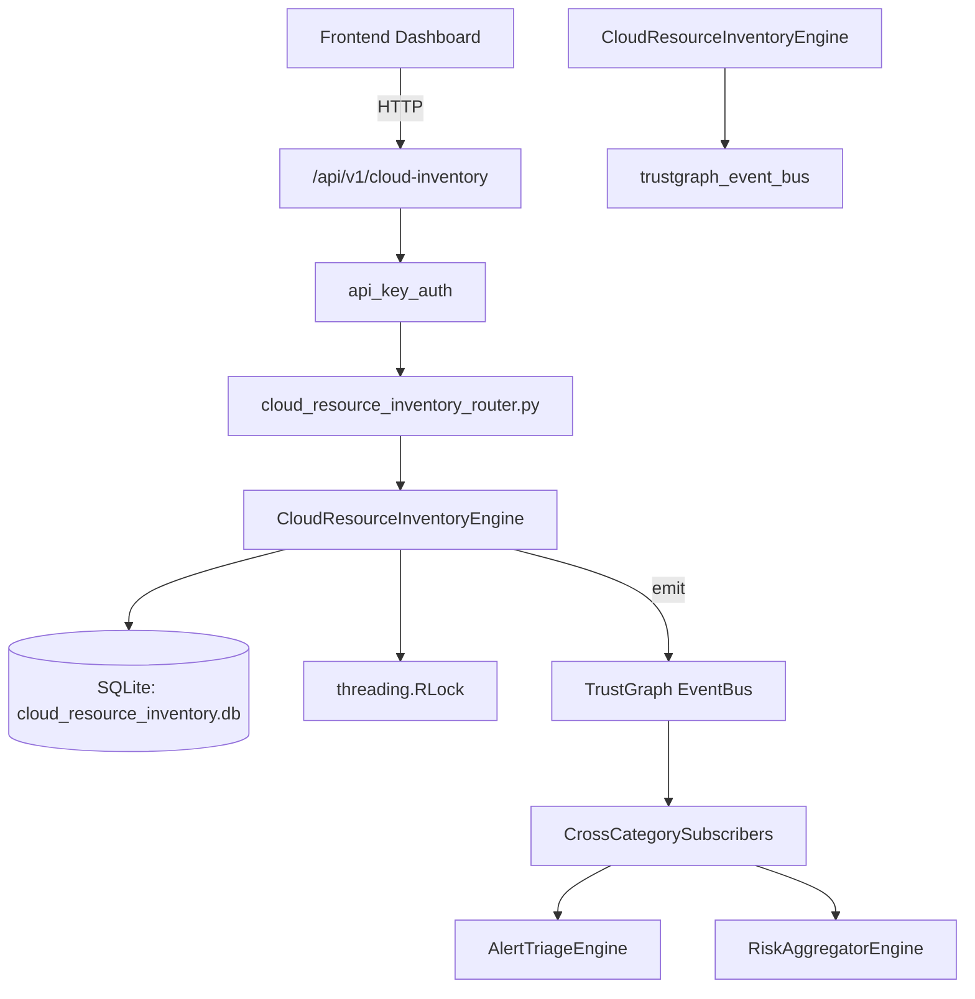

# US-0059: Cloud Resource Inventory

## Sub-Epic: CSPM
**Master Goal**: ALDECI — $35/mo enterprise security intelligence platform replacing $50K-500K/yr tools

## User Story
As a **Jennifer Wu (Cloud Security Architect)**, I need to secure cloud infrastructure and workloads
so that the platform delivers enterprise-grade cspm capabilities at 1/1000th the cost of legacy tools.

## Why This Matters
Cloud Resource Inventory replaces functionality found in enterprise tools like CrowdStrike, Wiz, Snyk, and Rapid7.
By building this into ALDECI's $35/mo stack, customers save $50K+/yr on standalone CSPM tooling.

## Architecture

## Current State: 95% Complete
- ✅ `register_resource()` — Register a new cloud resource in the inventory. (line 121)
- ✅ `list_resources()` — List resources with optional filters, org-isolated. (line 174)
- ✅ `get_resource()` — Fetch a resource by internal id, org-isolated. (line 207)
- ✅ `update_resource_state()` — Update resource_state and optionally compliance_status. (line 217)
- ✅ `record_security_finding()` — Record a security finding against a resource and update its score. (line 265)
- ✅ `list_findings()` — List findings with optional filters. (line 324)
- ❌ TrustGraph event emission — not yet verified

## Key Functions (from `suite-core/core/cloud_resource_inventory_engine.py` — 413 lines)
- `CloudResourceInventoryEngine.register_resource()` — Register a new cloud resource in the inventory. (line 121)
- `CloudResourceInventoryEngine.list_resources()` — List resources with optional filters, org-isolated. (line 174)
- `CloudResourceInventoryEngine.get_resource()` — Fetch a resource by internal id, org-isolated. (line 207)
- `CloudResourceInventoryEngine.update_resource_state()` — Update resource_state and optionally compliance_status. (line 217)
- `CloudResourceInventoryEngine.record_security_finding()` — Record a security finding against a resource and update its score. (line 265)
- `CloudResourceInventoryEngine.list_findings()` — List findings with optional filters. (line 324)
- `CloudResourceInventoryEngine.get_inventory_stats()` — Return aggregated inventory statistics for an org. (line 357)

## Dependencies
- **Depends on**: trustgraph_event_bus
- **Depended by**: Routers, TrustGraph EventBus, CrossCategorySubscribers
- **TrustGraph**: Event emission wired via ResponseInterceptorMiddleware
- **Source file**: `suite-core/core/cloud_resource_inventory_engine.py` (413 lines)
- **Router file**: `suite-api/apps/api/cloud_resource_inventory_router.py`

## API Endpoints
| Method | Path | Description |
|--------|------|-------------|
| POST | `/api/v1/cloud-inventory/resources` | register resource |
| GET | `/api/v1/cloud-inventory/resources` | list resources |
| GET | `/api/v1/cloud-inventory/resources/{resource_id}` | get resource |
| PATCH | `/api/v1/cloud-inventory/resources/{resource_id}/state` | update resource state |
| POST | `/api/v1/cloud-inventory/resources/{resource_id}/findings` | record security finding |
| GET | `/api/v1/cloud-inventory/findings` | list findings |
| GET | `/api/v1/cloud-inventory/stats` | get inventory stats |

## Tasks Remaining
1. Verify TrustGraph event emission works end-to-end (2h)
2. Add integration test with real persona workflow (2h)
3. Wire CrossCategorySubscriber consumer chain (1h)
4. Validate with 30-persona walkthrough (1h)
5. Optimize query performance for large datasets (2h)
6. Expand test coverage to edge cases (2h)

## Definition of Done
- [ ] Jennifer Wu (Cloud Security Architect) can access /api/v1/cloud-inventory and get meaningful data
- [ ] All CRUD operations return correct HTTP status codes
- [ ] TrustGraph receives events from this engine
- [ ] 42+ tests passing in `tests/test_cloud_resource_inventory_engine.py`
- [ ] 30-persona walkthrough includes this endpoint at 100%
- [ ] No hardcoded org_id — all queries are org-scoped

## Sprint: Wave 43 (est. April 19-21, 2026)

## Test Coverage
- **Test file**: `tests/test_cloud_resource_inventory_engine.py`
- **Tests**: 42 tests
- **Status**: Passing
