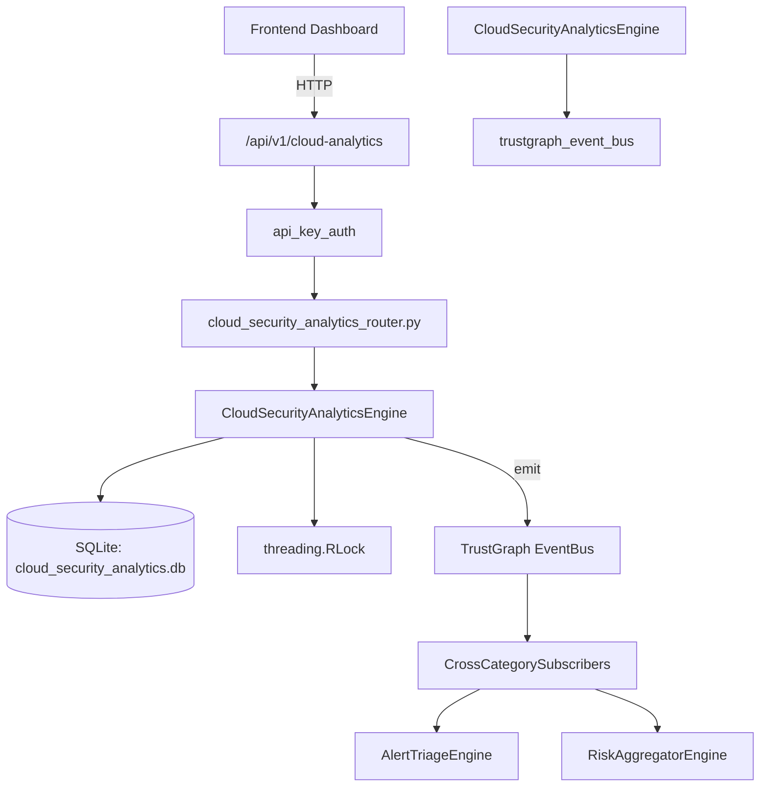

# US-0060: Cloud Security Analytics

## Sub-Epic: CSPM
**Master Goal**: ALDECI — $35/mo enterprise security intelligence platform replacing $50K-500K/yr tools

## User Story
As a **Jennifer Wu (Cloud Security Architect)**, I need to secure cloud infrastructure and workloads
so that the platform delivers enterprise-grade cspm capabilities at 1/1000th the cost of legacy tools.

## Why This Matters
Cloud Security Analytics replaces functionality found in enterprise tools like CrowdStrike, Wiz, Snyk, and Rapid7.
By building this into ALDECI's $35/mo stack, customers save $50K+/yr on standalone CSPM tooling.

## Architecture

## Current State: 95% Complete
- ✅ `record_event()` — Record a cloud security event. (line 153)
- ✅ `list_events()` — List events with optional filters. (line 209)
- ✅ `record_anomaly()` — Record a detected cloud security anomaly. (line 237)
- ✅ `list_anomalies()` — List anomalies with optional filters; deserializes affected_resources. (line 281)
- ✅ `update_anomaly_status()` — Update anomaly status. (line 305)
- ✅ `create_rule()` — Create a detection/compliance/baseline/anomaly rule. (line 326)
- ❌ TrustGraph event emission — not yet verified

## Key Functions (from `suite-core/core/cloud_security_analytics_engine.py` — 462 lines)
- `CloudSecurityAnalyticsEngine.record_event()` — Record a cloud security event. (line 153)
- `CloudSecurityAnalyticsEngine.list_events()` — List events with optional filters. (line 209)
- `CloudSecurityAnalyticsEngine.record_anomaly()` — Record a detected cloud security anomaly. (line 237)
- `CloudSecurityAnalyticsEngine.list_anomalies()` — List anomalies with optional filters; deserializes affected_resources. (line 281)
- `CloudSecurityAnalyticsEngine.update_anomaly_status()` — Update anomaly status. (line 305)
- `CloudSecurityAnalyticsEngine.create_rule()` — Create a detection/compliance/baseline/anomaly rule. (line 326)
- `CloudSecurityAnalyticsEngine.trigger_rule()` — Increment match_count for a rule. (line 368)
- `CloudSecurityAnalyticsEngine.list_rules()` — List rules with optional filters; deserializes event_sources. (line 386)

## Dependencies
- **Depends on**: trustgraph_event_bus
- **Depended by**: Routers, TrustGraph EventBus, CrossCategorySubscribers
- **TrustGraph**: Event emission wired via ResponseInterceptorMiddleware
- **Source file**: `suite-core/core/cloud_security_analytics_engine.py` (462 lines)
- **Router file**: `suite-api/apps/api/cloud_security_analytics_router.py`

## API Endpoints
| Method | Path | Description |
|--------|------|-------------|
| POST | `/api/v1/cloud-analytics/events` | record event |
| GET | `/api/v1/cloud-analytics/events` | list events |
| POST | `/api/v1/cloud-analytics/anomalies` | record anomaly |
| GET | `/api/v1/cloud-analytics/anomalies` | list anomalies |
| PUT | `/api/v1/cloud-analytics/anomalies/{anomaly_id}/status` | update anomaly status |
| POST | `/api/v1/cloud-analytics/rules` | create rule |
| GET | `/api/v1/cloud-analytics/rules` | list rules |
| PUT | `/api/v1/cloud-analytics/rules/{rule_id}/trigger` | trigger rule |
| GET | `/api/v1/cloud-analytics/stats` | get analytics stats |

## Tasks Remaining
1. Verify TrustGraph event emission works end-to-end (2h)
2. Add integration test with real persona workflow (2h)
3. Wire CrossCategorySubscriber consumer chain (1h)
4. Validate with 30-persona walkthrough (1h)
5. Optimize query performance for large datasets (2h)
6. Expand test coverage to edge cases (2h)

## Definition of Done
- [ ] Jennifer Wu (Cloud Security Architect) can access /api/v1/cloud-analytics and get meaningful data
- [ ] All CRUD operations return correct HTTP status codes
- [ ] TrustGraph receives events from this engine
- [ ] 39+ tests passing in `tests/test_cloud_security_analytics_engine.py`
- [ ] 30-persona walkthrough includes this endpoint at 100%
- [ ] No hardcoded org_id — all queries are org-scoped

## Sprint: Wave 44 (est. April 20-22, 2026)

## Test Coverage
- **Test file**: `tests/test_cloud_security_analytics_engine.py`
- **Tests**: 39 tests
- **Status**: Passing
