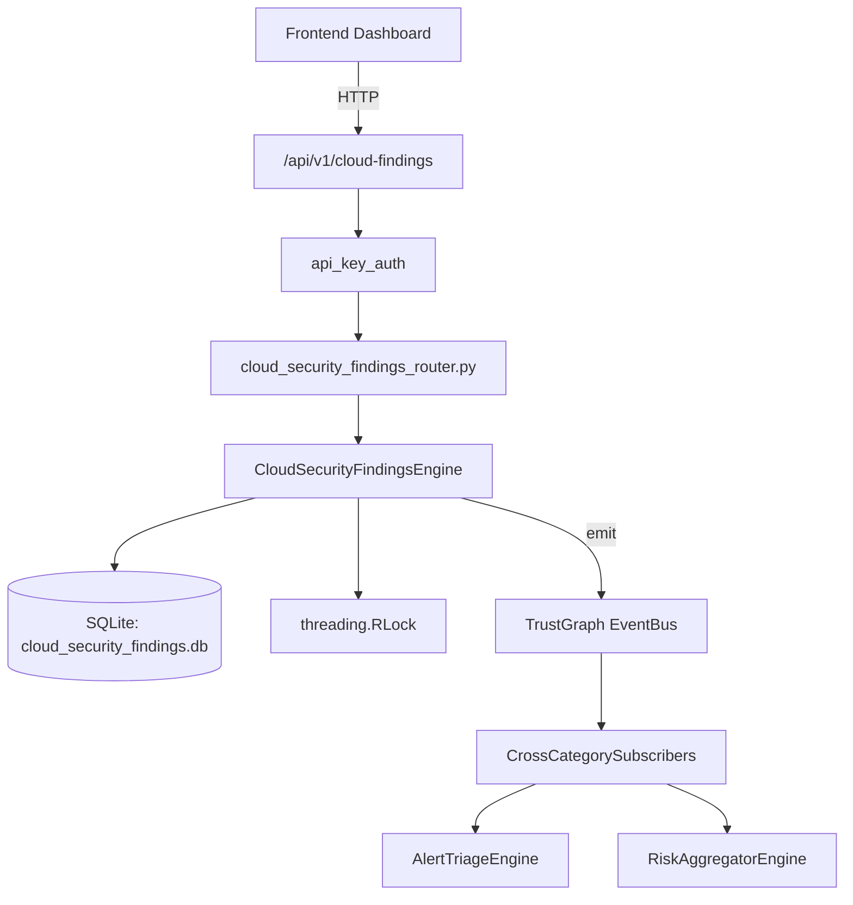

# US-0062: Cloud Security Findings

## Sub-Epic: CSPM
**Master Goal**: ALDECI — $35/mo enterprise security intelligence platform replacing $50K-500K/yr tools

## User Story
As a **Jennifer Wu (Cloud Security Architect)**, I need to secure cloud infrastructure and workloads
so that the platform delivers enterprise-grade cspm capabilities at 1/1000th the cost of legacy tools.

## Why This Matters
Cloud Security Findings replaces functionality found in enterprise tools like CrowdStrike, Wiz, Snyk, and Rapid7.
By building this into ALDECI's $35/mo stack, customers save $50K+/yr on standalone CSPM tooling.

## Architecture

## Current State: 95% Complete
- ✅ `ingest_finding()` — Ingest a cloud security finding. Deduplicates open findings by (line 137)
- ✅ `resolve_finding()` — Mark a finding as resolved. (line 207)
- ✅ `suppress_finding()` — Suppress a finding and record suppression details. (line 227)
- ✅ `assign_remediation()` — Create a remediation tracking record for a finding. (line 261)
- ✅ `update_remediation()` — Update status and notes on a remediation tracking record. (line 300)
- ✅ `get_findings()` — Return findings with optional filters. (line 328)
- ❌ TrustGraph event emission — not yet verified

## Key Functions (from `suite-core/core/cloud_security_findings_engine.py` — 464 lines)
- `CloudSecurityFindingsEngine.ingest_finding()` — Ingest a cloud security finding. Deduplicates open findings by (line 137)
- `CloudSecurityFindingsEngine.resolve_finding()` — Mark a finding as resolved. (line 207)
- `CloudSecurityFindingsEngine.suppress_finding()` — Suppress a finding and record suppression details. (line 227)
- `CloudSecurityFindingsEngine.assign_remediation()` — Create a remediation tracking record for a finding. (line 261)
- `CloudSecurityFindingsEngine.update_remediation()` — Update status and notes on a remediation tracking record. (line 300)
- `CloudSecurityFindingsEngine.get_findings()` — Return findings with optional filters. (line 328)
- `CloudSecurityFindingsEngine.get_finding_summary()` — Summary: total, by_provider, by_severity, by_status, critical_open, (line 353)
- `CloudSecurityFindingsEngine.get_top_affected_resources()` — Top resources by open finding count. (line 398)

## Dependencies
- **Depends on**: standalone
- **Depended by**: Routers, TrustGraph EventBus, CrossCategorySubscribers
- **TrustGraph**: Event emission wired via ResponseInterceptorMiddleware
- **Source file**: `suite-core/core/cloud_security_findings_engine.py` (464 lines)
- **Router file**: `suite-api/apps/api/cloud_security_findings_router.py`

## API Endpoints
| Method | Path | Description |
|--------|------|-------------|
| POST | `/api/v1/cloud-findings/findings` | ingest finding |
| POST | `/api/v1/cloud-findings/findings/bulk` | bulk ingest |
| PUT | `/api/v1/cloud-findings/findings/{finding_id}/resolve` | resolve finding |
| POST | `/api/v1/cloud-findings/findings/{finding_id}/suppress` | suppress finding |
| POST | `/api/v1/cloud-findings/findings/{finding_id}/remediation` | assign remediation |
| PUT | `/api/v1/cloud-findings/remediation/{remediation_id}` | update remediation |
| GET | `/api/v1/cloud-findings/findings` | get findings |
| GET | `/api/v1/cloud-findings/summary` | get finding summary |
| GET | `/api/v1/cloud-findings/top-resources` | get top affected resources |

## Tasks Remaining
1. Verify TrustGraph event emission works end-to-end (2h)
2. Add integration test with real persona workflow (2h)
3. Wire CrossCategorySubscriber consumer chain (1h)
4. Validate with 30-persona walkthrough (1h)
5. Optimize query performance for large datasets (2h)
6. Expand test coverage to edge cases (2h)

## Definition of Done
- [ ] Jennifer Wu (Cloud Security Architect) can access /api/v1/cloud-findings and get meaningful data
- [ ] All CRUD operations return correct HTTP status codes
- [ ] TrustGraph receives events from this engine
- [ ] 48+ tests passing in `tests/test_cloud_security_findings_engine.py`
- [ ] 30-persona walkthrough includes this endpoint at 100%
- [ ] No hardcoded org_id — all queries are org-scoped

## Sprint: Wave 44 (est. April 20-22, 2026)

## Test Coverage
- **Test file**: `tests/test_cloud_security_findings_engine.py`
- **Tests**: 48 tests
- **Status**: Passing
