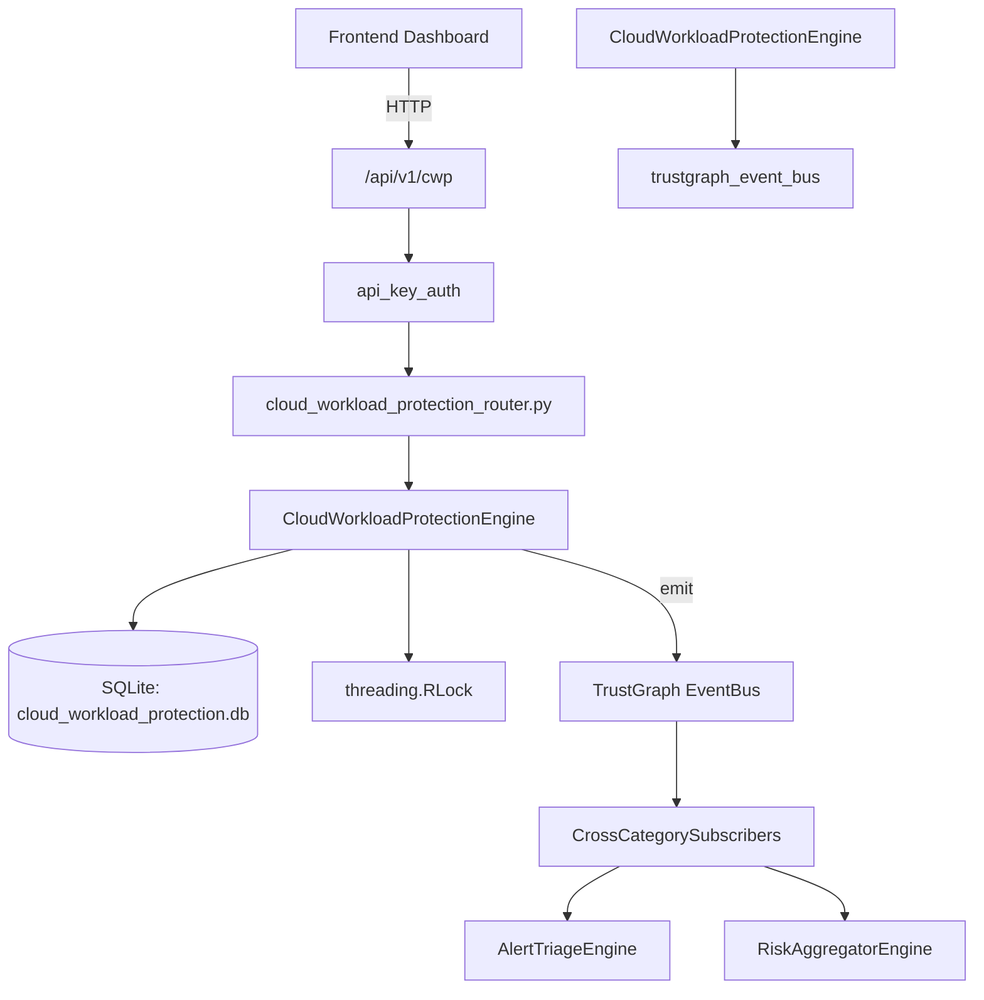

# US-0063: Cloud Workload Protection

## Sub-Epic: CSPM
**Master Goal**: ALDECI — $35/mo enterprise security intelligence platform replacing $50K-500K/yr tools

## User Story
As a **Jennifer Wu (Cloud Security Architect)**, I need to secure cloud infrastructure and workloads
so that the platform delivers enterprise-grade cspm capabilities at 1/1000th the cost of legacy tools.

## Why This Matters
Cloud Workload Protection replaces functionality found in enterprise tools like CrowdStrike, Wiz, Snyk, and Rapid7.
By building this into ALDECI's $35/mo stack, customers save $50K+/yr on standalone CSPM tooling.

## Architecture

## Current State: 95% Complete
- ✅ `register_workload()` — Register a cloud workload. Returns the workload record. (line 144)
- ✅ `list_workloads()` — List workloads for org, optionally filtered. (line 194)
- ✅ `get_workload()` — Fetch a single workload scoped to org_id, or None if not found. (line 218)
- ✅ `update_protection_status()` — Update the protection status of a workload. (line 227)
- ✅ `record_threat()` — Record a threat detection against a workload. (line 259)
- ✅ `list_threats()` — List threats for org, optionally filtered. (line 299)
- ❌ TrustGraph event emission — not yet verified

## Key Functions (from `suite-core/core/cloud_workload_protection_engine.py` — 485 lines)
- `CloudWorkloadProtectionEngine.register_workload()` — Register a cloud workload. Returns the workload record. (line 144)
- `CloudWorkloadProtectionEngine.list_workloads()` — List workloads for org, optionally filtered. (line 194)
- `CloudWorkloadProtectionEngine.get_workload()` — Fetch a single workload scoped to org_id, or None if not found. (line 218)
- `CloudWorkloadProtectionEngine.update_protection_status()` — Update the protection status of a workload. (line 227)
- `CloudWorkloadProtectionEngine.record_threat()` — Record a threat detection against a workload. (line 259)
- `CloudWorkloadProtectionEngine.list_threats()` — List threats for org, optionally filtered. (line 299)
- `CloudWorkloadProtectionEngine.update_threat_status()` — Update the status of a threat. (line 333)
- `CloudWorkloadProtectionEngine.create_policy()` — Create a CWP policy. (line 357)

## Dependencies
- **Depends on**: trustgraph_event_bus
- **Depended by**: Routers, TrustGraph EventBus, CrossCategorySubscribers
- **TrustGraph**: Event emission wired via ResponseInterceptorMiddleware
- **Source file**: `suite-core/core/cloud_workload_protection_engine.py` (485 lines)
- **Router file**: `suite-api/apps/api/cloud_workload_protection_router.py`

## API Endpoints
| Method | Path | Description |
|--------|------|-------------|
| POST | `/api/v1/cwp/workloads` | register workload |
| GET | `/api/v1/cwp/workloads` | list workloads |
| GET | `/api/v1/cwp/workloads/{workload_id}` | get workload |
| PUT | `/api/v1/cwp/workloads/{workload_id}/protection` | update protection status |
| POST | `/api/v1/cwp/threats` | record threat |
| GET | `/api/v1/cwp/threats` | list threats |
| PUT | `/api/v1/cwp/threats/{threat_id}/status` | update threat status |
| POST | `/api/v1/cwp/policies` | create policy |
| GET | `/api/v1/cwp/policies` | list policies |
| GET | `/api/v1/cwp/stats` | get cwp stats |

## Tasks Remaining
1. Verify TrustGraph event emission works end-to-end (2h)
2. Add integration test with real persona workflow (2h)
3. Wire CrossCategorySubscriber consumer chain (1h)
4. Validate with 30-persona walkthrough (1h)
5. Optimize query performance for large datasets (2h)
6. Expand test coverage to edge cases (2h)

## Definition of Done
- [ ] Jennifer Wu (Cloud Security Architect) can access /api/v1/cwp and get meaningful data
- [ ] All CRUD operations return correct HTTP status codes
- [ ] TrustGraph receives events from this engine
- [ ] 46+ tests passing in `tests/test_cloud_workload_protection_engine.py`
- [ ] 30-persona walkthrough includes this endpoint at 100%
- [ ] No hardcoded org_id — all queries are org-scoped

## Sprint: Wave 44 (est. April 20-22, 2026)

## Test Coverage
- **Test file**: `tests/test_cloud_workload_protection_engine.py`
- **Tests**: 46 tests
- **Status**: Passing
