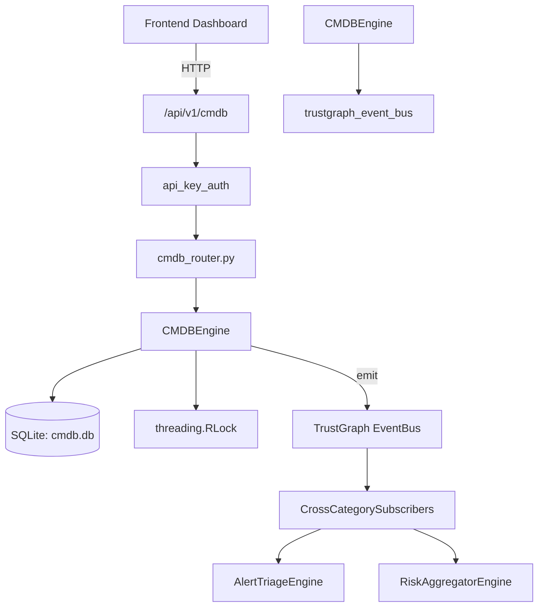

# US-0064: Cmdb

## Sub-Epic: Advanced
**Master Goal**: ALDECI — $35/mo enterprise security intelligence platform replacing $50K-500K/yr tools

## User Story
As a **Maria Lopez (IT Director)**, I need to maintain configuration management database
so that the platform delivers enterprise-grade advanced capabilities at 1/1000th the cost of legacy tools.

## Why This Matters
Cmdb replaces functionality found in enterprise tools like CrowdStrike, Wiz, Snyk, and Rapid7.
By building this into ALDECI's $35/mo stack, customers save $50K+/yr on standalone Advanced tooling.

## Architecture

## Current State: 95% Complete
- ✅ `add_ci()` — Add a configuration item. Returns the full CI dict. (line 146)
- ✅ `list_cis()` — List CIs for an org with optional filters. (line 225)
- ✅ `get_ci()` — Fetch a single CI scoped to org. (line 252)
- ✅ `update_ci()` — Update allowed fields on a CI. Returns True if updated. (line 261)
- ✅ `add_relationship()` — Add a directional relationship between two CIs. Returns the relationship dict. (line 291)
- ✅ `list_relationships()` — List relationships for an org. Optionally filter by CI (src or dst). (line 325)
- ❌ TrustGraph event emission — not yet verified

## Key Functions (from `suite-core/core/cmdb_engine.py` — 458 lines)
- `CMDBEngine.add_ci()` — Add a configuration item. Returns the full CI dict. (line 146)
- `CMDBEngine.list_cis()` — List CIs for an org with optional filters. (line 225)
- `CMDBEngine.get_ci()` — Fetch a single CI scoped to org. (line 252)
- `CMDBEngine.update_ci()` — Update allowed fields on a CI. Returns True if updated. (line 261)
- `CMDBEngine.add_relationship()` — Add a directional relationship between two CIs. Returns the relationship dict. (line 291)
- `CMDBEngine.list_relationships()` — List relationships for an org. Optionally filter by CI (src or dst). (line 325)
- `CMDBEngine.record_change()` — Record a change event for a CI. Returns the change record dict. (line 349)
- `CMDBEngine.list_changes()` — List change records for an org, optionally filtered by CI. (line 389)

## Dependencies
- **Depends on**: trustgraph_event_bus
- **Depended by**: Routers, TrustGraph EventBus, CrossCategorySubscribers
- **TrustGraph**: Event emission wired via ResponseInterceptorMiddleware
- **Source file**: `suite-core/core/cmdb_engine.py` (458 lines)
- **Router file**: `suite-api/apps/api/cmdb_router.py`

## API Endpoints
| Method | Path | Description |
|--------|------|-------------|
| GET | `/api/v1/cmdb/cis` | list cis |
| POST | `/api/v1/cmdb/cis` | create ci |
| GET | `/api/v1/cmdb/cis/{ci_id}` | get ci |
| PATCH | `/api/v1/cmdb/cis/{ci_id}` | update ci |
| GET | `/api/v1/cmdb/relationships` | list relationships |
| POST | `/api/v1/cmdb/relationships` | create relationship |
| GET | `/api/v1/cmdb/changes` | list changes |
| POST | `/api/v1/cmdb/changes` | record change |
| GET | `/api/v1/cmdb/stats` | get stats |

## Tasks Remaining
1. Verify TrustGraph event emission works end-to-end (2h)
2. Add integration test with real persona workflow (2h)
3. Wire CrossCategorySubscriber consumer chain (1h)
4. Validate with 30-persona walkthrough (1h)
5. Optimize query performance for large datasets (2h)
6. Expand test coverage to edge cases (2h)

## Definition of Done
- [ ] Maria Lopez (IT Director) can access /api/v1/cmdb and get meaningful data
- [ ] All CRUD operations return correct HTTP status codes
- [ ] TrustGraph receives events from this engine
- [ ] 26+ tests passing in `tests/test_cmdb_engine.py`
- [ ] 30-persona walkthrough includes this endpoint at 100%
- [ ] No hardcoded org_id — all queries are org-scoped

## Sprint: Wave 44 (est. April 20-22, 2026)

## Test Coverage
- **Test file**: `tests/test_cmdb_engine.py`
- **Tests**: 26 tests
- **Status**: Passing
