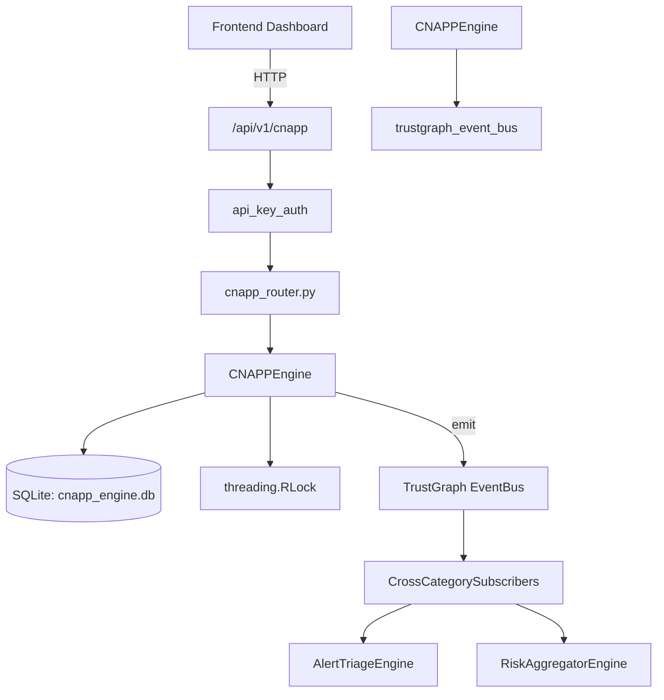

# US-0065: Cnapp

## Sub-Epic: CSPM
**Master Goal**: ALDECI — $35/mo enterprise security intelligence platform replacing $50K-500K/yr tools

## User Story
As a **Jennifer Wu (Cloud Security Architect)**, I need to protect cloud-native applications
so that the platform delivers enterprise-grade cspm capabilities at 1/1000th the cost of legacy tools.

## Why This Matters
Cnapp replaces functionality found in enterprise tools like CrowdStrike, Wiz, Snyk, and Rapid7.
By building this into ALDECI's $35/mo stack, customers save $50K+/yr on standalone CSPM tooling.

## Architecture

## Current State: 95% Complete
- ✅ `register_workload()` — Register a new cloud workload. (line 174)
- ✅ `list_workloads()` — List cloud workloads with optional filters. (line 226)
- ✅ `add_finding()` — Add a CNAPP finding and update the workload's risk_score. (line 254)
- ✅ `list_findings()` — List CNAPP findings with optional filters. (line 311)
- ✅ `suppress_finding()` — Suppress a finding. Returns True if a row was updated. (line 336)
- ✅ `create_policy()` — Create a cloud security policy. (line 353)
- ❌ TrustGraph event emission — not yet verified

## Key Functions (from `suite-core/core/cnapp_engine.py` — 589 lines)
- `CNAPPEngine.register_workload()` — Register a new cloud workload. (line 174)
- `CNAPPEngine.list_workloads()` — List cloud workloads with optional filters. (line 226)
- `CNAPPEngine.add_finding()` — Add a CNAPP finding and update the workload's risk_score. (line 254)
- `CNAPPEngine.list_findings()` — List CNAPP findings with optional filters. (line 311)
- `CNAPPEngine.suppress_finding()` — Suppress a finding. Returns True if a row was updated. (line 336)
- `CNAPPEngine.create_policy()` — Create a cloud security policy. (line 353)
- `CNAPPEngine.list_policies()` — List cloud policies with optional filters. (line 398)
- `CNAPPEngine.calculate_cnapp_score()` — Calculate composite CNAPP score (CSPM + CWPP + CIEM) and persist it. (line 422)

## Dependencies
- **Depends on**: trustgraph_event_bus
- **Depended by**: Routers, TrustGraph EventBus, CrossCategorySubscribers
- **TrustGraph**: Event emission wired via ResponseInterceptorMiddleware
- **Source file**: `suite-core/core/cnapp_engine.py` (589 lines)
- **Router file**: `suite-api/apps/api/cnapp_router.py`

## API Endpoints
| Method | Path | Description |
|--------|------|-------------|
| POST | `/api/v1/cnapp/workloads` | register workload |
| GET | `/api/v1/cnapp/workloads` | list workloads |
| POST | `/api/v1/cnapp/workloads/{workload_id}/findings` | add finding |
| GET | `/api/v1/cnapp/findings` | list findings |
| POST | `/api/v1/cnapp/findings/{finding_id}/suppress` | suppress finding |
| POST | `/api/v1/cnapp/policies` | create policy |
| GET | `/api/v1/cnapp/policies` | list policies |
| POST | `/api/v1/cnapp/scores/calculate` | calculate cnapp score |
| GET | `/api/v1/cnapp/scores` | list scores |
| GET | `/api/v1/cnapp/stats` | get cnapp stats |

## Tasks Remaining
1. Verify TrustGraph event emission works end-to-end (2h)
2. Add integration test with real persona workflow (2h)
3. Wire CrossCategorySubscriber consumer chain (1h)
4. Validate with 30-persona walkthrough (1h)
5. Optimize query performance for large datasets (2h)
6. Expand test coverage to edge cases (2h)

## Definition of Done
- [ ] Jennifer Wu (Cloud Security Architect) can access /api/v1/cnapp and get meaningful data
- [ ] All CRUD operations return correct HTTP status codes
- [ ] TrustGraph receives events from this engine
- [ ] 37+ tests passing in `tests/test_cnapp_engine.py`
- [ ] 30-persona walkthrough includes this endpoint at 100%
- [ ] No hardcoded org_id — all queries are org-scoped

## Sprint: Wave 44 (est. April 20-22, 2026)

## Test Coverage
- **Test file**: `tests/test_cnapp_engine.py`
- **Tests**: 37 tests
- **Status**: Passing
