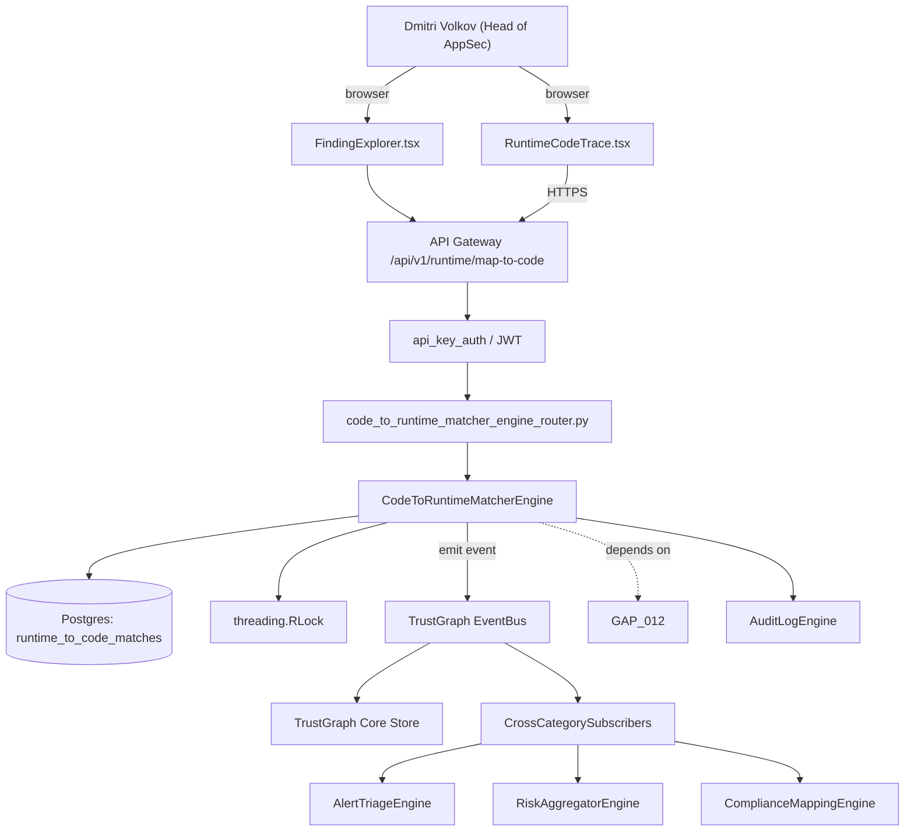

# US-0013: Add code-to-runtime matcher: map live API traffic back to repo+commit+owner

## Sub-Epic: ASPM
**Master Goal**: ALDECI — tiered $199-$1,499/mo enterprise security intelligence platform replacing $50K-$500K/yr tools

## User Story
As a **Dmitri Volkov (Head of AppSec)**, I need to add code-to-runtime matcher: map live API traffic back to repo+commit+owner so that Fixops matches Apiiro/Cycode ASPM depth and wins replacement deals.

## Why This Matters
Per competitor-aspm.md §1 and §4, Snyk (Helios) and Apiiro both link runtime signals back to code. Fixops has runtime + code engines but no matcher. Build an ML+heuristic matcher that consumes OpenTelemetry/eBPF traces + DCA entities and writes `runs_as` edges in TrustGraph.

This work is called out as a P1 gap in `competitor-aspm.md`. Shipping it is load-bearing for ALDECI's tiered $199-$1,499/mo positioning against $50K-$500K/yr incumbents: every delayed gap becomes a displacement deal we lose.

## Architecture

## Current State: 0% — MISSING (new engine)
- [ ] Engine module `suite-core/core/code_to_runtime_matcher_engine.py` does not exist yet
- [ ] Router `suite-api/apps/api/code_to_runtime_matcher_engine_router.py` does not exist yet
- [ ] DB tables listed under Data Model do not exist yet
- [ ] Frontend screens listed under Key Functions do not exist yet
- [ ] No TrustGraph events emitted yet

## Key Functions
**Backend (engine methods):**
- `create_map_to_code()` — backs `POST /api/v1/runtime/map-to-code`
- `get_api()` — backs `GET /api/v1/runtime/traffic/{api}`
- `create_ingest()` — backs `POST /api/v1/runtime/traces/ingest`

**Frontend screens:**
- `RuntimeCodeTrace.tsx` — operator-facing UI surface for this gap
- `FindingExplorer.tsx` — operator-facing UI surface for this gap

## API Endpoints
| Method | Path | Auth | Purpose |
|--------|------|------|---------|
| POST | `/api/v1/runtime/map-to-code` | api_key_auth | runtime map to code |
| GET | `/api/v1/runtime/traffic/{api}` | api_key_auth | traffic {api} |
| POST | `/api/v1/runtime/traces/ingest` | api_key_auth | traces ingest |

## Data Model
- add runtime_to_code_matches table: id, route, method, service, matched_entity_id, commit_sha, confidence, observed_at

## Dependencies
**Depends on**: GAP-012
**Depended by**: Router layer, TrustGraph EventBus, CrossCategorySubscribers, CrossCategoryEvidenceBuilder, AuditLogEngine
**New engine module**: `suite-core/core/code_to_runtime_matcher_engine.py`
**New router module**: `suite-api/apps/api/code_to_runtime_matcher_engine_router.py`
**Master gap id**: `GAP-013` (priority P1, effort L)

## Tasks Remaining
1. Schema migration: add runtime_to_code_matches table (4h)
2. Implement endpoint POST /api/v1/runtime/map-to-code (6h)
3. Implement endpoint GET /api/v1/runtime/traffic/{api} (6h)
4. Implement endpoint POST /api/v1/runtime/traces/ingest (6h)
5. Wire frontend screen RuntimeCodeTrace.tsx (5h)
6. Wire frontend screen FindingExplorer.tsx (5h)
7. Write 4 pytest cases: test_route_matches_controller_canonical, test_orphan_route_recorded… (6h)
8. Wire TrustGraph event emission + CrossCategorySubscriber consumers (4h)
9. Persona walkthrough + integration test (3h)
10. Docs + API reference update (2h)

## Definition of Done
- [ ] Given a deployed service emitting OTLP traces, When matcher runs with DCA entities from the service's repo, Then each observed HTTP route is linked back to the exact controller method with match_confidence >= 0.9 for canonical routes.
- [ ] Given a trace for a route that does not exist in DCA, When the matcher processes it, Then an orphan_runtime_route record is emitted for investigation.
- [ ] Given RuntimeCodeTrace.tsx, When a runtime request is inspected, Then the UI shows the matched file:line and the commit SHA that introduced it.
- [ ] Given the matcher output, When a reachability query runs, Then `reachable_in_runtime=true` is added to findings on that code path.
- [ ] Given a match, When the code owner is queried, Then the owner is resolved from CODEOWNERS + commit history.
- [ ] All endpoints are org-scoped (no hardcoded org_id) and gated by `api_key_auth`.
- [ ] TrustGraph emits at least one event type for this engine and a CrossCategorySubscriber consumes it.
- [ ] `Dmitri Volkov (Head of AppSec)` can execute the full workflow in the 30-persona walkthrough.

## Tests Required
- `test_route_matches_controller_canonical`
- `test_orphan_route_recorded`
- `test_owner_resolution_from_codeowners`
- `test_runtime_reachability_flag_propagates`

## Sprint: Wave 49 (est. Jun 03-Jun 09, 2026)

## Citation
Source research: `competitor-aspm.md` (gap `GAP-013`, priority `P1`, effort `L`)
