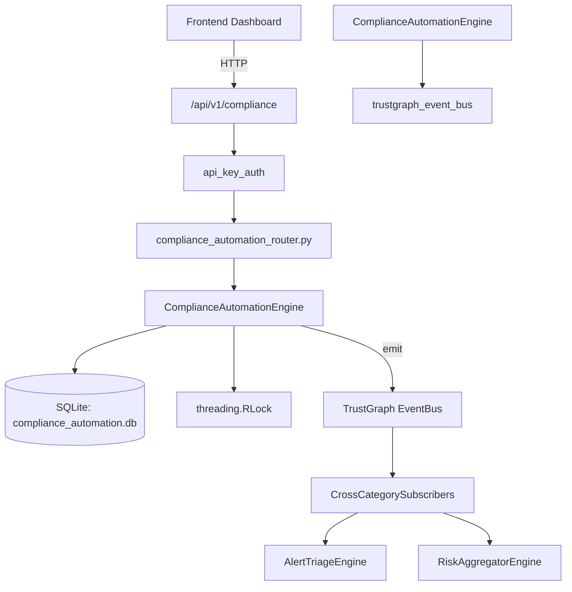

# US-0066: Compliance Automation

## Sub-Epic: GRC
**Master Goal**: ALDECI — $35/mo enterprise security intelligence platform replacing $50K-500K/yr tools

## User Story
As a **Robert Kim (Compliance Officer)**, I need to automate compliance assessment and evidence
so that the platform delivers enterprise-grade grc capabilities at 1/1000th the cost of legacy tools.

## Why This Matters
Compliance Automation replaces functionality found in enterprise tools like CrowdStrike, Wiz, Snyk, and Rapid7.
By building this into ALDECI's $35/mo stack, customers save $50K+/yr on standalone GRC tooling.

## Architecture

## Current State: 95% Complete
- ✅ `create_automation_job()` — Create a new automation job. (line 124)
- ✅ `list_jobs()` — List automation jobs for an org with optional filters. (line 174)
- ✅ `get_job()` — Get a single job by id (org-isolated). (line 201)
- ✅ `run_job()` — Execute a queued job, simulate results, and mark completed. (line 210)
- ✅ `record_control_result()` — Record a single control test result. (line 257)
- ✅ `list_control_results()` — List control results with optional filters. (line 298)
- ❌ TrustGraph event emission — not yet verified

## Key Functions (from `suite-core/core/compliance_automation_engine.py` — 377 lines)
- `ComplianceAutomationEngine.create_automation_job()` — Create a new automation job. (line 124)
- `ComplianceAutomationEngine.list_jobs()` — List automation jobs for an org with optional filters. (line 174)
- `ComplianceAutomationEngine.get_job()` — Get a single job by id (org-isolated). (line 201)
- `ComplianceAutomationEngine.run_job()` — Execute a queued job, simulate results, and mark completed. (line 210)
- `ComplianceAutomationEngine.record_control_result()` — Record a single control test result. (line 257)
- `ComplianceAutomationEngine.list_control_results()` — List control results with optional filters. (line 298)
- `ComplianceAutomationEngine.get_compliance_stats()` — Return aggregate compliance automation statistics. (line 329)

## Dependencies
- **Depends on**: trustgraph_event_bus
- **Depended by**: Routers, TrustGraph EventBus, CrossCategorySubscribers
- **TrustGraph**: Event emission wired via ResponseInterceptorMiddleware
- **Source file**: `suite-core/core/compliance_automation_engine.py` (377 lines)
- **Router file**: `suite-api/apps/api/compliance_automation_router.py`

## API Endpoints
| Method | Path | Description |
|--------|------|-------------|
| GET | `/api/v1/compliance/status` | get overall status |
| GET | `/api/v1/compliance/framework/{framework}` | get framework status |
| GET | `/api/v1/compliance/gaps` | get gaps |
| GET | `/api/v1/compliance/evidence` | get evidence |
| POST | `/api/v1/compliance/evidence/collect` | collect evidence |
| GET | `/api/v1/compliance/crossmap` | get cross map |
| GET | `/api/v1/compliance/poam` | get poam |
| POST | `/api/v1/compliance/poam` | create poam |
| PATCH | `/api/v1/compliance/poam/{poam_id}` | update poam status |
| POST | `/api/v1/compliance/report/{framework}` | generate report |
| POST | `/api/v1/compliance/score/{framework}` | record score |
| GET | `/api/v1/compliance/score/{framework}/trend` | get score trend |

## Tasks Remaining
1. Verify TrustGraph event emission works end-to-end (2h)
2. Add integration test with real persona workflow (2h)
3. Wire CrossCategorySubscriber consumer chain (1h)
4. Validate with 30-persona walkthrough (1h)
5. Optimize query performance for large datasets (2h)
6. Expand test coverage to edge cases (2h)

## Definition of Done
- [ ] Robert Kim (Compliance Officer) can access /api/v1/compliance and get meaningful data
- [ ] All CRUD operations return correct HTTP status codes
- [ ] TrustGraph receives events from this engine
- [ ] 33+ tests passing in `tests/test_compliance_automation_engine.py`
- [ ] 30-persona walkthrough includes this endpoint at 100%
- [ ] No hardcoded org_id — all queries are org-scoped

## Sprint: Wave 44 (est. April 20-22, 2026)

## Test Coverage
- **Test file**: `tests/test_compliance_automation_engine.py`
- **Tests**: 33 tests
- **Status**: Passing
