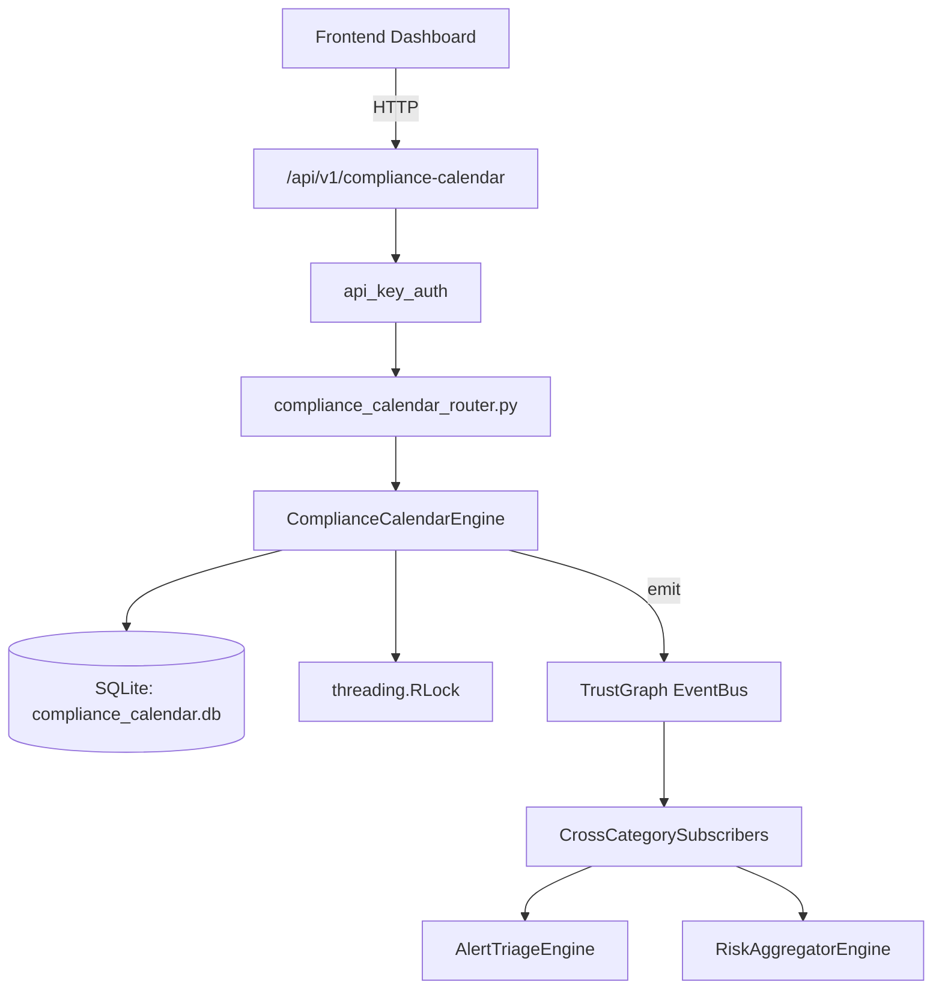

# US-0067: Compliance Calendar

## Sub-Epic: GRC
**Master Goal**: ALDECI — $35/mo enterprise security intelligence platform replacing $50K-500K/yr tools

## User Story
As a **Robert Kim (Compliance Officer)**, I need to automate compliance assessment and evidence
so that the platform delivers enterprise-grade grc capabilities at 1/1000th the cost of legacy tools.

## Why This Matters
Compliance Calendar replaces functionality found in enterprise tools like CrowdStrike, Wiz, Snyk, and Rapid7.
By building this into ALDECI's $35/mo stack, customers save $50K+/yr on standalone GRC tooling.

## Architecture

## Current State: 95% Complete
- ✅ `create_event()` — Create a new compliance calendar event with auto-reminder. (line 145)
- ✅ `get_event()` — implemented (line 209)
- ✅ `complete_event()` — Mark event as completed. If recurring, create the next occurrence. (line 216)
- ✅ `get_upcoming_events()` — Events due within the next `days_ahead` days with status=upcoming. (line 256)
- ✅ `get_overdue_events()` — Events past their due_date with status=upcoming. (line 273)
- ✅ `get_events_by_framework()` — List all events for a given framework. (line 289)
- ❌ TrustGraph event emission — not yet verified

## Key Functions (from `suite-core/core/compliance_calendar_engine.py` — 445 lines)
- `ComplianceCalendarEngine.create_event()` — Create a new compliance calendar event with auto-reminder. (line 145)
- `ComplianceCalendarEngine.get_event()` — Handle get event (line 209)
- `ComplianceCalendarEngine.complete_event()` — Mark event as completed. If recurring, create the next occurrence. (line 216)
- `ComplianceCalendarEngine.get_upcoming_events()` — Events due within the next `days_ahead` days with status=upcoming. (line 256)
- `ComplianceCalendarEngine.get_overdue_events()` — Events past their due_date with status=upcoming. (line 273)
- `ComplianceCalendarEngine.get_events_by_framework()` — List all events for a given framework. (line 289)
- `ComplianceCalendarEngine.mark_reminder_sent()` — Mark a reminder as sent. (line 306)
- `ComplianceCalendarEngine.get_due_reminders()` — Reminders where reminder_date <= today and not yet sent. (line 326)

## Dependencies
- **Depends on**: standalone
- **Depended by**: Routers, TrustGraph EventBus, CrossCategorySubscribers
- **TrustGraph**: Event emission wired via ResponseInterceptorMiddleware
- **Source file**: `suite-core/core/compliance_calendar_engine.py` (445 lines)
- **Router file**: `suite-api/apps/api/compliance_calendar_router.py`

## API Endpoints
| Method | Path | Description |
|--------|------|-------------|
| POST | `/api/v1/compliance-calendar/events` | create event |
| POST | `/api/v1/compliance-calendar/events/{event_id}/complete` | complete event |
| GET | `/api/v1/compliance-calendar/upcoming` | get upcoming events |
| GET | `/api/v1/compliance-calendar/overdue` | get overdue events |
| POST | `/api/v1/compliance-calendar/reminders/{reminder_id}/sent` | mark reminder sent |
| GET | `/api/v1/compliance-calendar/reminders/due` | get due reminders |
| POST | `/api/v1/compliance-calendar/views` | create view |
| GET | `/api/v1/compliance-calendar/framework/{framework}` | get events by framework |
| GET | `/api/v1/compliance-calendar/summary` | get calendar summary |

## Tasks Remaining
1. Verify TrustGraph event emission works end-to-end (2h)
2. Add integration test with real persona workflow (2h)
3. Wire CrossCategorySubscriber consumer chain (1h)
4. Validate with 30-persona walkthrough (1h)
5. Optimize query performance for large datasets (2h)
6. Expand test coverage to edge cases (2h)

## Definition of Done
- [ ] Robert Kim (Compliance Officer) can access /api/v1/compliance-calendar and get meaningful data
- [ ] All CRUD operations return correct HTTP status codes
- [ ] TrustGraph receives events from this engine
- [ ] 36+ tests passing in `tests/test_compliance_calendar_engine.py`
- [ ] 30-persona walkthrough includes this endpoint at 100%
- [ ] No hardcoded org_id — all queries are org-scoped

## Sprint: Wave 44 (est. April 20-22, 2026)

## Test Coverage
- **Test file**: `tests/test_compliance_calendar_engine.py`
- **Tests**: 36 tests
- **Status**: Passing
