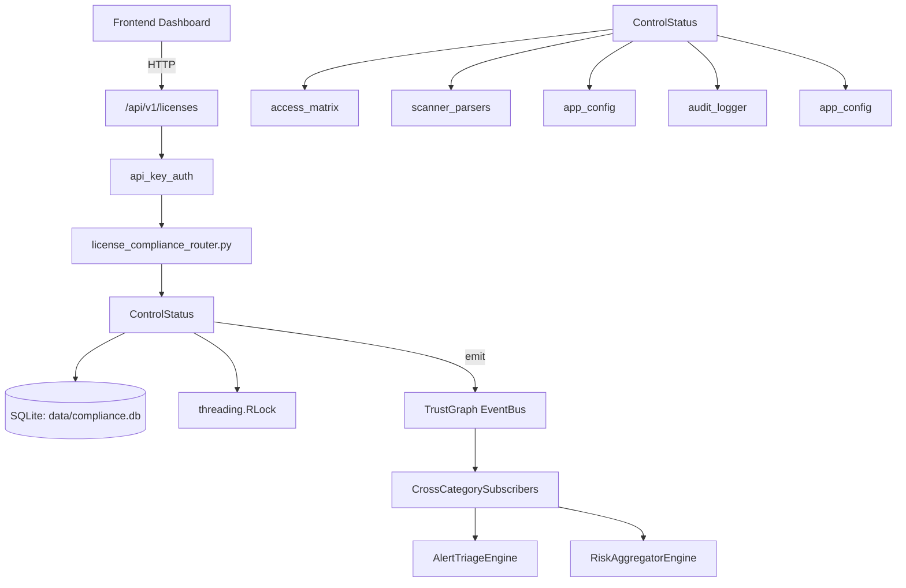

# US-0068: Compliance

## Sub-Epic: GRC
**Master Goal**: ALDECI — $35/mo enterprise security intelligence platform replacing $50K-500K/yr tools

## User Story
As a **Robert Kim (Compliance Officer)**, I need to automate compliance assessment and evidence
so that the platform delivers enterprise-grade grc capabilities at 1/1000th the cost of legacy tools.

## Why This Matters
Compliance replaces functionality found in enterprise tools like CrowdStrike, Wiz, Snyk, and Rapid7.
By building this into ALDECI's $35/mo stack, customers save $50K+/yr on standalone GRC tooling.

## Architecture

## Current State: 95% Complete
- ✅ `collect_evidence()` — Auto-collect evidence from ALDECI modules for a framework. (line 1230)
- ✅ `get_evidence()` — Return evidence items, optionally filtered by framework and/or control. (line 1311)
- ✅ `get_framework_status()` — Return detailed status for all controls in a framework. (line 1351)
- ✅ `get_overall_status()` — Return compliance status across all 7 frameworks. (line 1408)
- ✅ `get_gaps()` — Identify controls that are failing, not started, or stale. (line 1445)
- ✅ `get_cross_map()` — Return all cross-framework control mappings. (line 1502)
- ❌ TrustGraph event emission — not yet verified

## Key Functions (from `suite-core/core/compliance_engine.py` — 1822 lines)
- `ComplianceAutomationEngine.collect_evidence()` — Auto-collect evidence from ALDECI modules for a framework. (line 1230)
- `ComplianceAutomationEngine.get_evidence()` — Return evidence items, optionally filtered by framework and/or control. (line 1311)
- `ComplianceAutomationEngine.get_framework_status()` — Return detailed status for all controls in a framework. (line 1351)
- `ComplianceAutomationEngine.get_overall_status()` — Return compliance status across all 7 frameworks. (line 1408)
- `ComplianceAutomationEngine.get_gaps()` — Identify controls that are failing, not started, or stale. (line 1445)
- `ComplianceAutomationEngine.get_cross_map()` — Return all cross-framework control mappings. (line 1502)
- `ComplianceAutomationEngine.create_poam()` — Create a POA&M item for a failing control. (line 1542)
- `ComplianceAutomationEngine.update_poam_status()` — Update the status of a POA&M item. (line 1595)

## Dependencies
- **Depends on**: access_matrix, scanner_parsers, app_config, audit_logger, app_config
- **Depended by**: Routers, TrustGraph EventBus, CrossCategorySubscribers
- **TrustGraph**: Event emission wired via ResponseInterceptorMiddleware
- **Source file**: `suite-core/core/compliance_engine.py` (1822 lines)
- **Router file**: `suite-api/apps/api/license_compliance_router.py`

## API Endpoints
| Method | Path | Description |
|--------|------|-------------|
| GET | `/api/v1/licenses/lookup` | lookup license |
| GET | `/api/v1/licenses/list` | list licenses |
| POST | `/api/v1/licenses/compatibility` | check compatibility |
| GET | `/api/v1/licenses/policies` | list policies |
| POST | `/api/v1/licenses/policies` | create policy |
| DELETE | `/api/v1/licenses/policies/{policy_id}` | delete policy |
| POST | `/api/v1/licenses/audit` | audit sbom |
| POST | `/api/v1/licenses/obligations` | get obligations |
| POST | `/api/v1/licenses/risk-scores` | compute risk scores |
| POST | `/api/v1/licenses/dual-license` | detect dual licenses |

## Tasks Remaining
1. Verify TrustGraph event emission works end-to-end (2h)
2. Add integration test with real persona workflow (2h)
3. Wire CrossCategorySubscriber consumer chain (1h)
4. Validate with 30-persona walkthrough (1h)
5. Optimize query performance for large datasets (2h)
6. Expand test coverage to edge cases (2h)

## Definition of Done
- [ ] Robert Kim (Compliance Officer) can access /api/v1/licenses and get meaningful data
- [ ] All CRUD operations return correct HTTP status codes
- [ ] TrustGraph receives events from this engine
- [ ] 22+ tests passing in `tests/test_compliance_engine.py`
- [ ] 30-persona walkthrough includes this endpoint at 100%
- [ ] No hardcoded org_id — all queries are org-scoped

## Sprint: Wave 44 (est. April 20-22, 2026)

## Test Coverage
- **Test file**: `tests/test_compliance_engine.py`
- **Tests**: 22 tests
- **Status**: Passing
