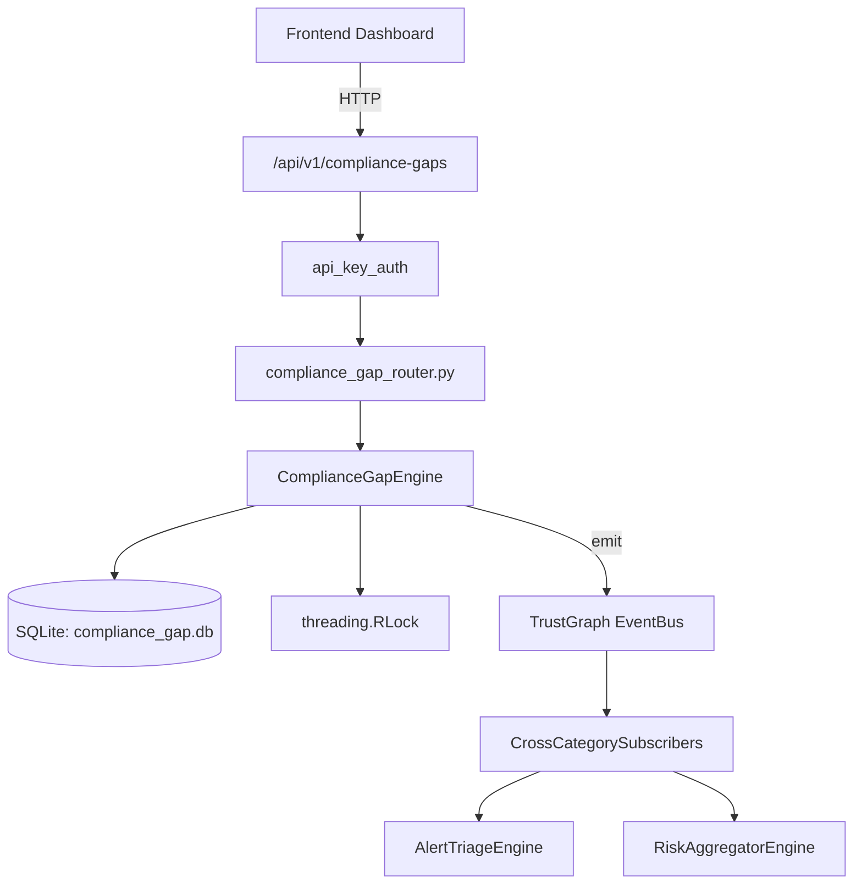

# US-0069: Compliance Gap

## Sub-Epic: GRC
**Master Goal**: ALDECI — $35/mo enterprise security intelligence platform replacing $50K-500K/yr tools

## User Story
As a **Robert Kim (Compliance Officer)**, I need to automate compliance assessment and evidence
so that the platform delivers enterprise-grade grc capabilities at 1/1000th the cost of legacy tools.

## Why This Matters
Compliance Gap replaces functionality found in enterprise tools like CrowdStrike, Wiz, Snyk, and Rapid7.
By building this into ALDECI's $35/mo stack, customers save $50K+/yr on standalone GRC tooling.

## Architecture

## Current State: 95% Complete
- ✅ `create_assessment()` — Create a new compliance gap assessment. (line 138)
- ✅ `list_assessments()` — List assessments with optional filters. (line 179)
- ✅ `get_assessment()` — Return a single assessment or None if not found / wrong org. (line 199)
- ✅ `complete_assessment()` — Mark an assessment as completed and recalculate compliance_pct. (line 210)
- ✅ `add_control_gap()` — Add a control gap to an assessment. (line 242)
- ✅ `update_gap_status()` — Update the status of a control gap. (line 318)
- ❌ TrustGraph event emission — not yet verified

## Key Functions (from `suite-core/core/compliance_gap_engine.py` — 527 lines)
- `ComplianceGapEngine.create_assessment()` — Create a new compliance gap assessment. (line 138)
- `ComplianceGapEngine.list_assessments()` — List assessments with optional filters. (line 179)
- `ComplianceGapEngine.get_assessment()` — Return a single assessment or None if not found / wrong org. (line 199)
- `ComplianceGapEngine.complete_assessment()` — Mark an assessment as completed and recalculate compliance_pct. (line 210)
- `ComplianceGapEngine.add_control_gap()` — Add a control gap to an assessment. (line 242)
- `ComplianceGapEngine.update_gap_status()` — Update the status of a control gap. (line 318)
- `ComplianceGapEngine.list_gaps()` — List control gaps with optional filters. (line 374)
- `ComplianceGapEngine.create_remediation_plan()` — Create a remediation plan for a control gap. (line 402)

## Dependencies
- **Depends on**: standalone
- **Depended by**: Routers, TrustGraph EventBus, CrossCategorySubscribers
- **TrustGraph**: Event emission wired via ResponseInterceptorMiddleware
- **Source file**: `suite-core/core/compliance_gap_engine.py` (527 lines)
- **Router file**: `suite-api/apps/api/compliance_gap_router.py`

## API Endpoints
| Method | Path | Description |
|--------|------|-------------|
| POST | `/api/v1/compliance-gaps/assessments` | create assessment |
| GET | `/api/v1/compliance-gaps/assessments` | list assessments |
| GET | `/api/v1/compliance-gaps/assessments/{assessment_id}` | get assessment |
| PUT | `/api/v1/compliance-gaps/assessments/{assessment_id}/complete` | complete assessment |
| POST | `/api/v1/compliance-gaps/gaps` | add control gap |
| GET | `/api/v1/compliance-gaps/gaps` | list gaps |
| PUT | `/api/v1/compliance-gaps/gaps/{gap_id}/status` | update gap status |
| PUT | `/api/v1/compliance-gaps/remediation-plans/{plan_id}/status` | update plan status |
| POST | `/api/v1/compliance-gaps/remediation-plans` | create remediation plan |
| GET | `/api/v1/compliance-gaps/stats` | get gap stats |

## Tasks Remaining
1. Verify TrustGraph event emission works end-to-end (2h)
2. Add integration test with real persona workflow (2h)
3. Wire CrossCategorySubscriber consumer chain (1h)
4. Validate with 30-persona walkthrough (1h)
5. Optimize query performance for large datasets (2h)
6. Expand test coverage to edge cases (2h)

## Definition of Done
- [ ] Robert Kim (Compliance Officer) can access /api/v1/compliance-gaps and get meaningful data
- [ ] All CRUD operations return correct HTTP status codes
- [ ] TrustGraph receives events from this engine
- [ ] 41+ tests passing in `tests/test_compliance_gap_engine.py`
- [ ] 30-persona walkthrough includes this endpoint at 100%
- [ ] No hardcoded org_id — all queries are org-scoped

## Sprint: Wave 44 (est. April 20-22, 2026)

## Test Coverage
- **Test file**: `tests/test_compliance_gap_engine.py`
- **Tests**: 41 tests
- **Status**: Passing
