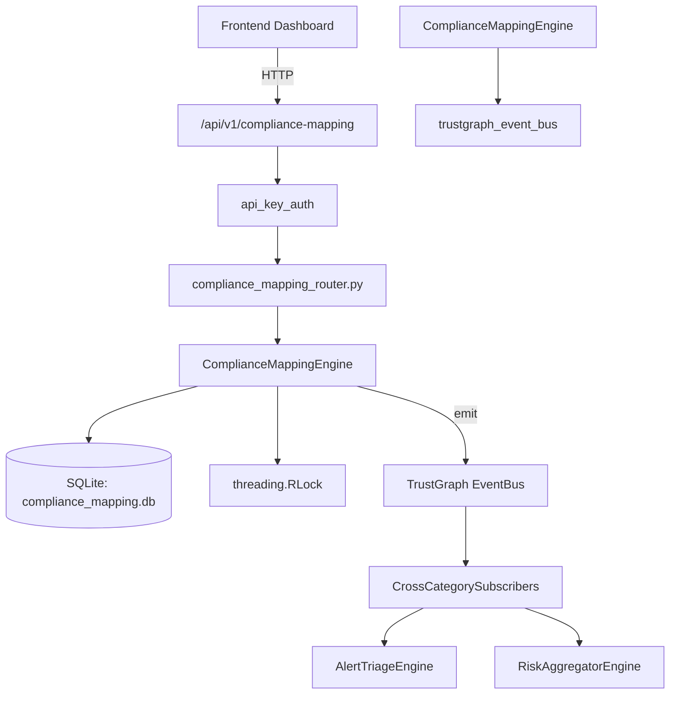

# US-0070: Compliance Mapping

## Sub-Epic: GRC
**Master Goal**: ALDECI — $35/mo enterprise security intelligence platform replacing $50K-500K/yr tools

## User Story
As a **Robert Kim (Compliance Officer)**, I need to automate compliance assessment and evidence
so that the platform delivers enterprise-grade grc capabilities at 1/1000th the cost of legacy tools.

## Why This Matters
Compliance Mapping replaces functionality found in enterprise tools like CrowdStrike, Wiz, Snyk, and Rapid7.
By building this into ALDECI's $35/mo stack, customers save $50K+/yr on standalone GRC tooling.

## Architecture

## Current State: 95% Complete
- ✅ `add_control()` — Add a compliance control. (line 121)
- ✅ `list_controls()` — List compliance controls with optional filters. (line 193)
- ✅ `get_control()` — Get a single control by its primary-key id column. (line 216)
- ✅ `update_control_status()` — Update control_status (and optionally implementation_notes). (line 225)
- ✅ `add_mapping()` — Add a cross-framework control mapping. (line 281)
- ✅ `list_mappings()` — List mappings with optional framework filters. (line 346)
- ❌ TrustGraph event emission — not yet verified

## Key Functions (from `suite-core/core/compliance_mapping_engine.py` — 572 lines)
- `ComplianceMappingEngine.add_control()` — Add a compliance control. (line 121)
- `ComplianceMappingEngine.list_controls()` — List compliance controls with optional filters. (line 193)
- `ComplianceMappingEngine.get_control()` — Get a single control by its primary-key id column. (line 216)
- `ComplianceMappingEngine.update_control_status()` — Update control_status (and optionally implementation_notes). (line 225)
- `ComplianceMappingEngine.add_mapping()` — Add a cross-framework control mapping. (line 281)
- `ComplianceMappingEngine.list_mappings()` — List mappings with optional framework filters. (line 346)
- `ComplianceMappingEngine.add_evidence()` — Add evidence for a control; increments evidence_count on the control. (line 373)
- `ComplianceMappingEngine.list_evidence()` — List evidence records; optionally filter by control primary-key id. (line 428)

## Dependencies
- **Depends on**: trustgraph_event_bus
- **Depended by**: Routers, TrustGraph EventBus, CrossCategorySubscribers
- **TrustGraph**: Event emission wired via ResponseInterceptorMiddleware
- **Source file**: `suite-core/core/compliance_mapping_engine.py` (572 lines)
- **Router file**: `suite-api/apps/api/compliance_mapping_router.py`

## API Endpoints
| Method | Path | Description |
|--------|------|-------------|
| POST | `/api/v1/compliance-mapping/controls` | add control |
| GET | `/api/v1/compliance-mapping/controls` | list controls |
| GET | `/api/v1/compliance-mapping/controls/{control_id}` | get control |
| PATCH | `/api/v1/compliance-mapping/controls/{control_id}/status` | update control status |
| POST | `/api/v1/compliance-mapping/mappings` | add mapping |
| GET | `/api/v1/compliance-mapping/mappings` | list mappings |
| POST | `/api/v1/compliance-mapping/controls/{control_id}/evidence` | add evidence |
| GET | `/api/v1/compliance-mapping/evidence` | list evidence |
| GET | `/api/v1/compliance-mapping/stats` | get stats |
| GET | `/api/v1/compliance-mapping/controls/{control_id}/context` | get control context |

## Tasks Remaining
1. Verify TrustGraph event emission works end-to-end (2h)
2. Add integration test with real persona workflow (2h)
3. Wire CrossCategorySubscriber consumer chain (1h)
4. Validate with 30-persona walkthrough (1h)
5. Optimize query performance for large datasets (2h)
6. Expand test coverage to edge cases (2h)

## Definition of Done
- [ ] Robert Kim (Compliance Officer) can access /api/v1/compliance-mapping and get meaningful data
- [ ] All CRUD operations return correct HTTP status codes
- [ ] TrustGraph receives events from this engine
- [ ] 47+ tests passing in `tests/test_compliance_mapping_engine.py`
- [ ] 30-persona walkthrough includes this endpoint at 100%
- [ ] No hardcoded org_id — all queries are org-scoped

## Sprint: Wave 44 (est. April 20-22, 2026)

## Test Coverage
- **Test file**: `tests/test_compliance_mapping_engine.py`
- **Tests**: 47 tests
- **Status**: Passing
