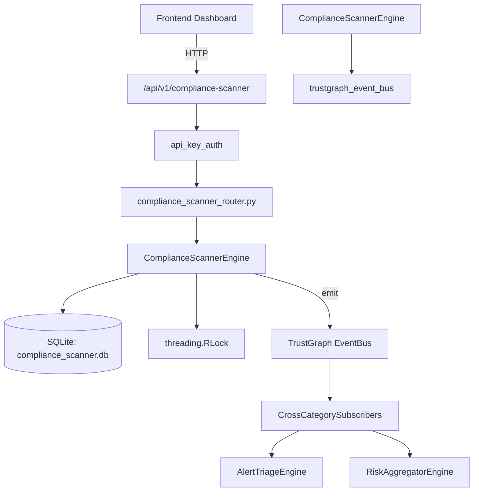

# US-0071: Compliance Scanner

## Sub-Epic: GRC
**Master Goal**: ALDECI — $35/mo enterprise security intelligence platform replacing $50K-500K/yr tools

## User Story
As a **Robert Kim (Compliance Officer)**, I need to automate compliance assessment and evidence
so that the platform delivers enterprise-grade grc capabilities at 1/1000th the cost of legacy tools.

## Why This Matters
Compliance Scanner replaces functionality found in enterprise tools like CrowdStrike, Wiz, Snyk, and Rapid7.
By building this into ALDECI's $35/mo stack, customers save $50K+/yr on standalone GRC tooling.

## Architecture

## Current State: 95% Complete
- ✅ `create_profile()` — Create a new scan profile for an org. (line 246)
- ✅ `list_profiles()` — List all scan profiles for an org. (line 301)
- ✅ `get_profile()` — Fetch a single scan profile, scoped to org. (line 310)
- ✅ `start_scan()` — Run a compliance scan for a profile. Returns the completed scan result. (line 325)
- ✅ `get_scan_result()` — Fetch a single scan result, scoped to org. (line 465)
- ✅ `list_scan_results()` — List scan results for an org, most recent first. (line 474)
- ❌ TrustGraph event emission — not yet verified

## Key Functions (from `suite-core/core/compliance_scanner_engine.py` — 674 lines)
- `ComplianceScannerEngine.create_profile()` — Create a new scan profile for an org. (line 246)
- `ComplianceScannerEngine.list_profiles()` — List all scan profiles for an org. (line 301)
- `ComplianceScannerEngine.get_profile()` — Fetch a single scan profile, scoped to org. (line 310)
- `ComplianceScannerEngine.start_scan()` — Run a compliance scan for a profile. Returns the completed scan result. (line 325)
- `ComplianceScannerEngine.get_scan_result()` — Fetch a single scan result, scoped to org. (line 465)
- `ComplianceScannerEngine.list_scan_results()` — List scan results for an org, most recent first. (line 474)
- `ComplianceScannerEngine.list_checks()` — List compliance checks for a scan result, with optional filters. (line 497)
- `ComplianceScannerEngine.create_remediation_task()` — Create a remediation task linked to a compliance check. (line 523)

## Dependencies
- **Depends on**: trustgraph_event_bus
- **Depended by**: Routers, TrustGraph EventBus, CrossCategorySubscribers
- **TrustGraph**: Event emission wired via ResponseInterceptorMiddleware
- **Source file**: `suite-core/core/compliance_scanner_engine.py` (674 lines)
- **Router file**: `suite-api/apps/api/compliance_scanner_router.py`

## API Endpoints
| Method | Path | Description |
|--------|------|-------------|
| POST | `/api/v1/compliance-scanner/profiles` | create profile |
| GET | `/api/v1/compliance-scanner/profiles` | list profiles |
| GET | `/api/v1/compliance-scanner/profiles/{profile_id}` | get profile |
| POST | `/api/v1/compliance-scanner/profiles/{profile_id}/scan` | start scan |
| GET | `/api/v1/compliance-scanner/results` | list scan results |
| GET | `/api/v1/compliance-scanner/results/{result_id}` | get scan result |
| GET | `/api/v1/compliance-scanner/results/{result_id}/checks` | list checks |
| POST | `/api/v1/compliance-scanner/checks/{check_id}/tasks` | create remediation task |
| GET | `/api/v1/compliance-scanner/tasks` | list remediation tasks |
| PATCH | `/api/v1/compliance-scanner/tasks/{task_id}/status` | update task status |
| GET | `/api/v1/compliance-scanner/stats` | get compliance stats |

## Tasks Remaining
1. Verify TrustGraph event emission works end-to-end (2h)
2. Add integration test with real persona workflow (2h)
3. Wire CrossCategorySubscriber consumer chain (1h)
4. Validate with 30-persona walkthrough (1h)
5. Optimize query performance for large datasets (2h)
6. Expand test coverage to edge cases (2h)

## Definition of Done
- [ ] Robert Kim (Compliance Officer) can access /api/v1/compliance-scanner and get meaningful data
- [ ] All CRUD operations return correct HTTP status codes
- [ ] TrustGraph receives events from this engine
- [ ] 58+ tests passing in `tests/test_compliance_scanner_engine.py`
- [ ] 30-persona walkthrough includes this endpoint at 100%
- [ ] No hardcoded org_id — all queries are org-scoped

## Sprint: Wave 44 (est. April 20-22, 2026)

## Test Coverage
- **Test file**: `tests/test_compliance_scanner_engine.py`
- **Tests**: 58 tests
- **Status**: Passing
