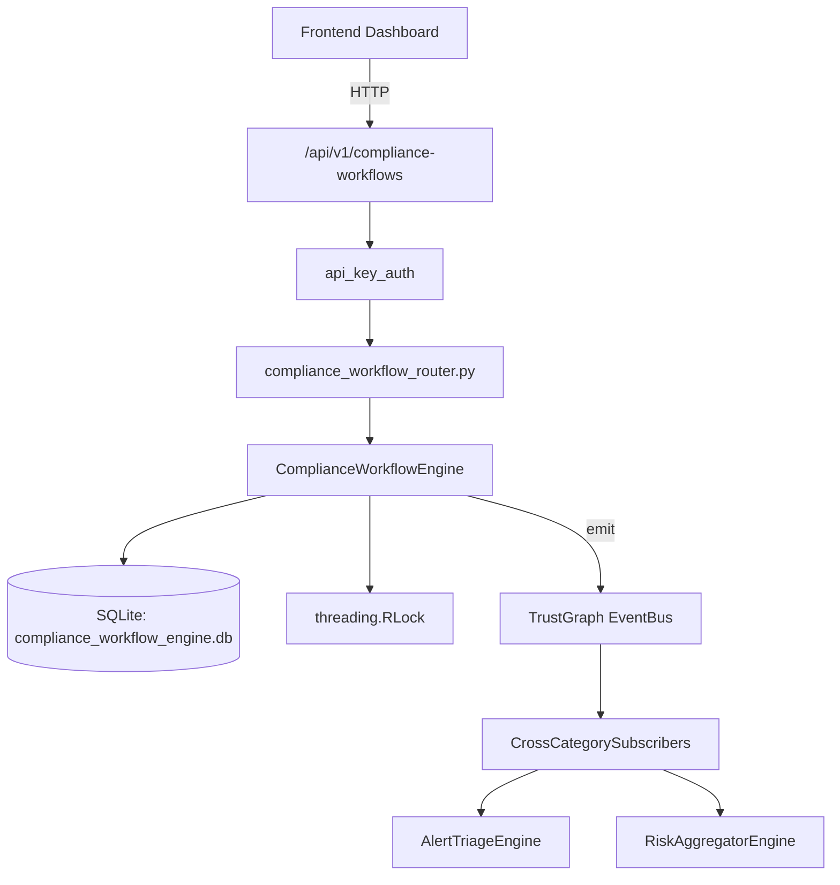

# US-0072: Compliance Workflow

## Sub-Epic: GRC
**Master Goal**: ALDECI — $35/mo enterprise security intelligence platform replacing $50K-500K/yr tools

## User Story
As a **Robert Kim (Compliance Officer)**, I need to automate compliance assessment and evidence
so that the platform delivers enterprise-grade grc capabilities at 1/1000th the cost of legacy tools.

## Why This Matters
Compliance Workflow replaces functionality found in enterprise tools like CrowdStrike, Wiz, Snyk, and Rapid7.
By building this into ALDECI's $35/mo stack, customers save $50K+/yr on standalone GRC tooling.

## Architecture

## Current State: 95% Complete
- ✅ `create_workflow()` — Create a new compliance workflow. (line 131)
- ✅ `add_task()` — Add a task to a workflow. (line 172)
- ✅ `complete_task()` — Mark a task completed; recompute workflow completion_rate; auto-transition workf (line 218)
- ✅ `submit_approval()` — Submit an approval decision; update workflow status accordingly. (line 279)
- ✅ `get_workflow()` — Get a workflow with its tasks and approvals. (line 319)
- ✅ `list_workflows()` — List workflows with optional framework and status filters. (line 344)
- ❌ TrustGraph event emission — not yet verified

## Key Functions (from `suite-core/core/compliance_workflow_engine.py` — 424 lines)
- `ComplianceWorkflowEngine.create_workflow()` — Create a new compliance workflow. (line 131)
- `ComplianceWorkflowEngine.add_task()` — Add a task to a workflow. (line 172)
- `ComplianceWorkflowEngine.complete_task()` — Mark a task completed; recompute workflow completion_rate; auto-transition workf (line 218)
- `ComplianceWorkflowEngine.submit_approval()` — Submit an approval decision; update workflow status accordingly. (line 279)
- `ComplianceWorkflowEngine.get_workflow()` — Get a workflow with its tasks and approvals. (line 319)
- `ComplianceWorkflowEngine.list_workflows()` — List workflows with optional framework and status filters. (line 344)
- `ComplianceWorkflowEngine.get_overdue_tasks()` — Return tasks past their due_date that are not completed. (line 364)
- `ComplianceWorkflowEngine.get_framework_readiness()` — Return avg completion_rate and workflow counts for a framework. (line 376)

## Dependencies
- **Depends on**: standalone
- **Depended by**: Routers, TrustGraph EventBus, CrossCategorySubscribers
- **TrustGraph**: Event emission wired via ResponseInterceptorMiddleware
- **Source file**: `suite-core/core/compliance_workflow_engine.py` (424 lines)
- **Router file**: `suite-api/apps/api/compliance_workflow_router.py`

## API Endpoints
| Method | Path | Description |
|--------|------|-------------|
| POST | `/api/v1/compliance-workflows/workflows` | create workflow |
| GET | `/api/v1/compliance-workflows/workflows` | list workflows |
| GET | `/api/v1/compliance-workflows/workflows/{workflow_id}` | get workflow |
| POST | `/api/v1/compliance-workflows/workflows/{workflow_id}/tasks` | add task |
| POST | `/api/v1/compliance-workflows/workflows/{workflow_id}/tasks/{task_id}/complete` | complete task |
| POST | `/api/v1/compliance-workflows/workflows/{workflow_id}/approvals` | submit approval |
| GET | `/api/v1/compliance-workflows/overdue-tasks` | get overdue tasks |
| GET | `/api/v1/compliance-workflows/framework/{framework}/readiness` | get framework readiness |
| GET | `/api/v1/compliance-workflows/summary` | get workflow summary |

## Tasks Remaining
1. Verify TrustGraph event emission works end-to-end (2h)
2. Add integration test with real persona workflow (2h)
3. Wire CrossCategorySubscriber consumer chain (1h)
4. Validate with 30-persona walkthrough (1h)
5. Optimize query performance for large datasets (2h)
6. Expand test coverage to edge cases (2h)

## Definition of Done
- [ ] Robert Kim (Compliance Officer) can access /api/v1/compliance-workflows and get meaningful data
- [ ] All CRUD operations return correct HTTP status codes
- [ ] TrustGraph receives events from this engine
- [ ] 36+ tests passing in `tests/test_compliance_workflow_engine.py`
- [ ] 30-persona walkthrough includes this endpoint at 100%
- [ ] No hardcoded org_id — all queries are org-scoped

## Sprint: Wave 44 (est. April 20-22, 2026)

## Test Coverage
- **Test file**: `tests/test_compliance_workflow_engine.py`
- **Tests**: 36 tests
- **Status**: Passing
