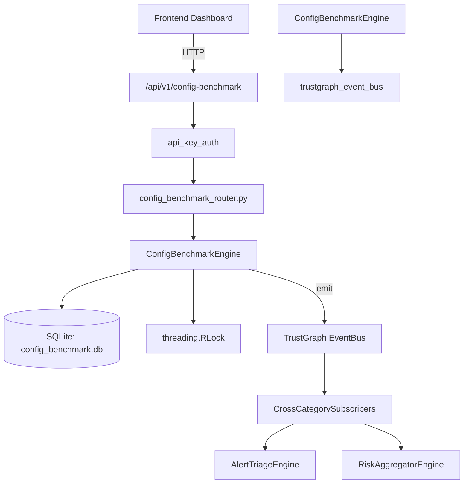

# US-0073: Config Benchmark

## Sub-Epic: Advanced
**Master Goal**: ALDECI — $35/mo enterprise security intelligence platform replacing $50K-500K/yr tools

## User Story
As a **James Wilson (Security Engineer)**, I need to benchmark configurations against CIS/STIG
so that the platform delivers enterprise-grade advanced capabilities at 1/1000th the cost of legacy tools.

## Why This Matters
Config Benchmark replaces functionality found in enterprise tools like CrowdStrike, Wiz, Snyk, and Rapid7.
By building this into ALDECI's $35/mo stack, customers save $50K+/yr on standalone Advanced tooling.

## Architecture

## Current State: 95% Complete
- ✅ `create_profile()` — Create a new benchmark profile. (line 145)
- ✅ `list_profiles()` — List profiles for an org, optionally filtered by standard. (line 192)
- ✅ `add_check()` — Add a benchmark check to a profile. (line 212)
- ✅ `list_checks()` — List checks for a profile, optionally filtered by severity. (line 252)
- ✅ `run_assessment()` — Run a mock assessment against a profile (~65% pass rate). (line 274)
- ✅ `get_assessment()` — Return assessment with embedded check_results. (line 377)
- ❌ TrustGraph event emission — not yet verified

## Key Functions (from `suite-core/core/config_benchmark_engine.py` — 495 lines)
- `ConfigBenchmarkEngine.create_profile()` — Create a new benchmark profile. (line 145)
- `ConfigBenchmarkEngine.list_profiles()` — List profiles for an org, optionally filtered by standard. (line 192)
- `ConfigBenchmarkEngine.add_check()` — Add a benchmark check to a profile. (line 212)
- `ConfigBenchmarkEngine.list_checks()` — List checks for a profile, optionally filtered by severity. (line 252)
- `ConfigBenchmarkEngine.run_assessment()` — Run a mock assessment against a profile (~65% pass rate). (line 274)
- `ConfigBenchmarkEngine.get_assessment()` — Return assessment with embedded check_results. (line 377)
- `ConfigBenchmarkEngine.list_assessments()` — List assessments, optionally filtered by profile. (line 395)
- `ConfigBenchmarkEngine.get_failed_checks()` — Return failed check_results with check details joined. (line 411)

## Dependencies
- **Depends on**: trustgraph_event_bus
- **Depended by**: Routers, TrustGraph EventBus, CrossCategorySubscribers
- **TrustGraph**: Event emission wired via ResponseInterceptorMiddleware
- **Source file**: `suite-core/core/config_benchmark_engine.py` (495 lines)
- **Router file**: `suite-api/apps/api/config_benchmark_router.py`

## API Endpoints
| Method | Path | Description |
|--------|------|-------------|
| POST | `/api/v1/config-benchmark/profiles` | create profile |
| GET | `/api/v1/config-benchmark/profiles` | list profiles |
| POST | `/api/v1/config-benchmark/profiles/{profile_id}/checks` | add check |
| GET | `/api/v1/config-benchmark/profiles/{profile_id}/checks` | list checks |
| POST | `/api/v1/config-benchmark/profiles/{profile_id}/assess` | run assessment |
| GET | `/api/v1/config-benchmark/assessments` | list assessments |
| GET | `/api/v1/config-benchmark/assessments/{result_id}` | get assessment |
| GET | `/api/v1/config-benchmark/assessments/{result_id}/failures` | get failed checks |
| GET | `/api/v1/config-benchmark/stats` | get benchmark stats |

## Tasks Remaining
1. Verify TrustGraph event emission works end-to-end (2h)
2. Add integration test with real persona workflow (2h)
3. Wire CrossCategorySubscriber consumer chain (1h)
4. Validate with 30-persona walkthrough (1h)
5. Optimize query performance for large datasets (2h)
6. Expand test coverage to edge cases (2h)

## Definition of Done
- [ ] James Wilson (Security Engineer) can access /api/v1/config-benchmark and get meaningful data
- [ ] All CRUD operations return correct HTTP status codes
- [ ] TrustGraph receives events from this engine
- [ ] 26+ tests passing in `tests/test_config_benchmark_engine.py`
- [ ] 30-persona walkthrough includes this endpoint at 100%
- [ ] No hardcoded org_id — all queries are org-scoped

## Sprint: Wave 44 (est. April 20-22, 2026)

## Test Coverage
- **Test file**: `tests/test_config_benchmark_engine.py`
- **Tests**: 26 tests
- **Status**: Passing
