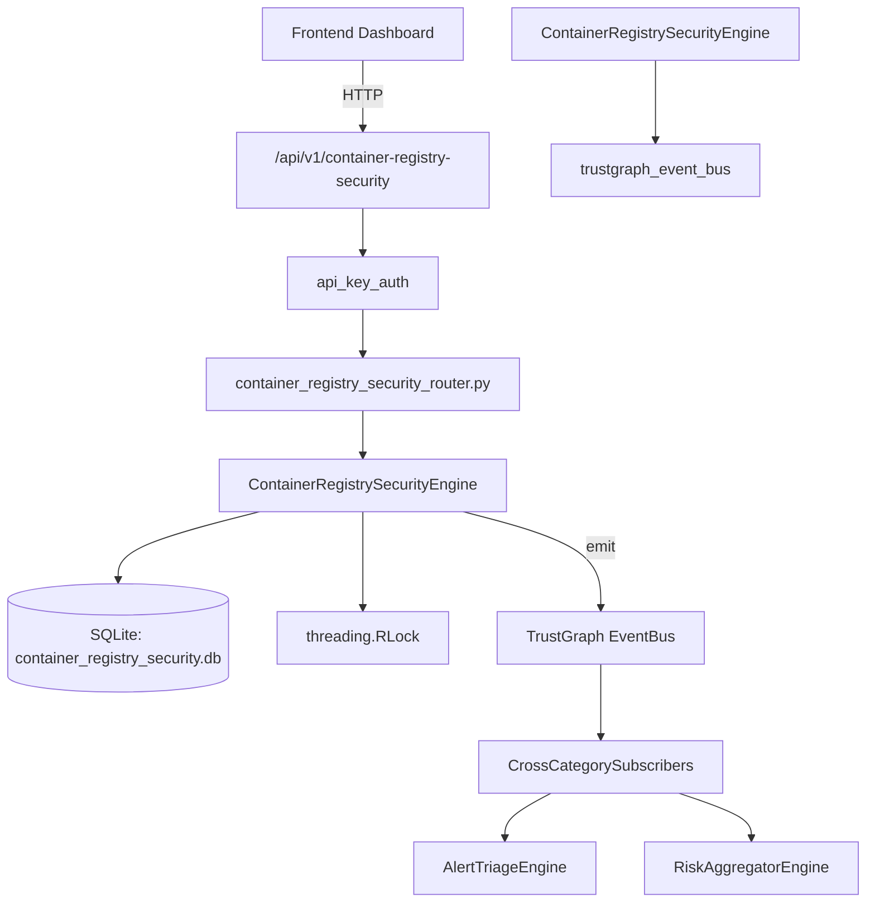

# US-0074: Container Registry Security

## Sub-Epic: CSPM
**Master Goal**: ALDECI — $35/mo enterprise security intelligence platform replacing $50K-500K/yr tools

## User Story
As a **Jennifer Wu (Cloud Security Architect)**, I need to secure container registries and runtimes
so that the platform delivers enterprise-grade cspm capabilities at 1/1000th the cost of legacy tools.

## Why This Matters
Container Registry Security replaces functionality found in enterprise tools like CrowdStrike, Wiz, Snyk, and Rapid7.
By building this into ALDECI's $35/mo stack, customers save $50K+/yr on standalone CSPM tooling.

## Architecture

## Current State: 95% Complete
- ✅ `register_registry()` — Register a new container registry. (line 142)
- ✅ `list_registries()` — List all registries for an org. (line 182)
- ✅ `get_registry()` — Retrieve a single registry by ID. (line 191)
- ✅ `scan_image()` — Record an image vulnerability scan result. (line 204)
- ✅ `list_image_scans()` — List image scans, optionally filtered by registry or minimum severity. (line 275)
- ✅ `get_scan()` — Retrieve a single image scan by ID. (line 300)
- ❌ TrustGraph event emission — not yet verified

## Key Functions (from `suite-core/core/container_registry_security_engine.py` — 448 lines)
- `ContainerRegistrySecurityEngine.register_registry()` — Register a new container registry. (line 142)
- `ContainerRegistrySecurityEngine.list_registries()` — List all registries for an org. (line 182)
- `ContainerRegistrySecurityEngine.get_registry()` — Retrieve a single registry by ID. (line 191)
- `ContainerRegistrySecurityEngine.scan_image()` — Record an image vulnerability scan result. (line 204)
- `ContainerRegistrySecurityEngine.list_image_scans()` — List image scans, optionally filtered by registry or minimum severity. (line 275)
- `ContainerRegistrySecurityEngine.get_scan()` — Retrieve a single image scan by ID. (line 300)
- `ContainerRegistrySecurityEngine.create_policy()` — Create an image admission policy. (line 313)
- `ContainerRegistrySecurityEngine.list_policies()` — List all policies for an org. (line 340)

## Dependencies
- **Depends on**: trustgraph_event_bus
- **Depended by**: Routers, TrustGraph EventBus, CrossCategorySubscribers
- **TrustGraph**: Event emission wired via ResponseInterceptorMiddleware
- **Source file**: `suite-core/core/container_registry_security_engine.py` (448 lines)
- **Router file**: `suite-api/apps/api/container_registry_security_router.py`

## API Endpoints
| Method | Path | Description |
|--------|------|-------------|
| POST | `/api/v1/container-registry-security/registries` | register registry |
| GET | `/api/v1/container-registry-security/registries` | list registries |
| GET | `/api/v1/container-registry-security/registries/{registry_id}` | get registry |
| POST | `/api/v1/container-registry-security/scans` | scan image |
| GET | `/api/v1/container-registry-security/scans` | list image scans |
| GET | `/api/v1/container-registry-security/scans/{scan_id}` | get scan |
| POST | `/api/v1/container-registry-security/policies` | create policy |
| GET | `/api/v1/container-registry-security/policies` | list policies |
| POST | `/api/v1/container-registry-security/scans/{scan_id}/evaluate` | evaluate image |
| GET | `/api/v1/container-registry-security/stats` | get registry stats |

## Tasks Remaining
1. Verify TrustGraph event emission works end-to-end (2h)
2. Add integration test with real persona workflow (2h)
3. Wire CrossCategorySubscriber consumer chain (1h)
4. Validate with 30-persona walkthrough (1h)
5. Optimize query performance for large datasets (2h)
6. Expand test coverage to edge cases (2h)

## Definition of Done
- [ ] Jennifer Wu (Cloud Security Architect) can access /api/v1/container-registry-security and get meaningful data
- [ ] All CRUD operations return correct HTTP status codes
- [ ] TrustGraph receives events from this engine
- [ ] 33+ tests passing in `tests/test_container_registry_security_engine.py`
- [ ] 30-persona walkthrough includes this endpoint at 100%
- [ ] No hardcoded org_id — all queries are org-scoped

## Sprint: Wave 44 (est. April 20-22, 2026)

## Test Coverage
- **Test file**: `tests/test_container_registry_security_engine.py`
- **Tests**: 33 tests
- **Status**: Passing
