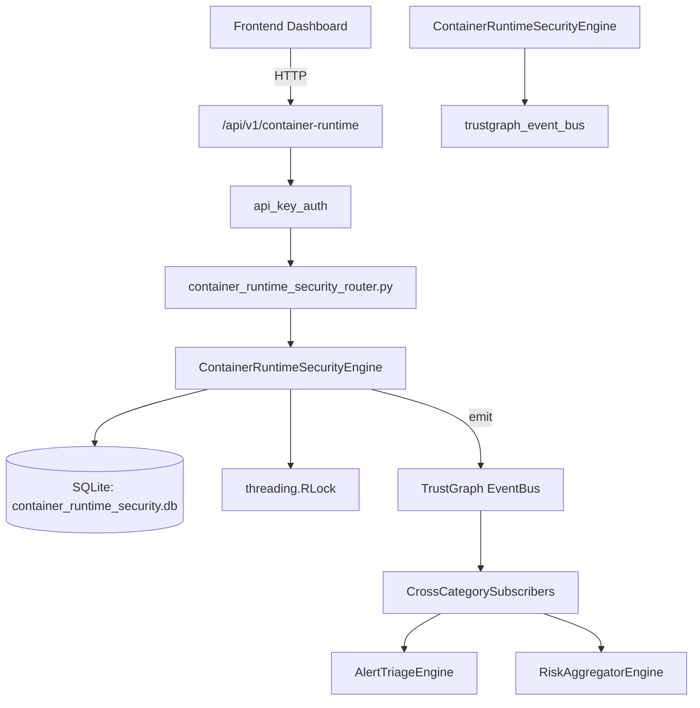

# US-0075: Container Runtime Security

## Sub-Epic: CSPM
**Master Goal**: ALDECI — $35/mo enterprise security intelligence platform replacing $50K-500K/yr tools

## User Story
As a **Jennifer Wu (Cloud Security Architect)**, I need to secure container registries and runtimes
so that the platform delivers enterprise-grade cspm capabilities at 1/1000th the cost of legacy tools.

## Why This Matters
Container Runtime Security replaces functionality found in enterprise tools like CrowdStrike, Wiz, Snyk, and Rapid7.
By building this into ALDECI's $35/mo stack, customers save $50K+/yr on standalone CSPM tooling.

## Architecture

## Current State: 95% Complete
- ✅ `register_container()` — Register a container instance. (line 145)
- ✅ `list_containers()` — List container instances with optional filters. (line 201)
- ✅ `get_container()` — Get a container by its container_id field (not UUID). Returns None if not found  (line 221)
- ✅ `update_container_status()` — Update runtime_status and last_seen for a container. (line 230)
- ✅ `record_runtime_event()` — Record a runtime security event and decrement container security_score. (line 259)
- ✅ `list_events()` — List runtime events with optional filters. (line 317)
- ❌ TrustGraph event emission — not yet verified

## Key Functions (from `suite-core/core/container_runtime_security_engine.py` — 474 lines)
- `ContainerRuntimeSecurityEngine.register_container()` — Register a container instance. (line 145)
- `ContainerRuntimeSecurityEngine.list_containers()` — List container instances with optional filters. (line 201)
- `ContainerRuntimeSecurityEngine.get_container()` — Get a container by its container_id field (not UUID). Returns None if not found  (line 221)
- `ContainerRuntimeSecurityEngine.update_container_status()` — Update runtime_status and last_seen for a container. (line 230)
- `ContainerRuntimeSecurityEngine.record_runtime_event()` — Record a runtime security event and decrement container security_score. (line 259)
- `ContainerRuntimeSecurityEngine.list_events()` — List runtime events with optional filters. (line 317)
- `ContainerRuntimeSecurityEngine.update_event_status()` — Update the status of a runtime event. (line 341)
- `ContainerRuntimeSecurityEngine.create_policy()` — Create a runtime security policy. (line 366)

## Dependencies
- **Depends on**: trustgraph_event_bus
- **Depended by**: Routers, TrustGraph EventBus, CrossCategorySubscribers
- **TrustGraph**: Event emission wired via ResponseInterceptorMiddleware
- **Source file**: `suite-core/core/container_runtime_security_engine.py` (474 lines)
- **Router file**: `suite-api/apps/api/container_runtime_security_router.py`

## API Endpoints
| Method | Path | Description |
|--------|------|-------------|
| POST | `/api/v1/container-runtime/containers` | register container |
| GET | `/api/v1/container-runtime/containers` | list containers |
| GET | `/api/v1/container-runtime/containers/{container_id}` | get container |
| PUT | `/api/v1/container-runtime/containers/{container_id}/status` | update container status |
| POST | `/api/v1/container-runtime/events` | record runtime event |
| GET | `/api/v1/container-runtime/events` | list events |
| PUT | `/api/v1/container-runtime/events/{event_id}/status` | update event status |
| POST | `/api/v1/container-runtime/policies` | create policy |
| GET | `/api/v1/container-runtime/policies` | list policies |
| GET | `/api/v1/container-runtime/stats` | get runtime stats |

## Tasks Remaining
1. Verify TrustGraph event emission works end-to-end (2h)
2. Add integration test with real persona workflow (2h)
3. Wire CrossCategorySubscriber consumer chain (1h)
4. Validate with 30-persona walkthrough (1h)
5. Optimize query performance for large datasets (2h)
6. Expand test coverage to edge cases (2h)

## Definition of Done
- [ ] Jennifer Wu (Cloud Security Architect) can access /api/v1/container-runtime and get meaningful data
- [ ] All CRUD operations return correct HTTP status codes
- [ ] TrustGraph receives events from this engine
- [ ] 50+ tests passing in `tests/test_container_runtime_security_engine.py`
- [ ] 30-persona walkthrough includes this endpoint at 100%
- [ ] No hardcoded org_id — all queries are org-scoped

## Sprint: Wave 44 (est. April 20-22, 2026)

## Test Coverage
- **Test file**: `tests/test_container_runtime_security_engine.py`
- **Tests**: 50 tests
- **Status**: Passing
