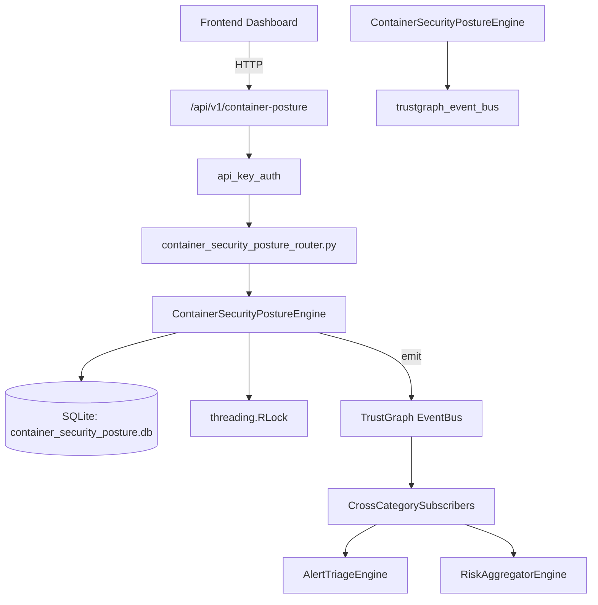

# US-0076: Container Security Posture

## Sub-Epic: CSPM
**Master Goal**: ALDECI — $35/mo enterprise security intelligence platform replacing $50K-500K/yr tools

## User Story
As a **Jennifer Wu (Cloud Security Architect)**, I need to secure container registries and runtimes
so that the platform delivers enterprise-grade cspm capabilities at 1/1000th the cost of legacy tools.

## Why This Matters
Container Security Posture replaces functionality found in enterprise tools like CrowdStrike, Wiz, Snyk, and Rapid7.
By building this into ALDECI's $35/mo stack, customers save $50K+/yr on standalone CSPM tooling.

## Architecture

## Current State: 95% Complete
- ✅ `register_cluster()` — Register a new cluster. (line 135)
- ✅ `list_clusters()` — List clusters with optional runtime filter. (line 187)
- ✅ `get_cluster()` — Return a single cluster or None. (line 204)
- ✅ `record_finding()` — Record a security finding and decrement cluster posture score. (line 217)
- ✅ `list_findings()` — List findings with optional filters. (line 286)
- ✅ `resolve_finding()` — Resolve a finding and restore posture score. (line 315)
- ❌ TrustGraph event emission — not yet verified

## Key Functions (from `suite-core/core/container_security_posture_engine.py` — 420 lines)
- `ContainerSecurityPostureEngine.register_cluster()` — Register a new cluster. (line 135)
- `ContainerSecurityPostureEngine.list_clusters()` — List clusters with optional runtime filter. (line 187)
- `ContainerSecurityPostureEngine.get_cluster()` — Return a single cluster or None. (line 204)
- `ContainerSecurityPostureEngine.record_finding()` — Record a security finding and decrement cluster posture score. (line 217)
- `ContainerSecurityPostureEngine.list_findings()` — List findings with optional filters. (line 286)
- `ContainerSecurityPostureEngine.resolve_finding()` — Resolve a finding and restore posture score. (line 315)
- `ContainerSecurityPostureEngine.get_posture_stats()` — Return aggregated container posture statistics. (line 370)

## Dependencies
- **Depends on**: trustgraph_event_bus
- **Depended by**: Routers, TrustGraph EventBus, CrossCategorySubscribers
- **TrustGraph**: Event emission wired via ResponseInterceptorMiddleware
- **Source file**: `suite-core/core/container_security_posture_engine.py` (420 lines)
- **Router file**: `suite-api/apps/api/container_security_posture_router.py`

## API Endpoints
| Method | Path | Description |
|--------|------|-------------|
| POST | `/api/v1/container-posture/clusters` | register cluster |
| GET | `/api/v1/container-posture/clusters` | list clusters |
| GET | `/api/v1/container-posture/clusters/{cluster_id}` | get cluster |
| POST | `/api/v1/container-posture/findings` | record finding |
| GET | `/api/v1/container-posture/findings` | list findings |
| POST | `/api/v1/container-posture/findings/{finding_id}/resolve` | resolve finding |
| GET | `/api/v1/container-posture/stats` | get posture stats |

## Tasks Remaining
1. Verify TrustGraph event emission works end-to-end (2h)
2. Add integration test with real persona workflow (2h)
3. Wire CrossCategorySubscriber consumer chain (1h)
4. Validate with 30-persona walkthrough (1h)
5. Optimize query performance for large datasets (2h)
6. Expand test coverage to edge cases (2h)

## Definition of Done
- [ ] Jennifer Wu (Cloud Security Architect) can access /api/v1/container-posture and get meaningful data
- [ ] All CRUD operations return correct HTTP status codes
- [ ] TrustGraph receives events from this engine
- [ ] 41+ tests passing in `tests/test_container_security_posture_engine.py`
- [ ] 30-persona walkthrough includes this endpoint at 100%
- [ ] No hardcoded org_id — all queries are org-scoped

## Sprint: Wave 44 (est. April 20-22, 2026)

## Test Coverage
- **Test file**: `tests/test_container_security_posture_engine.py`
- **Tests**: 41 tests
- **Status**: Passing
