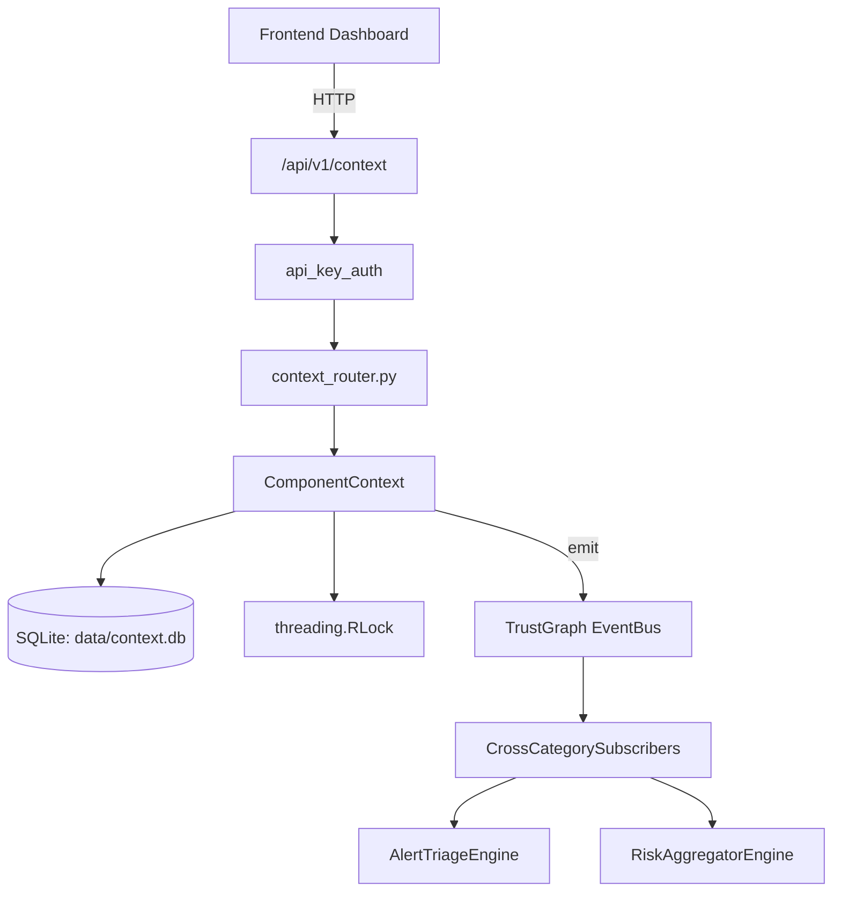

# US-0077: Context

## Sub-Epic: Advanced
**Master Goal**: ALDECI — $35/mo enterprise security intelligence platform replacing $50K-500K/yr tools

## User Story
As a **Priya Sharma (SOC T2 Analyst)**, I need to enrich security context for investigation
so that the platform delivers enterprise-grade advanced capabilities at 1/1000th the cost of legacy tools.

## Why This Matters
Context replaces functionality found in enterprise tools like CrowdStrike, Wiz, Snyk, and Rapid7.
By building this into ALDECI's $35/mo stack, customers save $50K+/yr on standalone Advanced tooling.

## Architecture

## Current State: 60% Complete
- ✅ `evaluate()` — implemented (line 204)
- ❌ No dedicated router — endpoint may be in gap_router.py
- ❌ No test file found — needs test coverage
- ❌ Limited public API — needs more methods
- ❌ TrustGraph event emission — not yet verified

## Key Functions (from `suite-core/core/context_engine.py` — 285 lines)
- `ContextEngine.evaluate()` — Handle evaluate (line 204)

## Dependencies
- **Depends on**: standalone
- **Depended by**: Routers, TrustGraph EventBus, CrossCategorySubscribers
- **TrustGraph**: Event emission wired via ResponseInterceptorMiddleware
- **Source file**: `suite-core/core/context_engine.py` (285 lines)
- **Router file**: `suite-api/apps/api/N/A`

## API Endpoints
| Method | Path | Description |
|--------|------|-------------|
| GET | `/api/v1/context` | List resources |

## Tasks Remaining
1. Verify TrustGraph event emission works end-to-end (2h)
2. Add integration test with real persona workflow (2h)
3. Wire CrossCategorySubscriber consumer chain (1h)
4. Validate with 30-persona walkthrough (1h)
5. Create dedicated router (needs wiring in app.py) (3h)
6. Write unit tests (4h)

## Definition of Done
- [ ] Priya Sharma (SOC T2 Analyst) can access /api/v1/context and get meaningful data
- [ ] All CRUD operations return correct HTTP status codes
- [ ] TrustGraph receives events from this engine
- [ ] 20+ tests passing in `tests/test_context_engine.py`
- [ ] 30-persona walkthrough includes this endpoint at 100%
- [ ] No hardcoded org_id — all queries are org-scoped

## Sprint: Wave 44 (est. April 20-22, 2026)

## Test Coverage
- **Test file**: `tests/test_context_engine.py`
- **Tests**: 0 tests
- **Status**: Needs coverage
