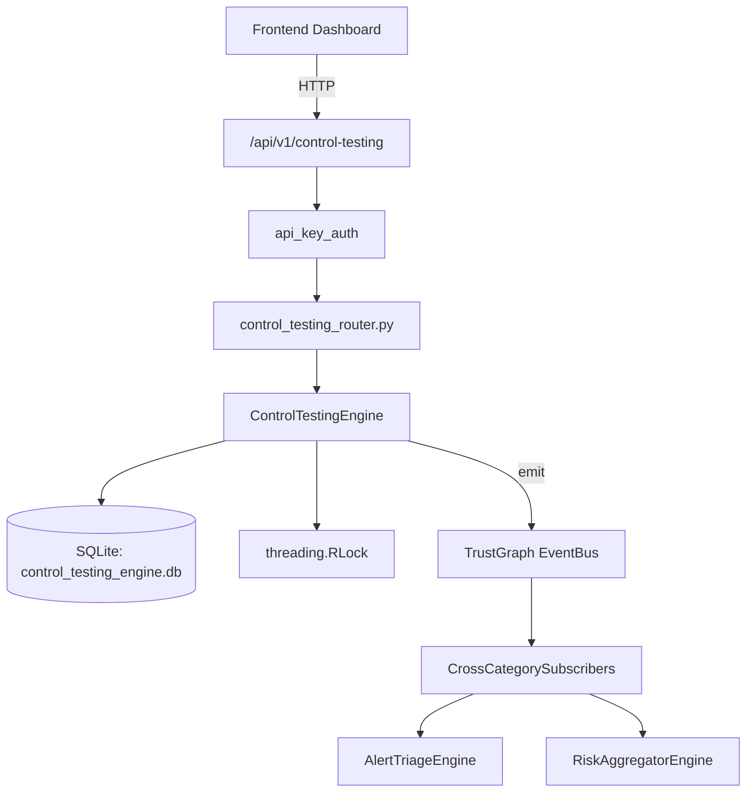

# US-0078: Control Testing

## Sub-Epic: GRC
**Master Goal**: ALDECI — $35/mo enterprise security intelligence platform replacing $50K-500K/yr tools

## User Story
As a **Robert Kim (Compliance Officer)**, I need to test security controls effectiveness
so that the platform delivers enterprise-grade grc capabilities at 1/1000th the cost of legacy tools.

## Why This Matters
Control Testing replaces functionality found in enterprise tools like CrowdStrike, Wiz, Snyk, and Rapid7.
By building this into ALDECI's $35/mo stack, customers save $50K+/yr on standalone GRC tooling.

## Architecture

## Current State: 95% Complete
- ✅ `create_control()` — Create a new security control. (line 142)
- ✅ `run_test()` — Run a test against a control; update rolling avg effectiveness (last 5). (line 182)
- ✅ `create_schedule()` — Create a test schedule for a control. (line 259)
- ✅ `update_schedule_run()` — Mark a schedule as run; advance next_run. (line 291)
- ✅ `get_control()` — Retrieve a control with its 10 most recent tests. (line 317)
- ✅ `list_controls()` — List controls with optional filters. (line 336)
- ❌ TrustGraph event emission — not yet verified

## Key Functions (from `suite-core/core/control_testing_engine.py` — 435 lines)
- `ControlTestingEngine.create_control()` — Create a new security control. (line 142)
- `ControlTestingEngine.run_test()` — Run a test against a control; update rolling avg effectiveness (last 5). (line 182)
- `ControlTestingEngine.create_schedule()` — Create a test schedule for a control. (line 259)
- `ControlTestingEngine.update_schedule_run()` — Mark a schedule as run; advance next_run. (line 291)
- `ControlTestingEngine.get_control()` — Retrieve a control with its 10 most recent tests. (line 317)
- `ControlTestingEngine.list_controls()` — List controls with optional filters. (line 336)
- `ControlTestingEngine.get_due_tests()` — Return controls where last_tested is NULL or overdue by frequency. (line 356)
- `ControlTestingEngine.get_control_effectiveness_summary()` — Summary: avg score, status counts, never-tested controls, framework breakdown. (line 381)

## Dependencies
- **Depends on**: standalone
- **Depended by**: Routers, TrustGraph EventBus, CrossCategorySubscribers
- **TrustGraph**: Event emission wired via ResponseInterceptorMiddleware
- **Source file**: `suite-core/core/control_testing_engine.py` (435 lines)
- **Router file**: `suite-api/apps/api/control_testing_router.py`

## API Endpoints
| Method | Path | Description |
|--------|------|-------------|
| POST | `/api/v1/control-testing/controls` | create control |
| GET | `/api/v1/control-testing/controls` | list controls |
| GET | `/api/v1/control-testing/controls/{control_id}` | get control |
| POST | `/api/v1/control-testing/controls/{control_id}/tests` | run test |
| POST | `/api/v1/control-testing/schedules` | create schedule |
| POST | `/api/v1/control-testing/schedules/{schedule_id}/run` | update schedule run |
| GET | `/api/v1/control-testing/due` | get due tests |
| GET | `/api/v1/control-testing/summary` | get control effectiveness summary |
| GET | `/api/v1/control-testing/failing` | get failing controls |

## Tasks Remaining
1. Verify TrustGraph event emission works end-to-end (2h)
2. Add integration test with real persona workflow (2h)
3. Wire CrossCategorySubscriber consumer chain (1h)
4. Validate with 30-persona walkthrough (1h)
5. Optimize query performance for large datasets (2h)
6. Expand test coverage to edge cases (2h)

## Definition of Done
- [ ] Robert Kim (Compliance Officer) can access /api/v1/control-testing and get meaningful data
- [ ] All CRUD operations return correct HTTP status codes
- [ ] TrustGraph receives events from this engine
- [ ] 39+ tests passing in `tests/test_control_testing_engine.py`
- [ ] 30-persona walkthrough includes this endpoint at 100%
- [ ] No hardcoded org_id — all queries are org-scoped

## Sprint: Wave 44 (est. April 20-22, 2026)

## Test Coverage
- **Test file**: `tests/test_control_testing_engine.py`
- **Tests**: 39 tests
- **Status**: Passing
