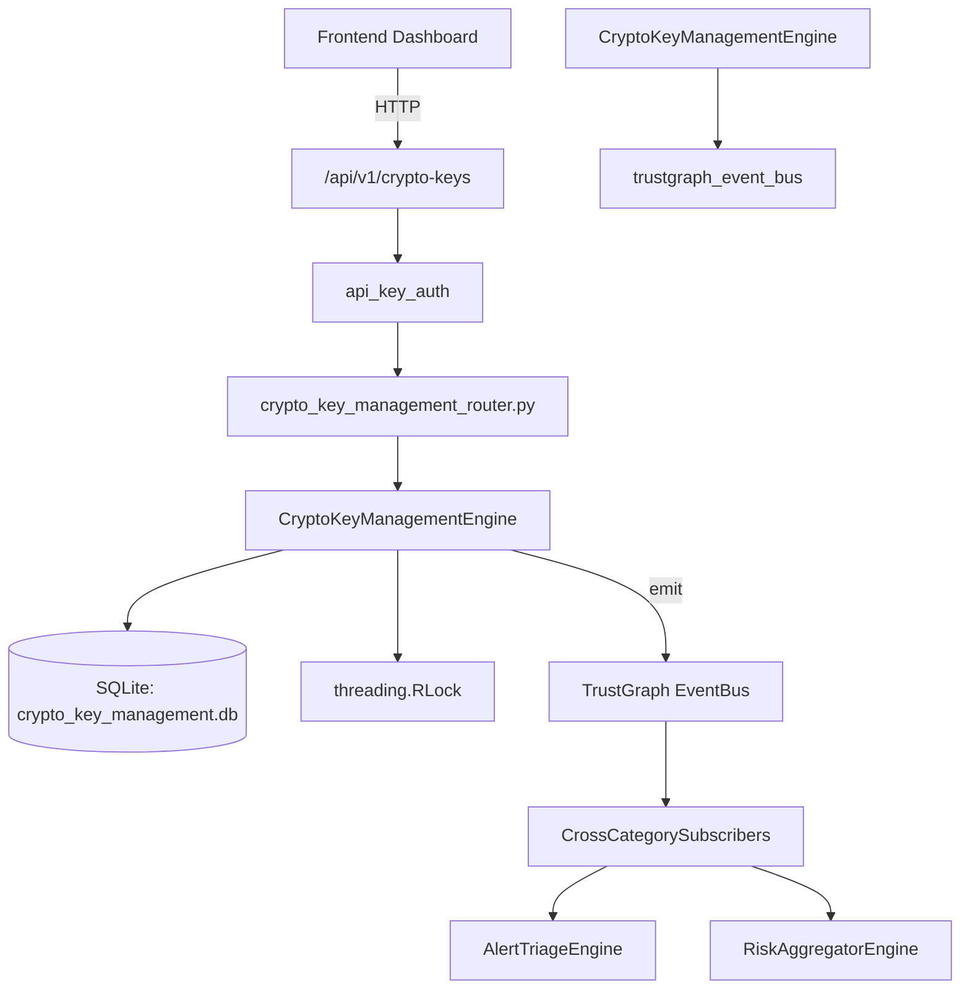

# US-0079: Crypto Key Management

## Sub-Epic: Advanced
**Master Goal**: ALDECI — $35/mo enterprise security intelligence platform replacing $50K-500K/yr tools

## User Story
As a **James Wilson (Security Engineer)**, I need to manage cryptographic key lifecycle
so that the platform delivers enterprise-grade advanced capabilities at 1/1000th the cost of legacy tools.

## Why This Matters
Crypto Key Management replaces functionality found in enterprise tools like CrowdStrike, Wiz, Snyk, and Rapid7.
By building this into ALDECI's $35/mo stack, customers save $50K+/yr on standalone Advanced tooling.

## Architecture

## Current State: 95% Complete
- ✅ `create_key()` — Create a new cryptographic key. Returns the full key record. (line 113)
- ✅ `list_keys()` — List keys for an org, optionally filtered by key_type and/or purpose. (line 175)
- ✅ `get_key()` — Fetch a single key by key_id (org-scoped). (line 197)
- ✅ `rotate_key()` — Rotate a key: mark old as 'rotating', create new version with incremented versio (line 207)
- ✅ `revoke_key()` — Revoke a key. Returns updated record. (line 260)
- ✅ `get_expiring_keys()` — Return active keys expiring within the next N days. (line 286)
- ❌ TrustGraph event emission — not yet verified

## Key Functions (from `suite-core/core/crypto_key_management_engine.py` — 382 lines)
- `CryptoKeyManagementEngine.create_key()` — Create a new cryptographic key. Returns the full key record. (line 113)
- `CryptoKeyManagementEngine.list_keys()` — List keys for an org, optionally filtered by key_type and/or purpose. (line 175)
- `CryptoKeyManagementEngine.get_key()` — Fetch a single key by key_id (org-scoped). (line 197)
- `CryptoKeyManagementEngine.rotate_key()` — Rotate a key: mark old as 'rotating', create new version with incremented versio (line 207)
- `CryptoKeyManagementEngine.revoke_key()` — Revoke a key. Returns updated record. (line 260)
- `CryptoKeyManagementEngine.get_expiring_keys()` — Return active keys expiring within the next N days. (line 286)
- `CryptoKeyManagementEngine.record_key_usage()` — Record a key usage event for audit trail. (line 308)
- `CryptoKeyManagementEngine.get_key_stats()` — Return aggregated key statistics for the org. (line 333)

## Dependencies
- **Depends on**: trustgraph_event_bus
- **Depended by**: Routers, TrustGraph EventBus, CrossCategorySubscribers
- **TrustGraph**: Event emission wired via ResponseInterceptorMiddleware
- **Source file**: `suite-core/core/crypto_key_management_engine.py` (382 lines)
- **Router file**: `suite-api/apps/api/crypto_key_management_router.py`

## API Endpoints
| Method | Path | Description |
|--------|------|-------------|
| POST | `/api/v1/crypto-keys/` | create key |
| GET | `/api/v1/crypto-keys/expiring` | get expiring keys |
| GET | `/api/v1/crypto-keys/stats` | get key stats |
| GET | `/api/v1/crypto-keys/` | list keys |
| GET | `/api/v1/crypto-keys/{key_id}` | get key |
| POST | `/api/v1/crypto-keys/{key_id}/rotate` | rotate key |
| POST | `/api/v1/crypto-keys/{key_id}/revoke` | revoke key |
| POST | `/api/v1/crypto-keys/{key_id}/usage` | record key usage |

## Tasks Remaining
1. Verify TrustGraph event emission works end-to-end (2h)
2. Add integration test with real persona workflow (2h)
3. Wire CrossCategorySubscriber consumer chain (1h)
4. Validate with 30-persona walkthrough (1h)
5. Optimize query performance for large datasets (2h)
6. Expand test coverage to edge cases (2h)

## Definition of Done
- [ ] James Wilson (Security Engineer) can access /api/v1/crypto-keys and get meaningful data
- [ ] All CRUD operations return correct HTTP status codes
- [ ] TrustGraph receives events from this engine
- [ ] 31+ tests passing in `tests/test_crypto_key_management_engine.py`
- [ ] 30-persona walkthrough includes this endpoint at 100%
- [ ] No hardcoded org_id — all queries are org-scoped

## Sprint: Wave 44 (est. April 20-22, 2026)

## Test Coverage
- **Test file**: `tests/test_crypto_key_management_engine.py`
- **Tests**: 31 tests
- **Status**: Passing
