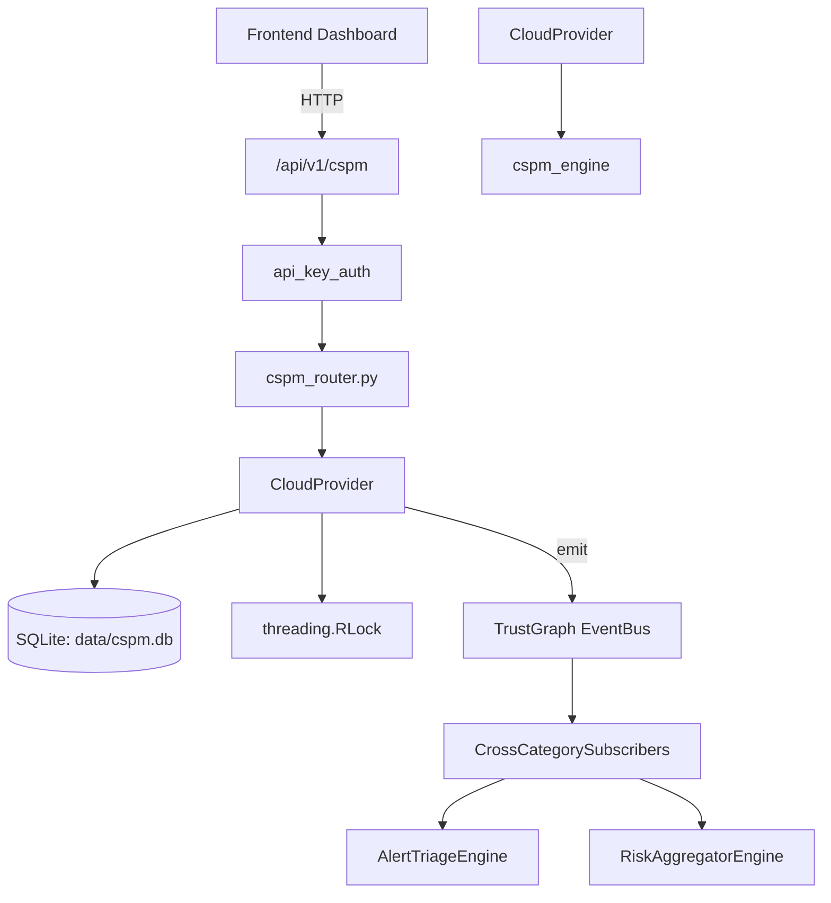

# US-0080: Cspm

## Sub-Epic: CSPM
**Master Goal**: ALDECI — $35/mo enterprise security intelligence platform replacing $50K-500K/yr tools

## User Story
As a **Jennifer Wu (Cloud Security Architect)**, I need to assess cloud security posture
so that the platform delivers enterprise-grade cspm capabilities at 1/1000th the cost of legacy tools.

## Why This Matters
Cspm replaces functionality found in enterprise tools like CrowdStrike, Wiz, Snyk, and Rapid7.
By building this into ALDECI's $35/mo stack, customers save $50K+/yr on standalone CSPM tooling.

## Architecture

## Current State: 95% Complete
- ✅ `to_dict()` — implemented (line 957)
- ✅ `to_dict()` — implemented (line 993)
- ✅ `scan_terraform()` — Scan a Terraform HCL template for misconfigurations. (line 1122)
- ✅ `scan_cloudformation()` — Scan a CloudFormation template (JSON) for misconfigurations. (line 1187)
- ❌ TrustGraph event emission — not yet verified

## Key Functions (from `suite-core/core/cspm_engine.py` — 1545 lines)
- `CspmFinding.to_dict()` — Handle to dict (line 957)
- `CspmScanResult.to_dict()` — Handle to dict (line 993)
- `CSPMEngine.scan_terraform()` — Scan a Terraform HCL template for misconfigurations. (line 1122)
- `CSPMEngine.scan_cloudformation()` — Scan a CloudFormation template (JSON) for misconfigurations. (line 1187)

## Dependencies
- **Depends on**: cspm_engine
- **Depended by**: Routers, TrustGraph EventBus, CrossCategorySubscribers
- **TrustGraph**: Event emission wired via ResponseInterceptorMiddleware
- **Source file**: `suite-core/core/cspm_engine.py` (1545 lines)
- **Router file**: `suite-api/apps/api/cspm_router.py`

## API Endpoints
| Method | Path | Description |
|--------|------|-------------|
| GET | `/api/v1/cspm/posture` | get posture |
| GET | `/api/v1/cspm/findings` | list findings |
| GET | `/api/v1/cspm/resources` | list resources |
| POST | `/api/v1/cspm/resources` | register resource |
| GET | `/api/v1/cspm/benchmarks` | get benchmarks |
| POST | `/api/v1/cspm/scan` | trigger scan |
| GET | `/api/v1/cspm/drift` | get drift |
| POST | `/api/v1/cspm/baseline` | save baseline |
| GET | `/api/v1/cspm/remediation/{finding_id}` | get remediation |
| GET | `/api/v1/cspm/compliance-map` | get compliance map |
| GET | `/api/v1/cspm/findings/{finding_id}` | get finding |
| POST | `/api/v1/cspm/findings/{finding_id}/suppress` | suppress finding |

## Tasks Remaining
1. Verify TrustGraph event emission works end-to-end (2h)
2. Add integration test with real persona workflow (2h)
3. Wire CrossCategorySubscriber consumer chain (1h)
4. Validate with 30-persona walkthrough (1h)
5. Optimize query performance for large datasets (2h)
6. Expand test coverage to edge cases (2h)

## Definition of Done
- [ ] Jennifer Wu (Cloud Security Architect) can access /api/v1/cspm and get meaningful data
- [ ] All CRUD operations return correct HTTP status codes
- [ ] TrustGraph receives events from this engine
- [ ] 136+ tests passing in `tests/test_cspm_engine.py`
- [ ] 30-persona walkthrough includes this endpoint at 100%
- [ ] No hardcoded org_id — all queries are org-scoped

## Sprint: Wave 44 (est. April 20-22, 2026)

## Test Coverage
- **Test file**: `tests/test_cspm_engine.py`
- **Tests**: 136 tests
- **Status**: Passing
