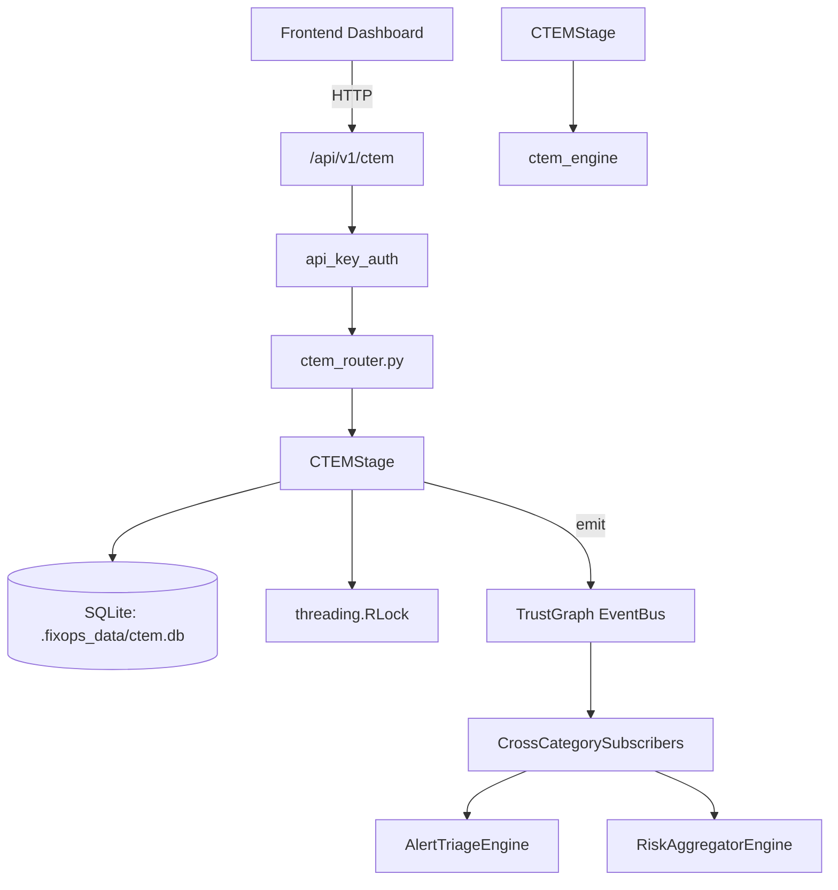

# US-0081: Ctem

## Sub-Epic: CTEM
**Master Goal**: ALDECI — $35/mo enterprise security intelligence platform replacing $50K-500K/yr tools

## User Story
As a **Lisa Zhang (Pentester)**, I need to manage continuous threat exposure
so that the platform delivers enterprise-grade ctem capabilities at 1/1000th the cost of legacy tools.

## Why This Matters
Ctem replaces functionality found in enterprise tools like CrowdStrike, Wiz, Snyk, and Rapid7.
By building this into ALDECI's $35/mo stack, customers save $50K+/yr on standalone CTEM tooling.

## Architecture

## Current State: 95% Complete
- ✅ `upsert_cycle()` — implemented (line 159)
- ✅ `get_cycle()` — implemented (line 177)
- ✅ `list_cycles()` — implemented (line 186)
- ✅ `upsert_exposure()` — implemented (line 208)
- ✅ `get_exposure()` — implemented (line 233)
- ✅ `list_exposures_for_cycle()` — implemented (line 243)
- ❌ TrustGraph event emission — not yet verified

## Key Functions (from `suite-core/core/ctem_engine.py` — 634 lines)
- `_CTEMDB.upsert_cycle()` — Handle upsert cycle (line 159)
- `_CTEMDB.get_cycle()` — Handle get cycle (line 177)
- `_CTEMDB.list_cycles()` — Handle list cycles (line 186)
- `_CTEMDB.upsert_exposure()` — Handle upsert exposure (line 208)
- `_CTEMDB.get_exposure()` — Handle get exposure (line 233)
- `_CTEMDB.list_exposures_for_cycle()` — Handle list exposures for cycle (line 243)
- `_CTEMDB.list_exposures_by_org()` — Handle list exposures by org (line 257)
- `CTEMEngine.start_cycle()` — Create and persist a new CTEM cycle, beginning at SCOPING. (line 301)

## Dependencies
- **Depends on**: ctem_engine
- **Depended by**: Routers, TrustGraph EventBus, CrossCategorySubscribers
- **TrustGraph**: Event emission wired via ResponseInterceptorMiddleware
- **Source file**: `suite-core/core/ctem_engine.py` (634 lines)
- **Router file**: `suite-api/apps/api/ctem_router.py`

## API Endpoints
| Method | Path | Description |
|--------|------|-------------|
| POST | `/api/v1/ctem/cycles` | start cycle |
| GET | `/api/v1/ctem/cycles` | list cycles |
| GET | `/api/v1/ctem/cycles/{cycle_id}` | get cycle |
| POST | `/api/v1/ctem/cycles/{cycle_id}/advance` | advance stage |
| POST | `/api/v1/ctem/cycles/{cycle_id}/exposures` | add exposure |
| GET | `/api/v1/ctem/cycles/{cycle_id}/exposures` | get exposures |
| PATCH | `/api/v1/ctem/exposures/{exposure_id}` | update exposure |
| POST | `/api/v1/ctem/cycles/{cycle_id}/scope` | scope assets |

## Tasks Remaining
1. Verify TrustGraph event emission works end-to-end (2h)
2. Add integration test with real persona workflow (2h)
3. Wire CrossCategorySubscriber consumer chain (1h)
4. Validate with 30-persona walkthrough (1h)
5. Optimize query performance for large datasets (2h)
6. Expand test coverage to edge cases (2h)

## Definition of Done
- [ ] Lisa Zhang (Pentester) can access /api/v1/ctem and get meaningful data
- [ ] All CRUD operations return correct HTTP status codes
- [ ] TrustGraph receives events from this engine
- [ ] 57+ tests passing in `tests/test_ctem_engine.py`
- [ ] 30-persona walkthrough includes this endpoint at 100%
- [ ] No hardcoded org_id — all queries are org-scoped

## Sprint: Wave 44 (est. April 20-22, 2026)

## Test Coverage
- **Test file**: `tests/test_ctem_engine.py`
- **Tests**: 57 tests
- **Status**: Passing
