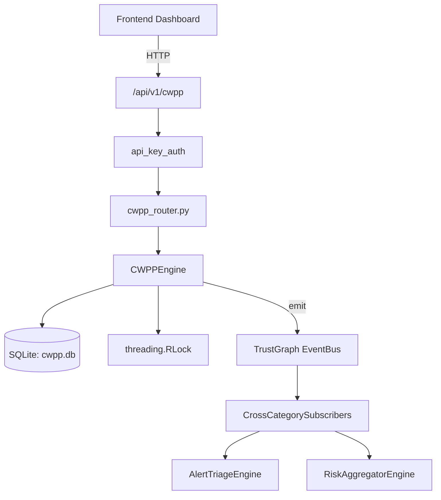

# US-0082: Cwpp

## Sub-Epic: CSPM
**Master Goal**: ALDECI — $35/mo enterprise security intelligence platform replacing $50K-500K/yr tools

## User Story
As a **Jennifer Wu (Cloud Security Architect)**, I need to protect cloud workloads
so that the platform delivers enterprise-grade cspm capabilities at 1/1000th the cost of legacy tools.

## Why This Matters
Cwpp replaces functionality found in enterprise tools like CrowdStrike, Wiz, Snyk, and Rapid7.
By building this into ALDECI's $35/mo stack, customers save $50K+/yr on standalone CSPM tooling.

## Architecture

## Current State: 95% Complete
- ✅ `register_workload()` — Register a workload for protection. (line 99)
- ✅ `deregister_workload()` — Mark workload as deregistered. Returns True if found, False otherwise. (line 140)
- ✅ `list_workloads()` — List workloads for an org, optionally filtered by type. (line 153)
- ✅ `get_workload()` — Return a single workload by ID, or None if not found. (line 169)
- ✅ `detect_threats()` — Analyze runtime events for threats. (line 181)
- ✅ `check_compliance()` — Check workload against compliance framework. (line 399)
- ❌ TrustGraph event emission — not yet verified

## Key Functions (from `suite-core/core/cwpp_engine.py` — 566 lines)
- `CWPPEngine.register_workload()` — Register a workload for protection. (line 99)
- `CWPPEngine.deregister_workload()` — Mark workload as deregistered. Returns True if found, False otherwise. (line 140)
- `CWPPEngine.list_workloads()` — List workloads for an org, optionally filtered by type. (line 153)
- `CWPPEngine.get_workload()` — Return a single workload by ID, or None if not found. (line 169)
- `CWPPEngine.detect_threats()` — Analyze runtime events for threats. (line 181)
- `CWPPEngine.check_compliance()` — Check workload against compliance framework. (line 399)
- `CWPPEngine.get_threat_events()` — Return threat events, optionally filtered by workload_id. (line 494)
- `CWPPEngine.get_protection_summary()` — Return aggregate protection statistics for an org. (line 510)

## Dependencies
- **Depends on**: standalone
- **Depended by**: Routers, TrustGraph EventBus, CrossCategorySubscribers
- **TrustGraph**: Event emission wired via ResponseInterceptorMiddleware
- **Source file**: `suite-core/core/cwpp_engine.py` (566 lines)
- **Router file**: `suite-api/apps/api/cwpp_router.py`

## API Endpoints
| Method | Path | Description |
|--------|------|-------------|
| POST | `/api/v1/cwpp/workloads` | register workload |
| DELETE | `/api/v1/cwpp/workloads/{workload_id}` | deregister workload |
| GET | `/api/v1/cwpp/workloads` | list workloads |
| GET | `/api/v1/cwpp/workloads/{workload_id}` | get workload |
| POST | `/api/v1/cwpp/workloads/{workload_id}/detect` | detect threats |
| POST | `/api/v1/cwpp/workloads/{workload_id}/compliance` | check compliance |
| GET | `/api/v1/cwpp/threats` | get threat events |
| GET | `/api/v1/cwpp/summary` | protection summary |

## Tasks Remaining
1. Verify TrustGraph event emission works end-to-end (2h)
2. Add integration test with real persona workflow (2h)
3. Wire CrossCategorySubscriber consumer chain (1h)
4. Validate with 30-persona walkthrough (1h)
5. Optimize query performance for large datasets (2h)
6. Expand test coverage to edge cases (2h)

## Definition of Done
- [ ] Jennifer Wu (Cloud Security Architect) can access /api/v1/cwpp and get meaningful data
- [ ] All CRUD operations return correct HTTP status codes
- [ ] TrustGraph receives events from this engine
- [ ] 31+ tests passing in `tests/test_cwpp_engine.py`
- [ ] 30-persona walkthrough includes this endpoint at 100%
- [ ] No hardcoded org_id — all queries are org-scoped

## Sprint: Wave 44 (est. April 20-22, 2026)

## Test Coverage
- **Test file**: `tests/test_cwpp_engine.py`
- **Tests**: 31 tests
- **Status**: Passing
