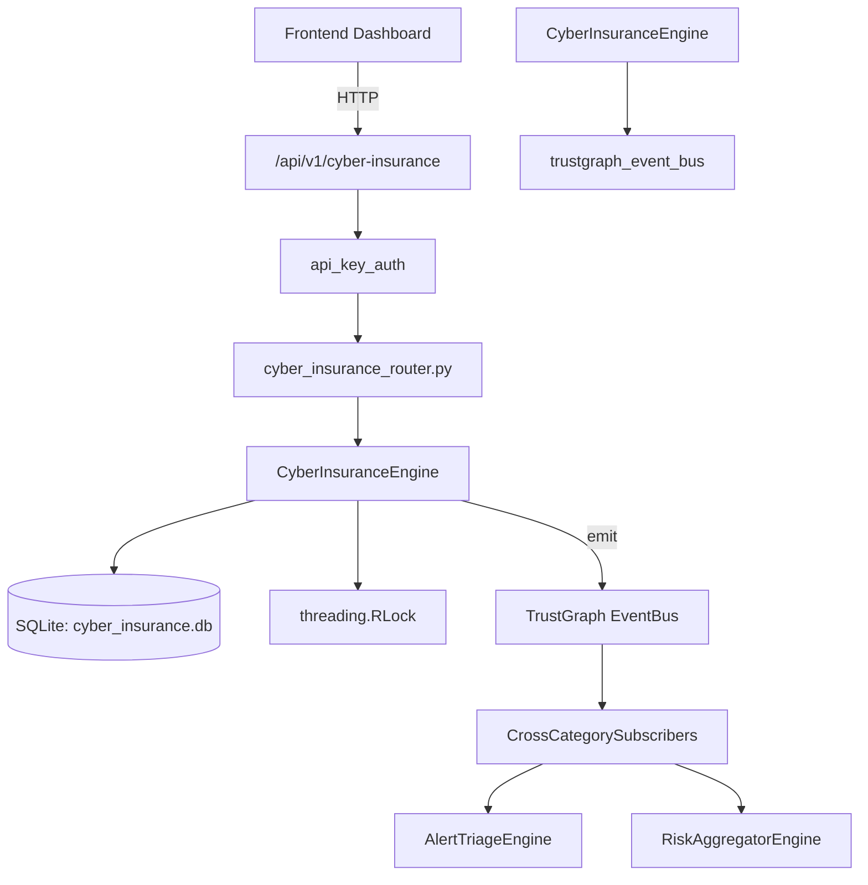

# US-0083: Cyber Insurance

## Sub-Epic: Executive
**Master Goal**: ALDECI — $35/mo enterprise security intelligence platform replacing $50K-500K/yr tools

## User Story
As a **David Park (Risk Manager)**, I need to manage cyber insurance policies and claims
so that the platform delivers enterprise-grade executive capabilities at 1/1000th the cost of legacy tools.

## Why This Matters
Cyber Insurance replaces functionality found in enterprise tools like CrowdStrike, Wiz, Snyk, and Rapid7.
By building this into ALDECI's $35/mo stack, customers save $50K+/yr on standalone Executive tooling.

## Architecture

## Current State: 95% Complete
- ✅ `add_policy()` — Add a cyber insurance policy. Returns the full policy record. (line 141)
- ✅ `list_policies()` — List all insurance policies for an org. (line 219)
- ✅ `create_assessment()` — Create a coverage assessment for a policy. Returns the full assessment record. (line 232)
- ✅ `list_assessments()` — List all coverage assessments for an org. (line 300)
- ✅ `file_claim()` — File a new insurance claim. Returns the full claim record. (line 313)
- ✅ `list_claims()` — List insurance claims for an org. (line 364)
- ❌ TrustGraph event emission — not yet verified

## Key Functions (from `suite-core/core/cyber_insurance_engine.py` — 941 lines)
- `CyberInsuranceEngine.add_policy()` — Add a cyber insurance policy. Returns the full policy record. (line 141)
- `CyberInsuranceEngine.list_policies()` — List all insurance policies for an org. (line 219)
- `CyberInsuranceEngine.create_assessment()` — Create a coverage assessment for a policy. Returns the full assessment record. (line 232)
- `CyberInsuranceEngine.list_assessments()` — List all coverage assessments for an org. (line 300)
- `CyberInsuranceEngine.file_claim()` — File a new insurance claim. Returns the full claim record. (line 313)
- `CyberInsuranceEngine.list_claims()` — List insurance claims for an org. (line 364)
- `CyberInsuranceEngine.update_claim()` — Update claim status and optionally set settlement amount. Returns True if update (line 381)
- `CyberInsuranceEngine.get_insurance_stats()` — Return summary statistics for cyber insurance portfolio. (line 408)

## Dependencies
- **Depends on**: trustgraph_event_bus
- **Depended by**: Routers, TrustGraph EventBus, CrossCategorySubscribers
- **TrustGraph**: Event emission wired via ResponseInterceptorMiddleware
- **Source file**: `suite-core/core/cyber_insurance_engine.py` (941 lines)
- **Router file**: `suite-api/apps/api/cyber_insurance_router.py`

## API Endpoints
| Method | Path | Description |
|--------|------|-------------|
| GET | `/api/v1/cyber-insurance/policies` | list policies |
| POST | `/api/v1/cyber-insurance/policies` | add policy |
| GET | `/api/v1/cyber-insurance/assessments` | list assessments |
| POST | `/api/v1/cyber-insurance/assessments` | create assessment |
| GET | `/api/v1/cyber-insurance/claims` | list claims |
| POST | `/api/v1/cyber-insurance/claims` | file claim |
| PATCH | `/api/v1/cyber-insurance/claims/{claim_id}` | update claim |
| GET | `/api/v1/cyber-insurance/stats` | get stats |

## Tasks Remaining
1. Verify TrustGraph event emission works end-to-end (2h)
2. Add integration test with real persona workflow (2h)
3. Wire CrossCategorySubscriber consumer chain (1h)
4. Validate with 30-persona walkthrough (1h)
5. Optimize query performance for large datasets (2h)
6. Expand test coverage to edge cases (2h)

## Definition of Done
- [ ] David Park (Risk Manager) can access /api/v1/cyber-insurance and get meaningful data
- [ ] All CRUD operations return correct HTTP status codes
- [ ] TrustGraph receives events from this engine
- [ ] 53+ tests passing in `tests/test_cyber_insurance_engine.py`
- [ ] 30-persona walkthrough includes this endpoint at 100%
- [ ] No hardcoded org_id — all queries are org-scoped

## Sprint: Wave 44 (est. April 20-22, 2026)

## Test Coverage
- **Test file**: `tests/test_cyber_insurance_engine.py`
- **Tests**: 53 tests
- **Status**: Passing
