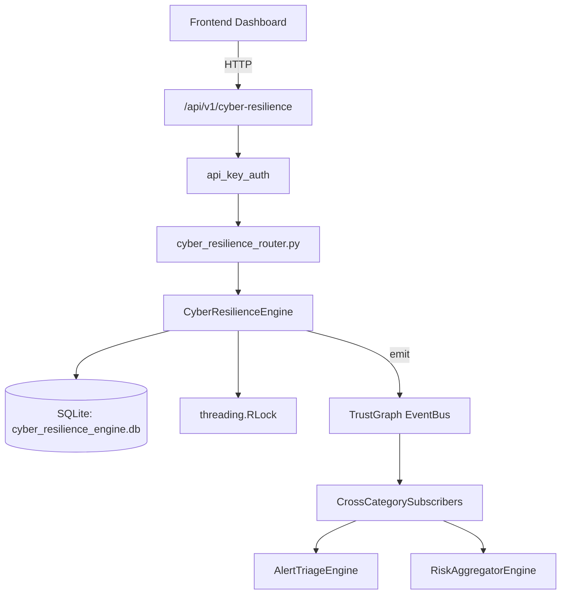

# US-0084: Cyber Resilience

## Sub-Epic: Advanced
**Master Goal**: ALDECI — $35/mo enterprise security intelligence platform replacing $50K-500K/yr tools

## User Story
As a **Sarah Chen (CISO)**, I need to measure and improve cyber resilience
so that the platform delivers enterprise-grade advanced capabilities at 1/1000th the cost of legacy tools.

## Why This Matters
Cyber Resilience replaces functionality found in enterprise tools like CrowdStrike, Wiz, Snyk, and Rapid7.
By building this into ALDECI's $35/mo stack, customers save $50K+/yr on standalone Advanced tooling.

## Architecture

## Current State: 95% Complete
- ✅ `create_assessment()` — Create a new resilience assessment. score = maturity_level/max_level*100. (line 134)
- ✅ `update_maturity()` — Update maturity level and recompute score. (line 190)
- ✅ `get_assessment()` — Retrieve a single assessment by ID within the org. (line 221)
- ✅ `list_assessments()` — List assessments with optional domain filter. (line 233)
- ✅ `get_resilience_score()` — Return overall score (avg of all assessments) + by_domain + maturity_distributio (line 252)
- ✅ `schedule_exercise()` — Schedule a resilience exercise. (line 298)
- ❌ TrustGraph event emission — not yet verified

## Key Functions (from `suite-core/core/cyber_resilience_engine.py` — 489 lines)
- `CyberResilienceEngine.create_assessment()` — Create a new resilience assessment. score = maturity_level/max_level*100. (line 134)
- `CyberResilienceEngine.update_maturity()` — Update maturity level and recompute score. (line 190)
- `CyberResilienceEngine.get_assessment()` — Retrieve a single assessment by ID within the org. (line 221)
- `CyberResilienceEngine.list_assessments()` — List assessments with optional domain filter. (line 233)
- `CyberResilienceEngine.get_resilience_score()` — Return overall score (avg of all assessments) + by_domain + maturity_distributio (line 252)
- `CyberResilienceEngine.schedule_exercise()` — Schedule a resilience exercise. (line 298)
- `CyberResilienceEngine.complete_exercise()` — Mark exercise as completed and record findings. (line 349)
- `CyberResilienceEngine.get_exercise_history()` — List exercises with optional type filter. (line 385)

## Dependencies
- **Depends on**: standalone
- **Depended by**: Routers, TrustGraph EventBus, CrossCategorySubscribers
- **TrustGraph**: Event emission wired via ResponseInterceptorMiddleware
- **Source file**: `suite-core/core/cyber_resilience_engine.py` (489 lines)
- **Router file**: `suite-api/apps/api/cyber_resilience_router.py`

## API Endpoints
| Method | Path | Description |
|--------|------|-------------|
| POST | `/api/v1/cyber-resilience/assessments` | create assessment |
| PATCH | `/api/v1/cyber-resilience/assessments/{assessment_id}/maturity` | update maturity |
| GET | `/api/v1/cyber-resilience/assessments` | list assessments |
| GET | `/api/v1/cyber-resilience/score` | get resilience score |
| POST | `/api/v1/cyber-resilience/exercises` | schedule exercise |
| POST | `/api/v1/cyber-resilience/exercises/{exercise_id}/complete` | complete exercise |
| GET | `/api/v1/cyber-resilience/exercises` | get exercise history |
| POST | `/api/v1/cyber-resilience/metrics` | record metric |
| GET | `/api/v1/cyber-resilience/metrics/summary` | get metrics summary |

## Tasks Remaining
1. Verify TrustGraph event emission works end-to-end (2h)
2. Add integration test with real persona workflow (2h)
3. Wire CrossCategorySubscriber consumer chain (1h)
4. Validate with 30-persona walkthrough (1h)
5. Optimize query performance for large datasets (2h)
6. Expand test coverage to edge cases (2h)

## Definition of Done
- [ ] Sarah Chen (CISO) can access /api/v1/cyber-resilience and get meaningful data
- [ ] All CRUD operations return correct HTTP status codes
- [ ] TrustGraph receives events from this engine
- [ ] 36+ tests passing in `tests/test_cyber_resilience_engine.py`
- [ ] 30-persona walkthrough includes this endpoint at 100%
- [ ] No hardcoded org_id — all queries are org-scoped

## Sprint: Wave 44 (est. April 20-22, 2026)

## Test Coverage
- **Test file**: `tests/test_cyber_resilience_engine.py`
- **Tests**: 36 tests
- **Status**: Passing
