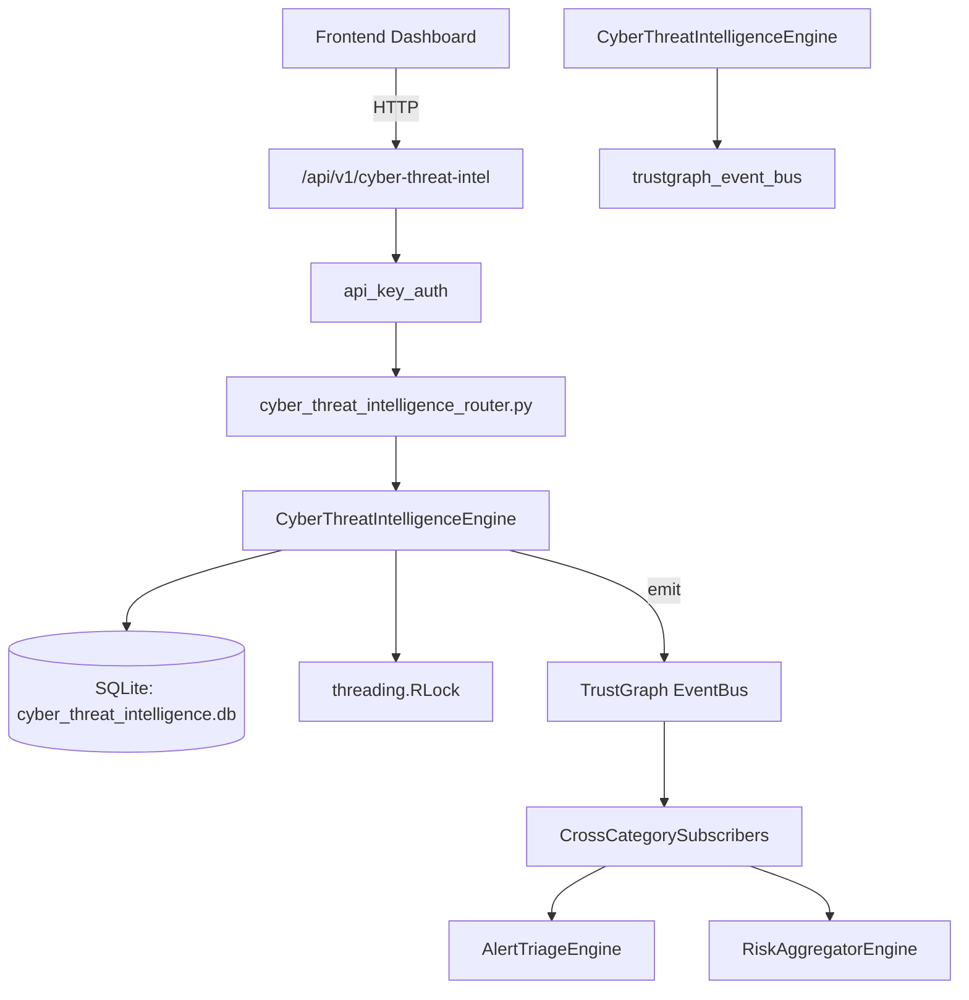

# US-0085: Cyber Threat Intelligence

## Sub-Epic: Advanced
**Master Goal**: ALDECI — $35/mo enterprise security intelligence platform replacing $50K-500K/yr tools

## User Story
As a **Nina Patel (Threat Intel Analyst)**, I need to model and track cyber threats
so that the platform delivers enterprise-grade advanced capabilities at 1/1000th the cost of legacy tools.

## Why This Matters
Cyber Threat Intelligence replaces functionality found in enterprise tools like CrowdStrike, Wiz, Snyk, and Rapid7.
By building this into ALDECI's $35/mo stack, customers save $50K+/yr on standalone Advanced tooling.

## Architecture

## Current State: 95% Complete
- ✅ `create_intel_report()` — Create a new CTI report in draft status. (line 120)
- ✅ `list_reports()` — List CTI reports with optional filters. (line 193)
- ✅ `get_report()` — Retrieve a single report by ID. Returns None if not found or wrong org. (line 217)
- ✅ `publish_report()` — Publish a CTI report (status=published, published_at=now). (line 226)
- ✅ `add_ioc_to_report()` — Add an IOC to an existing CTI report. (line 248)
- ✅ `list_iocs()` — List IOCs with optional filters. (line 291)
- ❌ TrustGraph event emission — not yet verified

## Key Functions (from `suite-core/core/cyber_threat_intelligence_engine.py` — 364 lines)
- `CyberThreatIntelligenceEngine.create_intel_report()` — Create a new CTI report in draft status. (line 120)
- `CyberThreatIntelligenceEngine.list_reports()` — List CTI reports with optional filters. (line 193)
- `CyberThreatIntelligenceEngine.get_report()` — Retrieve a single report by ID. Returns None if not found or wrong org. (line 217)
- `CyberThreatIntelligenceEngine.publish_report()` — Publish a CTI report (status=published, published_at=now). (line 226)
- `CyberThreatIntelligenceEngine.add_ioc_to_report()` — Add an IOC to an existing CTI report. (line 248)
- `CyberThreatIntelligenceEngine.list_iocs()` — List IOCs with optional filters. (line 291)
- `CyberThreatIntelligenceEngine.get_intel_stats()` — Return aggregated CTI statistics for an org. (line 315)

## Dependencies
- **Depends on**: trustgraph_event_bus
- **Depended by**: Routers, TrustGraph EventBus, CrossCategorySubscribers
- **TrustGraph**: Event emission wired via ResponseInterceptorMiddleware
- **Source file**: `suite-core/core/cyber_threat_intelligence_engine.py` (364 lines)
- **Router file**: `suite-api/apps/api/cyber_threat_intelligence_router.py`

## API Endpoints
| Method | Path | Description |
|--------|------|-------------|
| POST | `/api/v1/cyber-threat-intel/reports` | create intel report |
| GET | `/api/v1/cyber-threat-intel/reports` | list reports |
| GET | `/api/v1/cyber-threat-intel/reports/{report_id}` | get report |
| POST | `/api/v1/cyber-threat-intel/reports/{report_id}/publish` | publish report |
| POST | `/api/v1/cyber-threat-intel/reports/{report_id}/iocs` | add ioc to report |
| GET | `/api/v1/cyber-threat-intel/iocs` | list iocs |
| GET | `/api/v1/cyber-threat-intel/stats` | get intel stats |

## Tasks Remaining
1. Verify TrustGraph event emission works end-to-end (2h)
2. Add integration test with real persona workflow (2h)
3. Wire CrossCategorySubscriber consumer chain (1h)
4. Validate with 30-persona walkthrough (1h)
5. Optimize query performance for large datasets (2h)
6. Expand test coverage to edge cases (2h)

## Definition of Done
- [ ] Nina Patel (Threat Intel Analyst) can access /api/v1/cyber-threat-intel and get meaningful data
- [ ] All CRUD operations return correct HTTP status codes
- [ ] TrustGraph receives events from this engine
- [ ] 34+ tests passing in `tests/test_cyber_threat_intelligence_engine.py`
- [ ] 30-persona walkthrough includes this endpoint at 100%
- [ ] No hardcoded org_id — all queries are org-scoped

## Sprint: Wave 44 (est. April 20-22, 2026)

## Test Coverage
- **Test file**: `tests/test_cyber_threat_intelligence_engine.py`
- **Tests**: 34 tests
- **Status**: Passing
