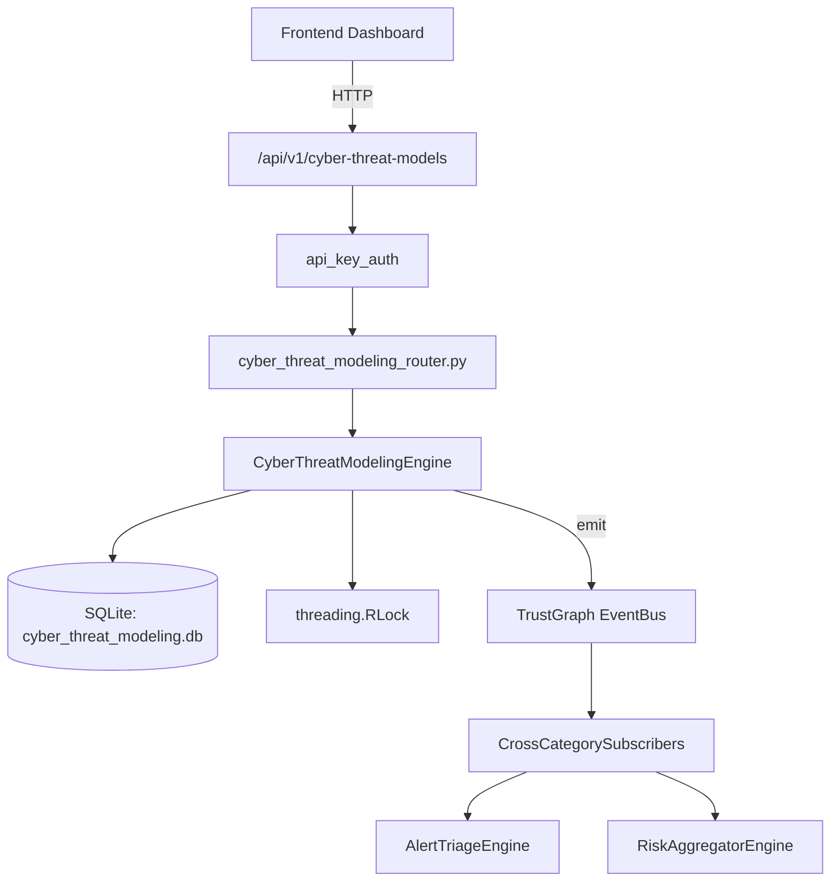

# US-0086: Cyber Threat Modeling

## Sub-Epic: Advanced
**Master Goal**: ALDECI — $35/mo enterprise security intelligence platform replacing $50K-500K/yr tools

## User Story
As a **Nina Patel (Threat Intel Analyst)**, I need to model and track cyber threats
so that the platform delivers enterprise-grade advanced capabilities at 1/1000th the cost of legacy tools.

## Why This Matters
Cyber Threat Modeling replaces functionality found in enterprise tools like CrowdStrike, Wiz, Snyk, and Rapid7.
By building this into ALDECI's $35/mo stack, customers save $50K+/yr on standalone Advanced tooling.

## Architecture

## Current State: 95% Complete
- ✅ `create_model()` — Create a new threat model. (line 184)
- ✅ `add_attack_tree()` — Add an attack tree node to a model; increment threat_count; recompute risk_score (line 228)
- ✅ `mitigate_tree()` — Mark an attack tree as mitigated (idempotent). Recompute model risk_score. (line 274)
- ✅ `add_threat_actor()` — Add a threat actor profile to a model. (line 324)
- ✅ `finalize_model()` — Finalize a threat model (status=finalized, reviewed_by stored). (line 367)
- ✅ `get_model_detail()` — Return model with its attack trees and threat actors. (line 392)
- ❌ TrustGraph event emission — not yet verified

## Key Functions (from `suite-core/core/cyber_threat_modeling_engine.py` — 496 lines)
- `CyberThreatModelingEngine.create_model()` — Create a new threat model. (line 184)
- `CyberThreatModelingEngine.add_attack_tree()` — Add an attack tree node to a model; increment threat_count; recompute risk_score (line 228)
- `CyberThreatModelingEngine.mitigate_tree()` — Mark an attack tree as mitigated (idempotent). Recompute model risk_score. (line 274)
- `CyberThreatModelingEngine.add_threat_actor()` — Add a threat actor profile to a model. (line 324)
- `CyberThreatModelingEngine.finalize_model()` — Finalize a threat model (status=finalized, reviewed_by stored). (line 367)
- `CyberThreatModelingEngine.get_model_detail()` — Return model with its attack trees and threat actors. (line 392)
- `CyberThreatModelingEngine.get_unmitigated_threats()` — Return all unmitigated attack trees with their model_name via JOIN. (line 437)
- `CyberThreatModelingEngine.get_model_summary()` — Return aggregate summary across all models for the org. (line 458)

## Dependencies
- **Depends on**: standalone
- **Depended by**: Routers, TrustGraph EventBus, CrossCategorySubscribers
- **TrustGraph**: Event emission wired via ResponseInterceptorMiddleware
- **Source file**: `suite-core/core/cyber_threat_modeling_engine.py` (496 lines)
- **Router file**: `suite-api/apps/api/cyber_threat_modeling_router.py`

## API Endpoints
| Method | Path | Description |
|--------|------|-------------|
| POST | `/api/v1/cyber-threat-models/models` | create model |
| POST | `/api/v1/cyber-threat-models/models/{model_id}/trees` | add attack tree |
| PUT | `/api/v1/cyber-threat-models/trees/{tree_id}/mitigate` | mitigate tree |
| POST | `/api/v1/cyber-threat-models/models/{model_id}/actors` | add threat actor |
| PUT | `/api/v1/cyber-threat-models/models/{model_id}/finalize` | finalize model |
| GET | `/api/v1/cyber-threat-models/models/{model_id}` | get model detail |
| GET | `/api/v1/cyber-threat-models/unmitigated` | get unmitigated threats |
| GET | `/api/v1/cyber-threat-models/summary` | get model summary |

## Tasks Remaining
1. Verify TrustGraph event emission works end-to-end (2h)
2. Add integration test with real persona workflow (2h)
3. Wire CrossCategorySubscriber consumer chain (1h)
4. Validate with 30-persona walkthrough (1h)
5. Optimize query performance for large datasets (2h)
6. Expand test coverage to edge cases (2h)

## Definition of Done
- [ ] Nina Patel (Threat Intel Analyst) can access /api/v1/cyber-threat-models and get meaningful data
- [ ] All CRUD operations return correct HTTP status codes
- [ ] TrustGraph receives events from this engine
- [ ] 38+ tests passing in `tests/test_cyber_threat_modeling_engine.py`
- [ ] 30-persona walkthrough includes this endpoint at 100%
- [ ] No hardcoded org_id — all queries are org-scoped

## Sprint: Wave 44 (est. April 20-22, 2026)

## Test Coverage
- **Test file**: `tests/test_cyber_threat_modeling_engine.py`
- **Tests**: 38 tests
- **Status**: Passing
