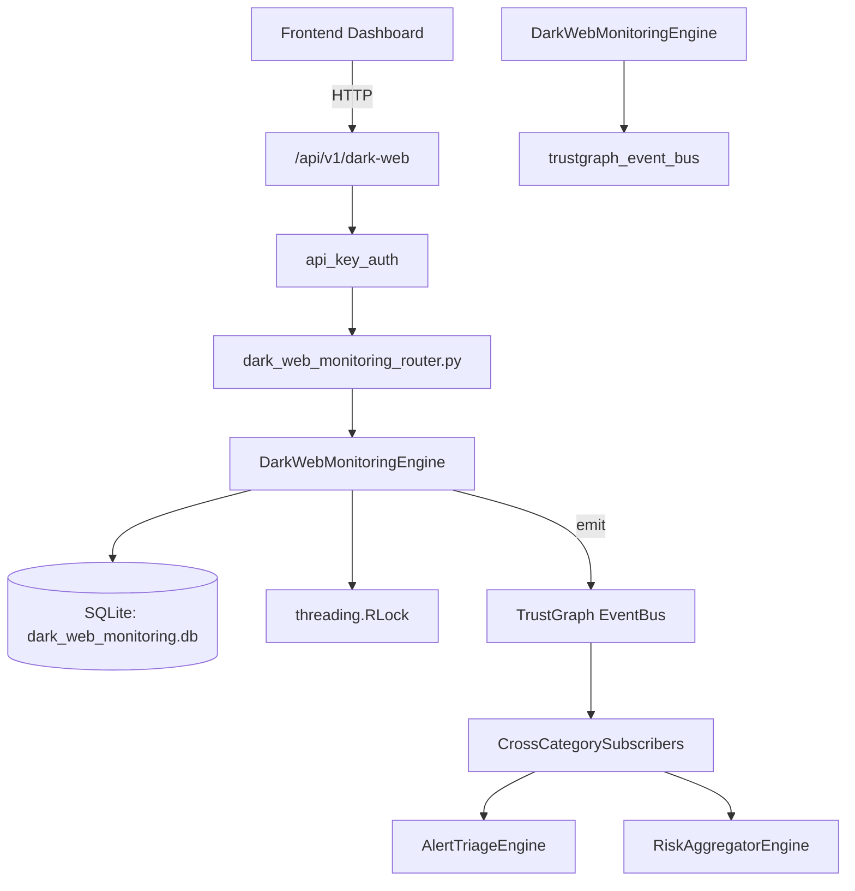

# US-0087: Dark Web Monitoring

## Sub-Epic: CTEM
**Master Goal**: ALDECI — $35/mo enterprise security intelligence platform replacing $50K-500K/yr tools

## User Story
As a **Nina Patel (Threat Intel Analyst)**, I need to monitor dark web for credential exposures
so that the platform delivers enterprise-grade ctem capabilities at 1/1000th the cost of legacy tools.

## Why This Matters
Dark Web Monitoring replaces functionality found in enterprise tools like CrowdStrike, Wiz, Snyk, and Rapid7.
By building this into ALDECI's $35/mo stack, customers save $50K+/yr on standalone CTEM tooling.

## Architecture

## Current State: 95% Complete
- ✅ `add_mention()` — Add a new dark web mention. (line 166)
- ✅ `list_mentions()` — List dark web mentions with optional filters. (line 242)
- ✅ `get_mention()` — Retrieve a single mention by ID. Returns None if not found or wrong org. (line 266)
- ✅ `update_mention_status()` — Update the status of a mention. Raises KeyError if not found. (line 275)
- ✅ `add_keyword()` — Add a monitored keyword. (line 304)
- ✅ `list_keywords()` — List monitored keywords with optional filters. (line 342)
- ❌ TrustGraph event emission — not yet verified

## Key Functions (from `suite-core/core/dark_web_monitoring_engine.py` — 485 lines)
- `DarkWebMonitoringEngine.add_mention()` — Add a new dark web mention. (line 166)
- `DarkWebMonitoringEngine.list_mentions()` — List dark web mentions with optional filters. (line 242)
- `DarkWebMonitoringEngine.get_mention()` — Retrieve a single mention by ID. Returns None if not found or wrong org. (line 266)
- `DarkWebMonitoringEngine.update_mention_status()` — Update the status of a mention. Raises KeyError if not found. (line 275)
- `DarkWebMonitoringEngine.add_keyword()` — Add a monitored keyword. (line 304)
- `DarkWebMonitoringEngine.list_keywords()` — List monitored keywords with optional filters. (line 342)
- `DarkWebMonitoringEngine.record_credential_exposure()` — Record a credential exposure event. (line 366)
- `DarkWebMonitoringEngine.list_credential_exposures()` — List credential exposures with optional verified filter. (line 414)

## Dependencies
- **Depends on**: trustgraph_event_bus
- **Depended by**: Routers, TrustGraph EventBus, CrossCategorySubscribers
- **TrustGraph**: Event emission wired via ResponseInterceptorMiddleware
- **Source file**: `suite-core/core/dark_web_monitoring_engine.py` (485 lines)
- **Router file**: `suite-api/apps/api/dark_web_monitoring_router.py`

## API Endpoints
| Method | Path | Description |
|--------|------|-------------|
| POST | `/api/v1/dark-web/mentions` | add mention |
| GET | `/api/v1/dark-web/mentions` | list mentions |
| GET | `/api/v1/dark-web/mentions/{mention_id}` | get mention |
| PUT | `/api/v1/dark-web/mentions/{mention_id}/status` | update mention status |
| POST | `/api/v1/dark-web/keywords` | add keyword |
| GET | `/api/v1/dark-web/keywords` | list keywords |
| POST | `/api/v1/dark-web/exposures` | record credential exposure |
| GET | `/api/v1/dark-web/exposures` | list credential exposures |
| GET | `/api/v1/dark-web/stats` | get dark web stats |

## Tasks Remaining
1. Verify TrustGraph event emission works end-to-end (2h)
2. Add integration test with real persona workflow (2h)
3. Wire CrossCategorySubscriber consumer chain (1h)
4. Validate with 30-persona walkthrough (1h)
5. Optimize query performance for large datasets (2h)
6. Expand test coverage to edge cases (2h)

## Definition of Done
- [ ] Nina Patel (Threat Intel Analyst) can access /api/v1/dark-web and get meaningful data
- [ ] All CRUD operations return correct HTTP status codes
- [ ] TrustGraph receives events from this engine
- [ ] 36+ tests passing in `tests/test_dark_web_monitoring_engine.py`
- [ ] 30-persona walkthrough includes this endpoint at 100%
- [ ] No hardcoded org_id — all queries are org-scoped

## Sprint: Wave 44 (est. April 20-22, 2026)

## Test Coverage
- **Test file**: `tests/test_dark_web_monitoring_engine.py`
- **Tests**: 36 tests
- **Status**: Passing
