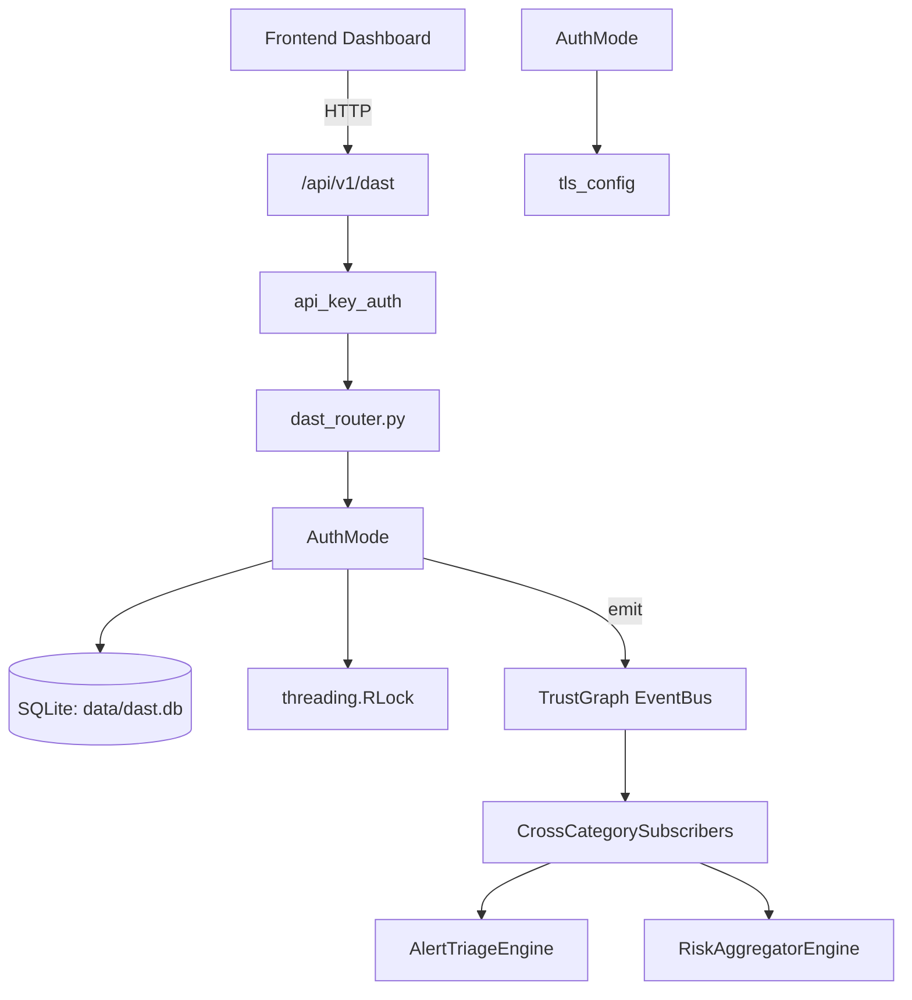

# US-0088: Dast

## Sub-Epic: ASPM
**Master Goal**: ALDECI — $35/mo enterprise security intelligence platform replacing $50K-500K/yr tools

## User Story
As a **Emma Davis (DevSecOps Engineer)**, I need to run dynamic application security tests
so that the platform delivers enterprise-grade aspm capabilities at 1/1000th the cost of legacy tools.

## Why This Matters
Dast replaces functionality found in enterprise tools like CrowdStrike, Wiz, Snyk, and Rapid7.
By building this into ALDECI's $35/mo stack, customers save $50K+/yr on standalone ASPM tooling.

## Architecture

## Current State: 95% Complete
- ✅ `to_dict()` — implemented (line 87)
- ✅ `is_authenticated()` — implemented (line 114)
- ✅ `session_cookies()` — implemented (line 118)
- ✅ `auth_headers()` — implemented (line 122)
- ✅ `authenticate()` — Perform authentication based on configured mode. (line 125)
- ✅ `check_session()` — Verify the current session is still valid. (line 275)
- ❌ TrustGraph event emission — not yet verified

## Key Functions (from `suite-core/core/dast_engine.py` — 1237 lines)
- `AuthSessionConfig.to_dict()` — Handle to dict (line 87)
- `AuthSessionManager.is_authenticated()` — Handle is authenticated (line 114)
- `AuthSessionManager.session_cookies()` — Handle session cookies (line 118)
- `AuthSessionManager.auth_headers()` — Handle auth headers (line 122)
- `AuthSessionManager.authenticate()` — Perform authentication based on configured mode. (line 125)
- `AuthSessionManager.check_session()` — Verify the current session is still valid. (line 275)
- `AuthSessionManager.handle_401()` — Handle 401 response by re-authenticating if configured. (line 293)
- `AuthSessionManager.apply_to_client_kwargs()` — Merge auth headers/cookies with user-provided ones. (line 306)

## Dependencies
- **Depends on**: tls_config
- **Depended by**: Routers, TrustGraph EventBus, CrossCategorySubscribers
- **TrustGraph**: Event emission wired via ResponseInterceptorMiddleware
- **Source file**: `suite-core/core/dast_engine.py` (1237 lines)
- **Router file**: `suite-api/apps/api/dast_router.py`

## API Endpoints
| Method | Path | Description |
|--------|------|-------------|
| POST | `/api/v1/dast/scan` | start scan |
| GET | `/api/v1/dast/scans/{scan_id}` | get scan status |
| GET | `/api/v1/dast/findings` | get findings |
| GET | `/api/v1/dast/headers/{url:path}` | check security headers |
| GET | `/api/v1/dast/profiles` | list scan profiles |
| GET | `/api/v1/dast/health` | dast health |

## Tasks Remaining
1. Verify TrustGraph event emission works end-to-end (2h)
2. Add integration test with real persona workflow (2h)
3. Wire CrossCategorySubscriber consumer chain (1h)
4. Validate with 30-persona walkthrough (1h)
5. Optimize query performance for large datasets (2h)
6. Expand test coverage to edge cases (2h)

## Definition of Done
- [ ] Emma Davis (DevSecOps Engineer) can access /api/v1/dast and get meaningful data
- [ ] All CRUD operations return correct HTTP status codes
- [ ] TrustGraph receives events from this engine
- [ ] 31+ tests passing in `tests/test_dast_engine.py`
- [ ] 30-persona walkthrough includes this endpoint at 100%
- [ ] No hardcoded org_id — all queries are org-scoped

## Sprint: Wave 44 (est. April 20-22, 2026)

## Test Coverage
- **Test file**: `tests/test_dast_engine.py`
- **Tests**: 31 tests
- **Status**: Passing
