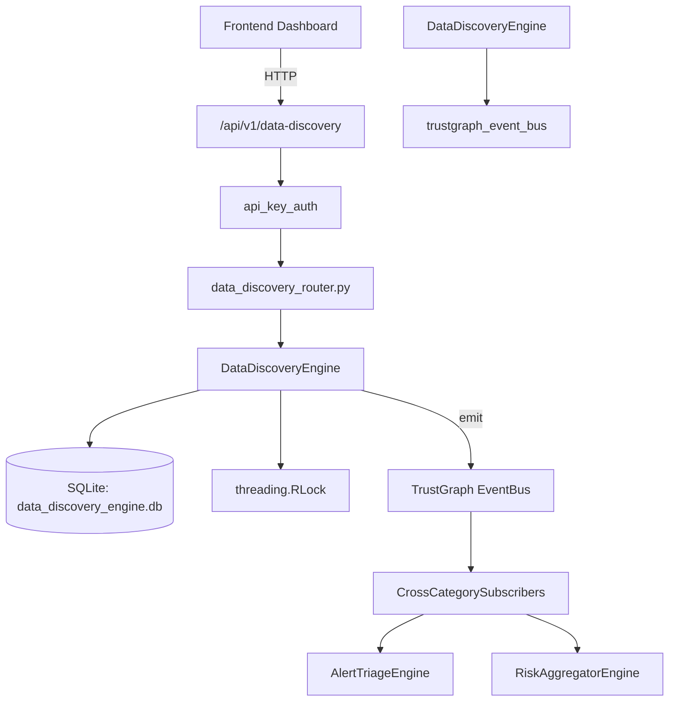

# US-0090: Data Discovery

## Sub-Epic: Advanced
**Master Goal**: ALDECI — $35/mo enterprise security intelligence platform replacing $50K-500K/yr tools

## User Story
As a **Robert Kim (Compliance Officer)**, I need to discover sensitive data across datastores
so that the platform delivers enterprise-grade advanced capabilities at 1/1000th the cost of legacy tools.

## Why This Matters
Data Discovery replaces functionality found in enterprise tools like CrowdStrike, Wiz, Snyk, and Rapid7.
By building this into ALDECI's $35/mo stack, customers save $50K+/yr on standalone Advanced tooling.

## Architecture

## Current State: 95% Complete
- ✅ `register_datastore()` — Register a new datastore. (line 145)
- ✅ `list_datastores()` — List datastores with optional filters. (line 212)
- ✅ `get_datastore()` — Retrieve a single datastore by ID. data_types_found returned as list. (line 232)
- ✅ `record_discovery()` — Record a data discovery finding for a datastore. (line 247)
- ✅ `list_discoveries()` — List discoveries with optional filters. (line 331)
- ✅ `create_scan_job()` — Create a new scan job for a datastore. (line 364)
- ❌ TrustGraph event emission — not yet verified

## Key Functions (from `suite-core/core/data_discovery_engine.py` — 477 lines)
- `DataDiscoveryEngine.register_datastore()` — Register a new datastore. (line 145)
- `DataDiscoveryEngine.list_datastores()` — List datastores with optional filters. (line 212)
- `DataDiscoveryEngine.get_datastore()` — Retrieve a single datastore by ID. data_types_found returned as list. (line 232)
- `DataDiscoveryEngine.record_discovery()` — Record a data discovery finding for a datastore. (line 247)
- `DataDiscoveryEngine.list_discoveries()` — List discoveries with optional filters. (line 331)
- `DataDiscoveryEngine.create_scan_job()` — Create a new scan job for a datastore. (line 364)
- `DataDiscoveryEngine.list_scan_jobs()` — List scan jobs with optional filters. (line 398)
- `DataDiscoveryEngine.get_discovery_stats()` — Return aggregated discovery statistics for an org. (line 422)

## Dependencies
- **Depends on**: trustgraph_event_bus
- **Depended by**: Routers, TrustGraph EventBus, CrossCategorySubscribers
- **TrustGraph**: Event emission wired via ResponseInterceptorMiddleware
- **Source file**: `suite-core/core/data_discovery_engine.py` (477 lines)
- **Router file**: `suite-api/apps/api/data_discovery_router.py`

## API Endpoints
| Method | Path | Description |
|--------|------|-------------|
| POST | `/api/v1/data-discovery/datastores` | register datastore |
| GET | `/api/v1/data-discovery/datastores` | list datastores |
| GET | `/api/v1/data-discovery/datastores/{datastore_id}` | get datastore |
| POST | `/api/v1/data-discovery/datastores/{datastore_id}/discoveries` | record discovery |
| GET | `/api/v1/data-discovery/discoveries` | list discoveries |
| POST | `/api/v1/data-discovery/datastores/{datastore_id}/scans` | create scan job |
| GET | `/api/v1/data-discovery/scans` | list scan jobs |
| GET | `/api/v1/data-discovery/stats` | get discovery stats |

## Tasks Remaining
1. Verify TrustGraph event emission works end-to-end (2h)
2. Add integration test with real persona workflow (2h)
3. Wire CrossCategorySubscriber consumer chain (1h)
4. Validate with 30-persona walkthrough (1h)
5. Optimize query performance for large datasets (2h)
6. Expand test coverage to edge cases (2h)

## Definition of Done
- [ ] Robert Kim (Compliance Officer) can access /api/v1/data-discovery and get meaningful data
- [ ] All CRUD operations return correct HTTP status codes
- [ ] TrustGraph receives events from this engine
- [ ] 46+ tests passing in `tests/test_data_discovery_engine.py`
- [ ] 30-persona walkthrough includes this endpoint at 100%
- [ ] No hardcoded org_id — all queries are org-scoped

## Sprint: Wave 45 (est. April 21-23, 2026)

## Test Coverage
- **Test file**: `tests/test_data_discovery_engine.py`
- **Tests**: 46 tests
- **Status**: Passing
