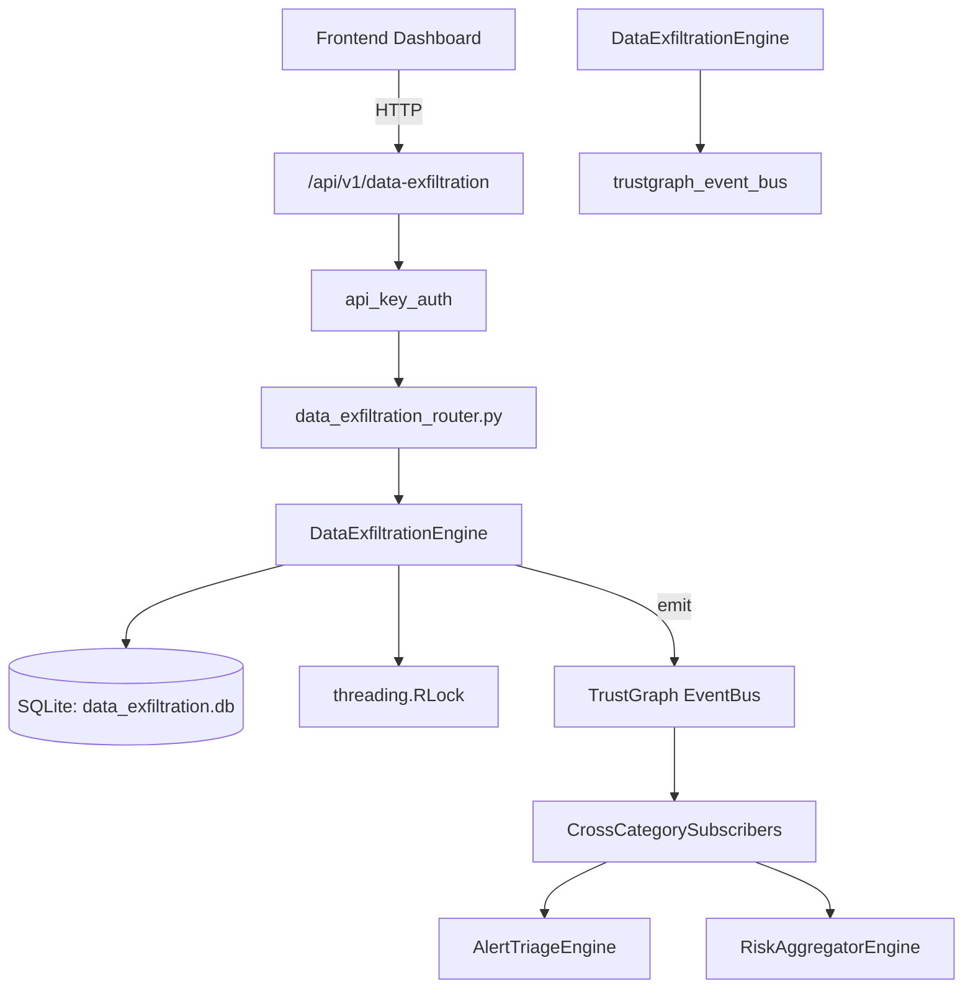

# US-0091: Data Exfiltration

## Sub-Epic: Advanced
**Master Goal**: ALDECI — $35/mo enterprise security intelligence platform replacing $50K-500K/yr tools

## User Story
As a **Karen Taylor (IR Lead)**, I need to detect and prevent data exfiltration
so that the platform delivers enterprise-grade advanced capabilities at 1/1000th the cost of legacy tools.

## Why This Matters
Data Exfiltration replaces functionality found in enterprise tools like CrowdStrike, Wiz, Snyk, and Rapid7.
By building this into ALDECI's $35/mo stack, customers save $50K+/yr on standalone Advanced tooling.

## Architecture

## Current State: 95% Complete
- ✅ `record_incident()` — Record a data exfiltration incident. (line 165)
- ✅ `list_incidents()` — List exfiltration incidents for the org with optional filters. (line 235)
- ✅ `get_incident()` — Return a single incident or None (with org isolation). (line 259)
- ✅ `update_incident_status()` — Update incident status. Returns updated record or None if not found. (line 268)
- ✅ `create_policy()` — Create a DLP policy. (line 291)
- ✅ `list_policies()` — List DLP policies for the org with optional enabled filter. (line 335)
- ❌ TrustGraph event emission — not yet verified

## Key Functions (from `suite-core/core/data_exfiltration_engine.py` — 461 lines)
- `DataExfiltrationEngine.record_incident()` — Record a data exfiltration incident. (line 165)
- `DataExfiltrationEngine.list_incidents()` — List exfiltration incidents for the org with optional filters. (line 235)
- `DataExfiltrationEngine.get_incident()` — Return a single incident or None (with org isolation). (line 259)
- `DataExfiltrationEngine.update_incident_status()` — Update incident status. Returns updated record or None if not found. (line 268)
- `DataExfiltrationEngine.create_policy()` — Create a DLP policy. (line 291)
- `DataExfiltrationEngine.list_policies()` — List DLP policies for the org with optional enabled filter. (line 335)
- `DataExfiltrationEngine.add_indicator()` — Add an exfiltration indicator. Clamps confidence_score to 0-100. (line 355)
- `DataExfiltrationEngine.list_indicators()` — List indicators for the org with optional incident_id filter. (line 387)

## Dependencies
- **Depends on**: trustgraph_event_bus
- **Depended by**: Routers, TrustGraph EventBus, CrossCategorySubscribers
- **TrustGraph**: Event emission wired via ResponseInterceptorMiddleware
- **Source file**: `suite-core/core/data_exfiltration_engine.py` (461 lines)
- **Router file**: `suite-api/apps/api/data_exfiltration_router.py`

## API Endpoints
| Method | Path | Description |
|--------|------|-------------|
| POST | `/api/v1/data-exfiltration/incidents` | record incident |
| GET | `/api/v1/data-exfiltration/incidents` | list incidents |
| GET | `/api/v1/data-exfiltration/incidents/{incident_id}` | get incident |
| PUT | `/api/v1/data-exfiltration/incidents/{incident_id}/status` | update incident status |
| POST | `/api/v1/data-exfiltration/policies` | create policy |
| GET | `/api/v1/data-exfiltration/policies` | list policies |
| POST | `/api/v1/data-exfiltration/indicators` | add indicator |
| GET | `/api/v1/data-exfiltration/indicators` | list indicators |
| GET | `/api/v1/data-exfiltration/stats` | get exfil stats |

## Tasks Remaining
1. Verify TrustGraph event emission works end-to-end (2h)
2. Add integration test with real persona workflow (2h)
3. Wire CrossCategorySubscriber consumer chain (1h)
4. Validate with 30-persona walkthrough (1h)
5. Optimize query performance for large datasets (2h)
6. Expand test coverage to edge cases (2h)

## Definition of Done
- [ ] Karen Taylor (IR Lead) can access /api/v1/data-exfiltration and get meaningful data
- [ ] All CRUD operations return correct HTTP status codes
- [ ] TrustGraph receives events from this engine
- [ ] 34+ tests passing in `tests/test_data_exfiltration_engine.py`
- [ ] 30-persona walkthrough includes this endpoint at 100%
- [ ] No hardcoded org_id — all queries are org-scoped

## Sprint: Wave 45 (est. April 21-23, 2026)

## Test Coverage
- **Test file**: `tests/test_data_exfiltration_engine.py`
- **Tests**: 34 tests
- **Status**: Passing
