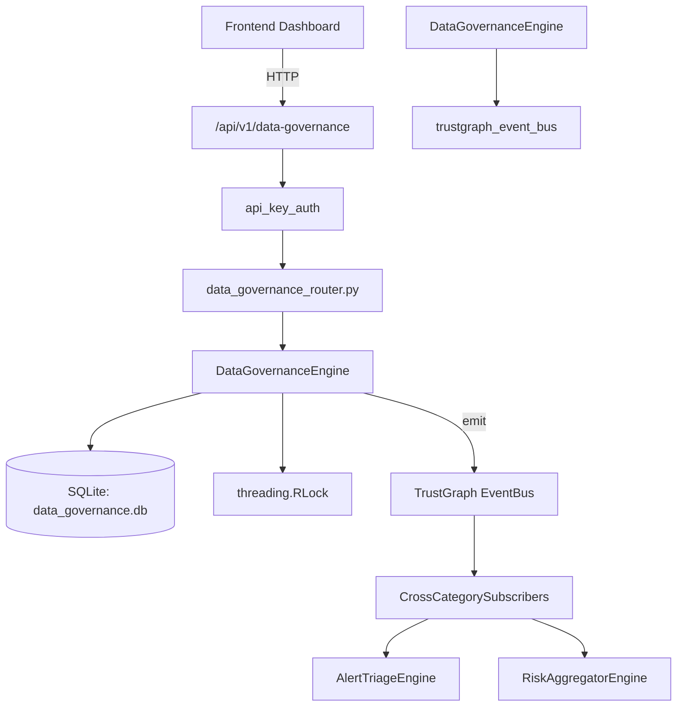

# US-0092: Data Governance

## Sub-Epic: GRC
**Master Goal**: ALDECI — $35/mo enterprise security intelligence platform replacing $50K-500K/yr tools

## User Story
As a **Robert Kim (Compliance Officer)**, I need to enforce data governance policies
so that the platform delivers enterprise-grade grc capabilities at 1/1000th the cost of legacy tools.

## Why This Matters
Data Governance replaces functionality found in enterprise tools like CrowdStrike, Wiz, Snyk, and Rapid7.
By building this into ALDECI's $35/mo stack, customers save $50K+/yr on standalone GRC tooling.

## Architecture

## Current State: 95% Complete
- ✅ `register_asset()` — Register a new data asset for an org. (line 162)
- ✅ `list_assets()` — List data assets for an org with optional filters. (line 225)
- ✅ `get_asset()` — Fetch a single data asset by ID, scoped to org. (line 255)
- ✅ `update_asset_classification()` — Update an asset's classification level. Returns True if updated. (line 268)
- ✅ `create_policy()` — Create a new governance policy. (line 286)
- ✅ `list_policies()` — List governance policies for an org with optional filters. (line 335)
- ❌ TrustGraph event emission — not yet verified

## Key Functions (from `suite-core/core/data_governance_engine.py` — 579 lines)
- `DataGovernanceEngine.register_asset()` — Register a new data asset for an org. (line 162)
- `DataGovernanceEngine.list_assets()` — List data assets for an org with optional filters. (line 225)
- `DataGovernanceEngine.get_asset()` — Fetch a single data asset by ID, scoped to org. (line 255)
- `DataGovernanceEngine.update_asset_classification()` — Update an asset's classification level. Returns True if updated. (line 268)
- `DataGovernanceEngine.create_policy()` — Create a new governance policy. (line 286)
- `DataGovernanceEngine.list_policies()` — List governance policies for an org with optional filters. (line 335)
- `DataGovernanceEngine.log_violation()` — Log a policy violation for an org. (line 363)
- `DataGovernanceEngine.list_violations()` — List policy violations for an org. (line 404)

## Dependencies
- **Depends on**: trustgraph_event_bus
- **Depended by**: Routers, TrustGraph EventBus, CrossCategorySubscribers
- **TrustGraph**: Event emission wired via ResponseInterceptorMiddleware
- **Source file**: `suite-core/core/data_governance_engine.py` (579 lines)
- **Router file**: `suite-api/apps/api/data_governance_router.py`

## API Endpoints
| Method | Path | Description |
|--------|------|-------------|
| POST | `/api/v1/data-governance/assets` | register asset |
| GET | `/api/v1/data-governance/assets` | list assets |
| GET | `/api/v1/data-governance/assets/{asset_id}` | get asset |
| PATCH | `/api/v1/data-governance/assets/{asset_id}/classification` | update asset classification |
| POST | `/api/v1/data-governance/policies` | create policy |
| GET | `/api/v1/data-governance/policies` | list policies |
| POST | `/api/v1/data-governance/violations` | log violation |
| GET | `/api/v1/data-governance/violations` | list violations |
| POST | `/api/v1/data-governance/violations/{violation_id}/resolve` | resolve violation |
| POST | `/api/v1/data-governance/flows` | add data flow |
| GET | `/api/v1/data-governance/flows` | list data flows |
| GET | `/api/v1/data-governance/stats` | get governance stats |

## Tasks Remaining
1. Verify TrustGraph event emission works end-to-end (2h)
2. Add integration test with real persona workflow (2h)
3. Wire CrossCategorySubscriber consumer chain (1h)
4. Validate with 30-persona walkthrough (1h)
5. Optimize query performance for large datasets (2h)
6. Expand test coverage to edge cases (2h)

## Definition of Done
- [ ] Robert Kim (Compliance Officer) can access /api/v1/data-governance and get meaningful data
- [ ] All CRUD operations return correct HTTP status codes
- [ ] TrustGraph receives events from this engine
- [ ] 40+ tests passing in `tests/test_data_governance_engine.py`
- [ ] 30-persona walkthrough includes this endpoint at 100%
- [ ] No hardcoded org_id — all queries are org-scoped

## Sprint: Wave 45 (est. April 21-23, 2026)

## Test Coverage
- **Test file**: `tests/test_data_governance_engine.py`
- **Tests**: 40 tests
- **Status**: Passing
