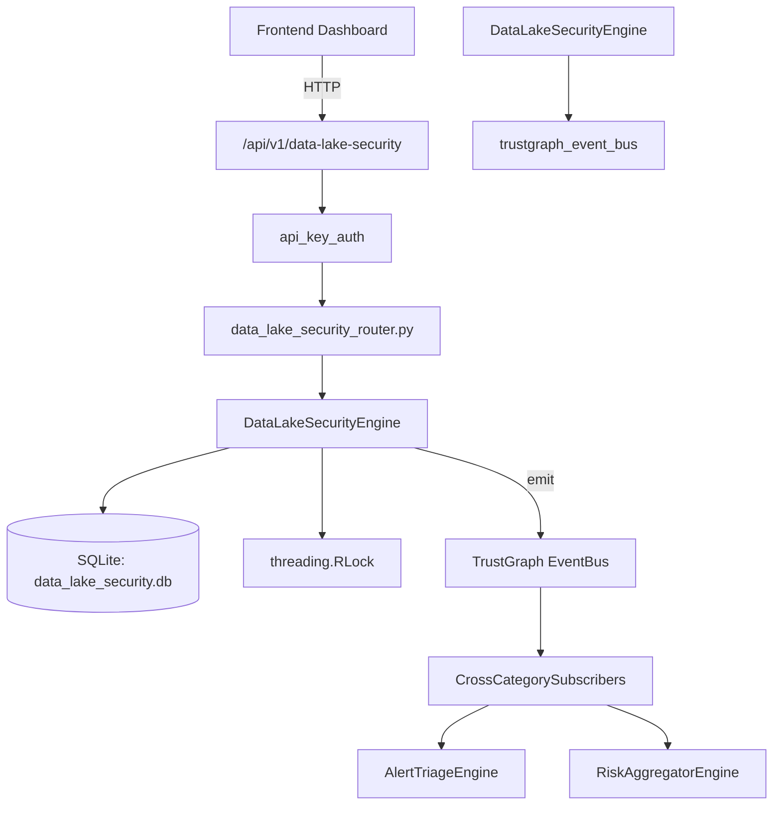

# US-0093: Data Lake Security

## Sub-Epic: Advanced
**Master Goal**: ALDECI — $35/mo enterprise security intelligence platform replacing $50K-500K/yr tools

## User Story
As a **Chris Lee (Security Data Scientist)**, I need to secure data lake environments
so that the platform delivers enterprise-grade advanced capabilities at 1/1000th the cost of legacy tools.

## Why This Matters
Data Lake Security replaces functionality found in enterprise tools like CrowdStrike, Wiz, Snyk, and Rapid7.
By building this into ALDECI's $35/mo stack, customers save $50K+/yr on standalone Advanced tooling.

## Architecture

## Current State: 95% Complete
- ✅ `register_data_store()` — Register a data store with classification and security config. (line 114)
- ✅ `list_data_stores()` — List data stores with optional classification filter. (line 157)
- ✅ `run_security_assessment()` — Run a security assessment on a data store. (line 185)
- ✅ `record_access_pattern()` — Record an access event for a data store. (line 268)
- ✅ `get_access_patterns()` — Return recent access patterns for a store. (line 304)
- ✅ `detect_data_exfiltration_risk()` — Compute exfiltration risk score and indicators for a store. (line 323)
- ❌ TrustGraph event emission — not yet verified

## Key Functions (from `suite-core/core/data_lake_security_engine.py` — 474 lines)
- `DataLakeSecurityEngine.register_data_store()` — Register a data store with classification and security config. (line 114)
- `DataLakeSecurityEngine.list_data_stores()` — List data stores with optional classification filter. (line 157)
- `DataLakeSecurityEngine.run_security_assessment()` — Run a security assessment on a data store. (line 185)
- `DataLakeSecurityEngine.record_access_pattern()` — Record an access event for a data store. (line 268)
- `DataLakeSecurityEngine.get_access_patterns()` — Return recent access patterns for a store. (line 304)
- `DataLakeSecurityEngine.detect_data_exfiltration_risk()` — Compute exfiltration risk score and indicators for a store. (line 323)
- `DataLakeSecurityEngine.get_data_lake_stats()` — Return aggregate data lake security stats for the org. (line 405)

## Dependencies
- **Depends on**: trustgraph_event_bus
- **Depended by**: Routers, TrustGraph EventBus, CrossCategorySubscribers
- **TrustGraph**: Event emission wired via ResponseInterceptorMiddleware
- **Source file**: `suite-core/core/data_lake_security_engine.py` (474 lines)
- **Router file**: `suite-api/apps/api/data_lake_security_router.py`

## API Endpoints
| Method | Path | Description |
|--------|------|-------------|
| POST | `/api/v1/data-lake-security/stores` | register data store |
| GET | `/api/v1/data-lake-security/stores` | list data stores |
| POST | `/api/v1/data-lake-security/stores/{store_id}/assess` | run security assessment |
| POST | `/api/v1/data-lake-security/stores/{store_id}/access` | record access pattern |
| GET | `/api/v1/data-lake-security/stores/{store_id}/access` | get access patterns |
| GET | `/api/v1/data-lake-security/stores/{store_id}/exfil-risk` | detect data exfiltration risk |
| GET | `/api/v1/data-lake-security/stats` | get data lake stats |

## Tasks Remaining
1. Verify TrustGraph event emission works end-to-end (2h)
2. Add integration test with real persona workflow (2h)
3. Wire CrossCategorySubscriber consumer chain (1h)
4. Validate with 30-persona walkthrough (1h)
5. Optimize query performance for large datasets (2h)
6. Expand test coverage to edge cases (2h)

## Definition of Done
- [ ] Chris Lee (Security Data Scientist) can access /api/v1/data-lake-security and get meaningful data
- [ ] All CRUD operations return correct HTTP status codes
- [ ] TrustGraph receives events from this engine
- [ ] 35+ tests passing in `tests/test_data_lake_security_engine.py`
- [ ] 30-persona walkthrough includes this endpoint at 100%
- [ ] No hardcoded org_id — all queries are org-scoped

## Sprint: Wave 45 (est. April 21-23, 2026)

## Test Coverage
- **Test file**: `tests/test_data_lake_security_engine.py`
- **Tests**: 35 tests
- **Status**: Passing
