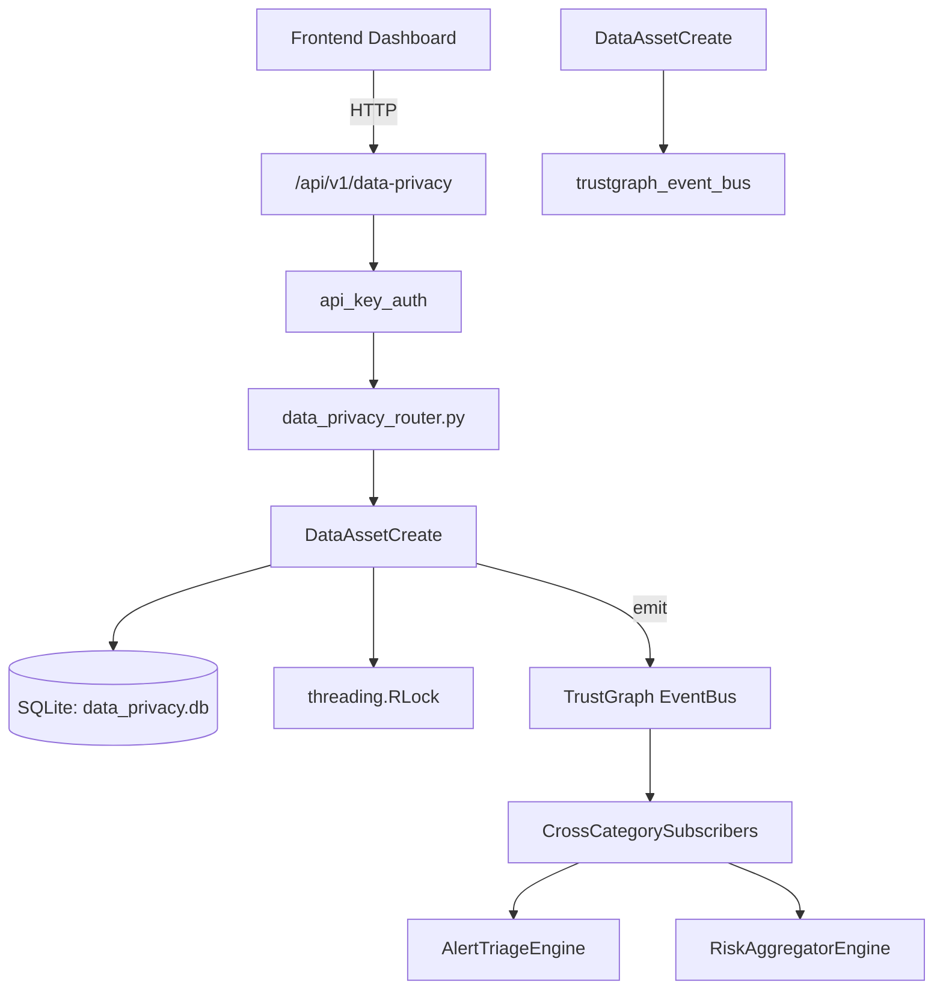

# US-0094: Data Privacy

## Sub-Epic: GRC
**Master Goal**: ALDECI — $35/mo enterprise security intelligence platform replacing $50K-500K/yr tools

## User Story
As a **Robert Kim (Compliance Officer)**, I need to manage data privacy compliance
so that the platform delivers enterprise-grade grc capabilities at 1/1000th the cost of legacy tools.

## Why This Matters
Data Privacy replaces functionality found in enterprise tools like CrowdStrike, Wiz, Snyk, and Rapid7.
By building this into ALDECI's $35/mo stack, customers save $50K+/yr on standalone GRC tooling.

## Architecture

## Current State: 95% Complete
- ✅ `register_data_asset()` — Register a new data asset. Validates name, data_category, and classification. (line 136)
- ✅ `list_data_assets()` — List data assets for org, optionally filtered by data_category or classification (line 174)
- ✅ `get_data_asset()` — Fetch a single data asset, scoped to org_id. (line 194)
- ✅ `record_privacy_request()` — Record a new data subject request. Validates request_type and subject_email. (line 209)
- ✅ `list_privacy_requests()` — List privacy requests for org, optionally filtered by request_type or status. (line 233)
- ✅ `update_request_status()` — Update a privacy request status. Sets completed_at when status=completed. (line 253)
- ❌ TrustGraph event emission — not yet verified

## Key Functions (from `suite-core/core/data_privacy_engine.py` — 349 lines)
- `DataPrivacyEngine.register_data_asset()` — Register a new data asset. Validates name, data_category, and classification. (line 136)
- `DataPrivacyEngine.list_data_assets()` — List data assets for org, optionally filtered by data_category or classification (line 174)
- `DataPrivacyEngine.get_data_asset()` — Fetch a single data asset, scoped to org_id. (line 194)
- `DataPrivacyEngine.record_privacy_request()` — Record a new data subject request. Validates request_type and subject_email. (line 209)
- `DataPrivacyEngine.list_privacy_requests()` — List privacy requests for org, optionally filtered by request_type or status. (line 233)
- `DataPrivacyEngine.update_request_status()` — Update a privacy request status. Sets completed_at when status=completed. (line 253)
- `DataPrivacyEngine.get_privacy_stats()` — Return privacy overview stats: assets by category/classification, requests by ty (line 297)

## Dependencies
- **Depends on**: trustgraph_event_bus
- **Depended by**: Routers, TrustGraph EventBus, CrossCategorySubscribers
- **TrustGraph**: Event emission wired via ResponseInterceptorMiddleware
- **Source file**: `suite-core/core/data_privacy_engine.py` (349 lines)
- **Router file**: `suite-api/apps/api/data_privacy_router.py`

## API Endpoints
| Method | Path | Description |
|--------|------|-------------|
| POST | `/api/v1/data-privacy/assets` | register data asset |
| GET | `/api/v1/data-privacy/assets` | list data assets |
| GET | `/api/v1/data-privacy/assets/{asset_id}` | get data asset |
| POST | `/api/v1/data-privacy/requests` | record privacy request |
| GET | `/api/v1/data-privacy/requests` | list privacy requests |
| PUT | `/api/v1/data-privacy/requests/{request_id}/status` | update request status |
| GET | `/api/v1/data-privacy/stats` | get privacy stats |

## Tasks Remaining
1. Verify TrustGraph event emission works end-to-end (2h)
2. Add integration test with real persona workflow (2h)
3. Wire CrossCategorySubscriber consumer chain (1h)
4. Validate with 30-persona walkthrough (1h)
5. Optimize query performance for large datasets (2h)
6. Expand test coverage to edge cases (2h)

## Definition of Done
- [ ] Robert Kim (Compliance Officer) can access /api/v1/data-privacy and get meaningful data
- [ ] All CRUD operations return correct HTTP status codes
- [ ] TrustGraph receives events from this engine
- [ ] 30+ tests passing in `tests/test_data_privacy_engine.py`
- [ ] 30-persona walkthrough includes this endpoint at 100%
- [ ] No hardcoded org_id — all queries are org-scoped

## Sprint: Wave 45 (est. April 21-23, 2026)

## Test Coverage
- **Test file**: `tests/test_data_privacy_engine.py`
- **Tests**: 30 tests
- **Status**: Passing
