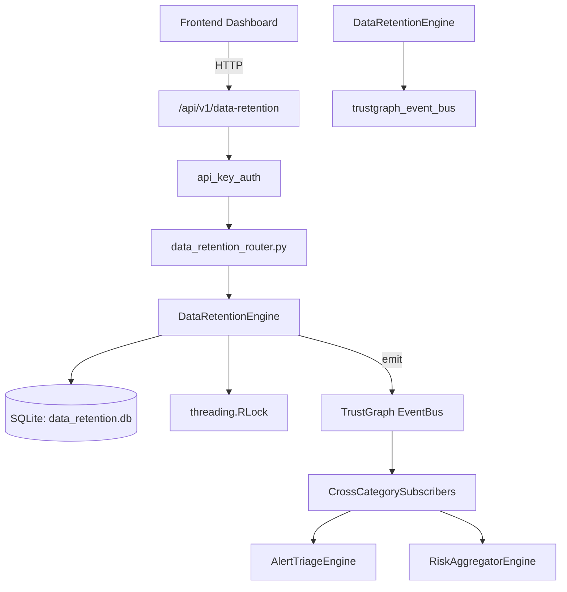

# US-0095: Data Retention

## Sub-Epic: GRC
**Master Goal**: ALDECI — $35/mo enterprise security intelligence platform replacing $50K-500K/yr tools

## User Story
As a **Robert Kim (Compliance Officer)**, I need to enforce GDPR/CCPA data retention
so that the platform delivers enterprise-grade grc capabilities at 1/1000th the cost of legacy tools.

## Why This Matters
Data Retention replaces functionality found in enterprise tools like CrowdStrike, Wiz, Snyk, and Rapid7.
By building this into ALDECI's $35/mo stack, customers save $50K+/yr on standalone GRC tooling.

## Architecture

## Current State: 95% Complete
- ✅ `create_policy()` — Create a retention policy. (line 137)
- ✅ `list_policies()` — List retention policies, optionally filtered by regulation. (line 182)
- ✅ `get_policy()` — Get a single policy by ID. (line 200)
- ✅ `register_dataset()` — Register a dataset under a retention policy. (line 214)
- ✅ `list_datasets()` — List datasets, optionally filtered by policy_id or expiry_status. (line 268)
- ✅ `mark_legal_hold()` — Place a legal hold on a dataset. (line 319)
- ❌ TrustGraph event emission — not yet verified

## Key Functions (from `suite-core/core/data_retention_engine.py` — 502 lines)
- `DataRetentionEngine.create_policy()` — Create a retention policy. (line 137)
- `DataRetentionEngine.list_policies()` — List retention policies, optionally filtered by regulation. (line 182)
- `DataRetentionEngine.get_policy()` — Get a single policy by ID. (line 200)
- `DataRetentionEngine.register_dataset()` — Register a dataset under a retention policy. (line 214)
- `DataRetentionEngine.list_datasets()` — List datasets, optionally filtered by policy_id or expiry_status. (line 268)
- `DataRetentionEngine.mark_legal_hold()` — Place a legal hold on a dataset. (line 319)
- `DataRetentionEngine.release_legal_hold()` — Release a legal hold from a dataset. (line 338)
- `DataRetentionEngine.schedule_deletion()` — Schedule a dataset for deletion. (line 360)

## Dependencies
- **Depends on**: trustgraph_event_bus
- **Depended by**: Routers, TrustGraph EventBus, CrossCategorySubscribers
- **TrustGraph**: Event emission wired via ResponseInterceptorMiddleware
- **Source file**: `suite-core/core/data_retention_engine.py` (502 lines)
- **Router file**: `suite-api/apps/api/data_retention_router.py`

## API Endpoints
| Method | Path | Description |
|--------|------|-------------|
| GET | `/api/v1/data-retention/policies` | list policies |
| POST | `/api/v1/data-retention/policies` | create policy |
| GET | `/api/v1/data-retention/datasets` | list datasets |
| POST | `/api/v1/data-retention/datasets` | register dataset |
| POST | `/api/v1/data-retention/datasets/{dataset_id}/legal-hold` | mark legal hold |
| POST | `/api/v1/data-retention/datasets/{dataset_id}/release-hold` | release legal hold |
| POST | `/api/v1/data-retention/datasets/{dataset_id}/schedule-delete` | schedule deletion |
| POST | `/api/v1/data-retention/datasets/{dataset_id}/complete-delete` | complete deletion |
| GET | `/api/v1/data-retention/deletion-audit` | get deletion audit |
| GET | `/api/v1/data-retention/stats` | get stats |

## Tasks Remaining
1. Verify TrustGraph event emission works end-to-end (2h)
2. Add integration test with real persona workflow (2h)
3. Wire CrossCategorySubscriber consumer chain (1h)
4. Validate with 30-persona walkthrough (1h)
5. Optimize query performance for large datasets (2h)
6. Expand test coverage to edge cases (2h)

## Definition of Done
- [ ] Robert Kim (Compliance Officer) can access /api/v1/data-retention and get meaningful data
- [ ] All CRUD operations return correct HTTP status codes
- [ ] TrustGraph receives events from this engine
- [ ] 28+ tests passing in `tests/test_data_retention_engine.py`
- [ ] 30-persona walkthrough includes this endpoint at 100%
- [ ] No hardcoded org_id — all queries are org-scoped

## Sprint: Wave 45 (est. April 21-23, 2026)

## Test Coverage
- **Test file**: `tests/test_data_retention_engine.py`
- **Tests**: 28 tests
- **Status**: Passing
