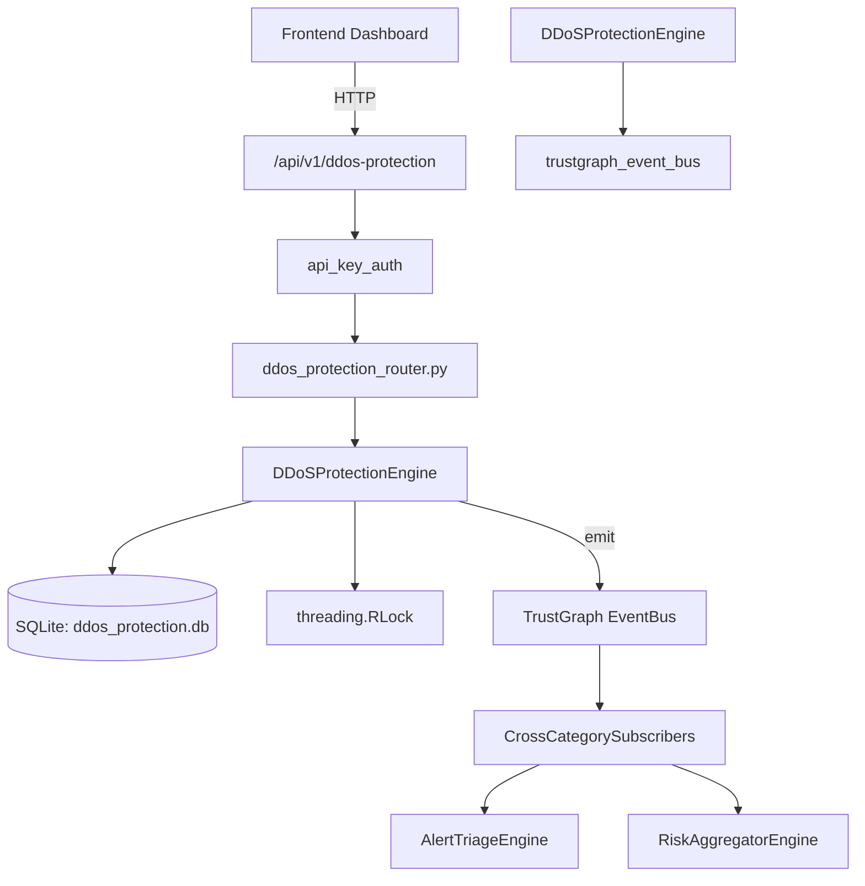

# US-0096: Ddos Protection

## Sub-Epic: Network
**Master Goal**: ALDECI — $35/mo enterprise security intelligence platform replacing $50K-500K/yr tools

## User Story
As a **Ryan Murphy (Platform Engineer)**, I need to detect and mitigate DDoS attacks
so that the platform delivers enterprise-grade network capabilities at 1/1000th the cost of legacy tools.

## Why This Matters
Ddos Protection replaces functionality found in enterprise tools like CrowdStrike, Wiz, Snyk, and Rapid7.
By building this into ALDECI's $35/mo stack, customers save $50K+/yr on standalone Network tooling.

## Architecture

## Current State: 95% Complete
- ✅ `register_protected_resource()` — Register a resource for DDoS protection. (line 122)
- ✅ `list_protected_resources()` — Return all protected resources for an org. (line 181)
- ✅ `record_attack_event()` — Record a DDoS attack event against a protected resource. (line 194)
- ✅ `list_attack_events()` — Return attack events filtered by org, resource, and/or status. (line 253)
- ✅ `update_attack_status()` — Update the status of an attack event. (line 287)
- ✅ `create_mitigation_rule()` — Create a DDoS mitigation rule. (line 329)
- ❌ TrustGraph event emission — not yet verified

## Key Functions (from `suite-core/core/ddos_protection_engine.py` — 437 lines)
- `DDoSProtectionEngine.register_protected_resource()` — Register a resource for DDoS protection. (line 122)
- `DDoSProtectionEngine.list_protected_resources()` — Return all protected resources for an org. (line 181)
- `DDoSProtectionEngine.record_attack_event()` — Record a DDoS attack event against a protected resource. (line 194)
- `DDoSProtectionEngine.list_attack_events()` — Return attack events filtered by org, resource, and/or status. (line 253)
- `DDoSProtectionEngine.update_attack_status()` — Update the status of an attack event. (line 287)
- `DDoSProtectionEngine.create_mitigation_rule()` — Create a DDoS mitigation rule. (line 329)
- `DDoSProtectionEngine.list_mitigation_rules()` — Return all mitigation rules for an org. (line 380)
- `DDoSProtectionEngine.get_ddos_stats()` — Return a summary of DDoS activity for an org. (line 393)

## Dependencies
- **Depends on**: trustgraph_event_bus
- **Depended by**: Routers, TrustGraph EventBus, CrossCategorySubscribers
- **TrustGraph**: Event emission wired via ResponseInterceptorMiddleware
- **Source file**: `suite-core/core/ddos_protection_engine.py` (437 lines)
- **Router file**: `suite-api/apps/api/ddos_protection_router.py`

## API Endpoints
| Method | Path | Description |
|--------|------|-------------|
| POST | `/api/v1/ddos-protection/resources` | register protected resource |
| GET | `/api/v1/ddos-protection/resources` | list protected resources |
| POST | `/api/v1/ddos-protection/attacks` | record attack event |
| GET | `/api/v1/ddos-protection/attacks` | list attack events |
| PATCH | `/api/v1/ddos-protection/attacks/{attack_id}/status` | update attack status |
| POST | `/api/v1/ddos-protection/rules` | create mitigation rule |
| GET | `/api/v1/ddos-protection/rules` | list mitigation rules |
| GET | `/api/v1/ddos-protection/stats` | get ddos stats |

## Tasks Remaining
1. Verify TrustGraph event emission works end-to-end (2h)
2. Add integration test with real persona workflow (2h)
3. Wire CrossCategorySubscriber consumer chain (1h)
4. Validate with 30-persona walkthrough (1h)
5. Optimize query performance for large datasets (2h)
6. Expand test coverage to edge cases (2h)

## Definition of Done
- [ ] Ryan Murphy (Platform Engineer) can access /api/v1/ddos-protection and get meaningful data
- [ ] All CRUD operations return correct HTTP status codes
- [ ] TrustGraph receives events from this engine
- [ ] 39+ tests passing in `tests/test_ddos_protection_engine.py`
- [ ] 30-persona walkthrough includes this endpoint at 100%
- [ ] No hardcoded org_id — all queries are org-scoped

## Sprint: Wave 45 (est. April 21-23, 2026)

## Test Coverage
- **Test file**: `tests/test_ddos_protection_engine.py`
- **Tests**: 39 tests
- **Status**: Passing
