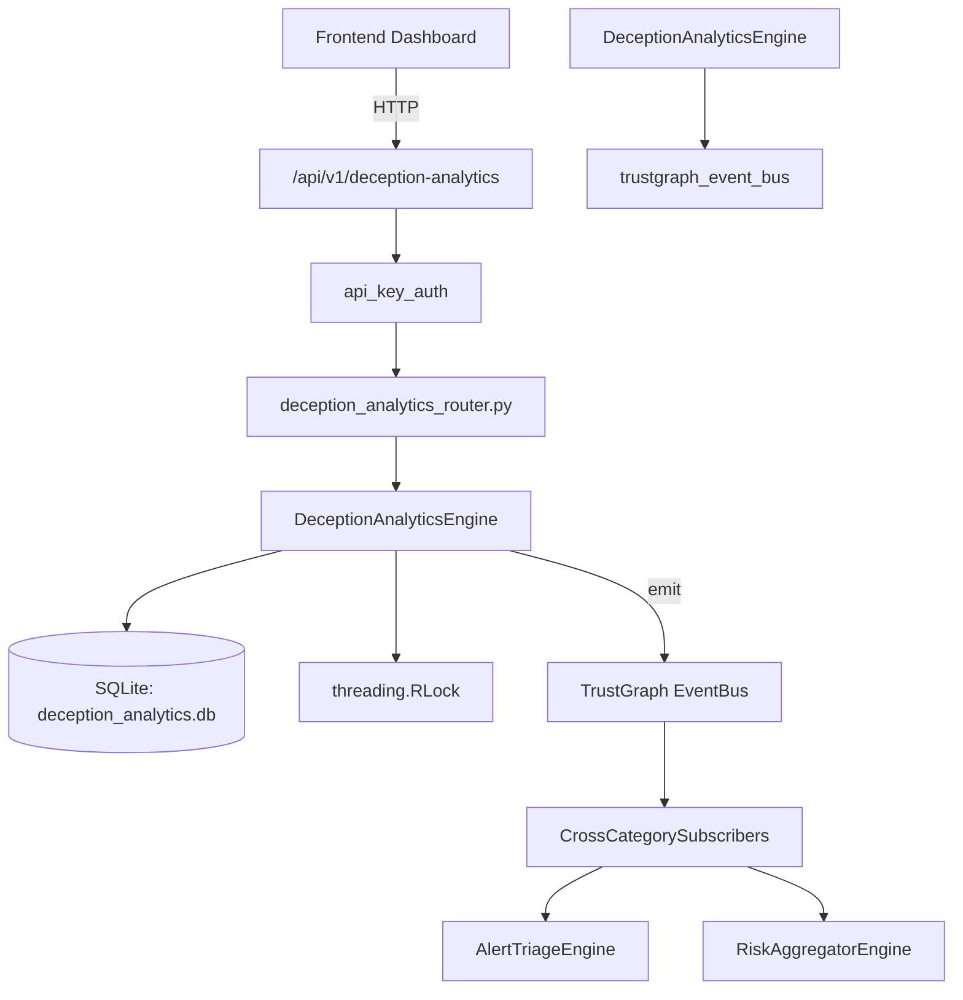

# US-0097: Deception Analytics

## Sub-Epic: Advanced
**Master Goal**: ALDECI — $35/mo enterprise security intelligence platform replacing $50K-500K/yr tools

## User Story
As a **Lisa Zhang (Pentester)**, I need to deploy honeypots and canary tokens
so that the platform delivers enterprise-grade advanced capabilities at 1/1000th the cost of legacy tools.

## Why This Matters
Deception Analytics replaces functionality found in enterprise tools like CrowdStrike, Wiz, Snyk, and Rapid7.
By building this into ALDECI's $35/mo stack, customers save $50K+/yr on standalone Advanced tooling.

## Architecture

## Current State: 95% Complete
- ✅ `register_asset()` — Register a new deception asset. (line 149)
- ✅ `list_assets()` — List deception assets with optional filters. (line 201)
- ✅ `get_asset()` — Retrieve a single asset by ID with org isolation. (line 221)
- ✅ `deactivate_asset()` — Deactivate a deception asset. (line 230)
- ✅ `record_interaction()` — Record an attacker interaction with a deception asset. (line 253)
- ✅ `list_interactions()` — List interactions with optional filters. (line 311)
- ❌ TrustGraph event emission — not yet verified

## Key Functions (from `suite-core/core/deception_analytics_engine.py` — 509 lines)
- `DeceptionAnalyticsEngine.register_asset()` — Register a new deception asset. (line 149)
- `DeceptionAnalyticsEngine.list_assets()` — List deception assets with optional filters. (line 201)
- `DeceptionAnalyticsEngine.get_asset()` — Retrieve a single asset by ID with org isolation. (line 221)
- `DeceptionAnalyticsEngine.deactivate_asset()` — Deactivate a deception asset. (line 230)
- `DeceptionAnalyticsEngine.record_interaction()` — Record an attacker interaction with a deception asset. (line 253)
- `DeceptionAnalyticsEngine.list_interactions()` — List interactions with optional filters. (line 311)
- `DeceptionAnalyticsEngine.create_campaign()` — Create a deception campaign. (line 339)
- `DeceptionAnalyticsEngine.update_campaign_stats()` — Update campaign statistics (non-None fields only). (line 380)

## Dependencies
- **Depends on**: trustgraph_event_bus
- **Depended by**: Routers, TrustGraph EventBus, CrossCategorySubscribers
- **TrustGraph**: Event emission wired via ResponseInterceptorMiddleware
- **Source file**: `suite-core/core/deception_analytics_engine.py` (509 lines)
- **Router file**: `suite-api/apps/api/deception_analytics_router.py`

## API Endpoints
| Method | Path | Description |
|--------|------|-------------|
| POST | `/api/v1/deception-analytics/assets` | register asset |
| GET | `/api/v1/deception-analytics/assets` | list assets |
| GET | `/api/v1/deception-analytics/assets/{asset_id}` | get asset |
| PUT | `/api/v1/deception-analytics/assets/{asset_id}/deactivate` | deactivate asset |
| POST | `/api/v1/deception-analytics/interactions` | record interaction |
| GET | `/api/v1/deception-analytics/interactions` | list interactions |
| POST | `/api/v1/deception-analytics/campaigns` | create campaign |
| GET | `/api/v1/deception-analytics/campaigns` | list campaigns |
| PUT | `/api/v1/deception-analytics/campaigns/{campaign_id}/stats` | update campaign stats |
| GET | `/api/v1/deception-analytics/stats` | get deception stats |

## Tasks Remaining
1. Verify TrustGraph event emission works end-to-end (2h)
2. Add integration test with real persona workflow (2h)
3. Wire CrossCategorySubscriber consumer chain (1h)
4. Validate with 30-persona walkthrough (1h)
5. Optimize query performance for large datasets (2h)
6. Expand test coverage to edge cases (2h)

## Definition of Done
- [ ] Lisa Zhang (Pentester) can access /api/v1/deception-analytics and get meaningful data
- [ ] All CRUD operations return correct HTTP status codes
- [ ] TrustGraph receives events from this engine
- [ ] 45+ tests passing in `tests/test_deception_analytics_engine.py`
- [ ] 30-persona walkthrough includes this endpoint at 100%
- [ ] No hardcoded org_id — all queries are org-scoped

## Sprint: Wave 45 (est. April 21-23, 2026)

## Test Coverage
- **Test file**: `tests/test_deception_analytics_engine.py`
- **Tests**: 45 tests
- **Status**: Passing
