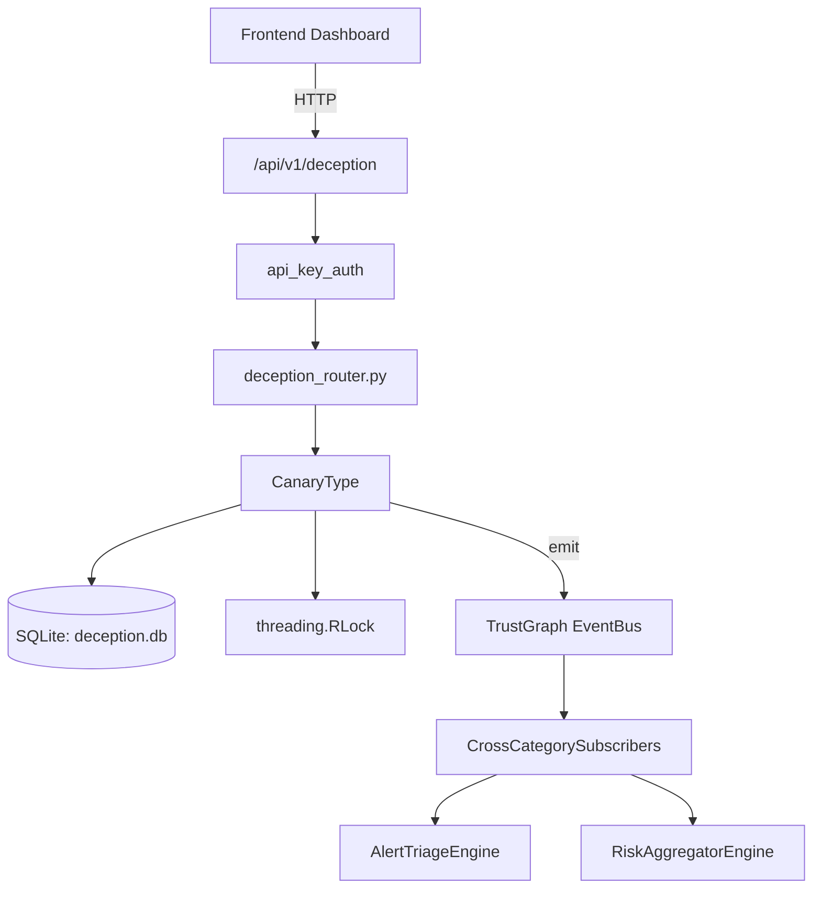

# US-0098: Deception

## Sub-Epic: Advanced
**Master Goal**: ALDECI — $35/mo enterprise security intelligence platform replacing $50K-500K/yr tools

## User Story
As a **Lisa Zhang (Pentester)**, I need to deploy honeypots and canary tokens
so that the platform delivers enterprise-grade advanced capabilities at 1/1000th the cost of legacy tools.

## Why This Matters
Deception replaces functionality found in enterprise tools like CrowdStrike, Wiz, Snyk, and Rapid7.
By building this into ALDECI's $35/mo stack, customers save $50K+/yr on standalone Advanced tooling.

## Architecture

## Current State: 95% Complete
- ✅ `generate_canary_aws_key()` — Return a fake AWS-style access key with ALDECI prefix (not AKIA). (line 173)
- ✅ `generate_canary_db_url()` — Return a fake DB connection string with canary marker. (line 180)
- ✅ `create_canary()` — Generate and persist a new canary token. (line 210)
- ✅ `check_canary()` — Check whether token_value matches any active canary. (line 245)
- ✅ `list_canaries()` — Return all canaries for an org (active and inactive). (line 311)
- ✅ `deactivate_canary()` — Deactivate a canary token. Returns True if found and updated. (line 321)
- ❌ TrustGraph event emission — not yet verified

## Key Functions (from `suite-core/core/deception_engine.py` — 458 lines)
- `DeceptionEngine.generate_canary_aws_key()` — Return a fake AWS-style access key with ALDECI prefix (not AKIA). (line 173)
- `DeceptionEngine.generate_canary_db_url()` — Return a fake DB connection string with canary marker. (line 180)
- `DeceptionEngine.create_canary()` — Generate and persist a new canary token. (line 210)
- `DeceptionEngine.check_canary()` — Check whether token_value matches any active canary. (line 245)
- `DeceptionEngine.list_canaries()` — Return all canaries for an org (active and inactive). (line 311)
- `DeceptionEngine.deactivate_canary()` — Deactivate a canary token. Returns True if found and updated. (line 321)
- `DeceptionEngine.get_alerts()` — Return canary alerts within the last N hours for an org. (line 331)
- `DeceptionEngine.deploy_honeypot_endpoint()` — Register a honeypot path. Returns info dict. (line 350)

## Dependencies
- **Depends on**: standalone
- **Depended by**: Routers, TrustGraph EventBus, CrossCategorySubscribers
- **TrustGraph**: Event emission wired via ResponseInterceptorMiddleware
- **Source file**: `suite-core/core/deception_engine.py` (458 lines)
- **Router file**: `suite-api/apps/api/deception_router.py`

## API Endpoints
| Method | Path | Description |
|--------|------|-------------|
| POST | `/api/v1/deception/canaries` | create canary |
| GET | `/api/v1/deception/canaries` | list canaries |
| DELETE | `/api/v1/deception/canaries/{canary_id}` | deactivate canary |
| POST | `/api/v1/deception/check` | check canary |
| GET | `/api/v1/deception/alerts` | get alerts |
| GET | `/api/v1/deception/stats` | get stats |
| POST | `/api/v1/deception/honeypots` | deploy honeypot |

## Tasks Remaining
1. Verify TrustGraph event emission works end-to-end (2h)
2. Add integration test with real persona workflow (2h)
3. Wire CrossCategorySubscriber consumer chain (1h)
4. Validate with 30-persona walkthrough (1h)
5. Optimize query performance for large datasets (2h)
6. Expand test coverage to edge cases (2h)

## Definition of Done
- [ ] Lisa Zhang (Pentester) can access /api/v1/deception and get meaningful data
- [ ] All CRUD operations return correct HTTP status codes
- [ ] TrustGraph receives events from this engine
- [ ] 29+ tests passing in `tests/test_deception_engine.py`
- [ ] 30-persona walkthrough includes this endpoint at 100%
- [ ] No hardcoded org_id — all queries are org-scoped

## Sprint: Wave 45 (est. April 21-23, 2026)

## Test Coverage
- **Test file**: `tests/test_deception_engine.py`
- **Tests**: 29 tests
- **Status**: Passing
