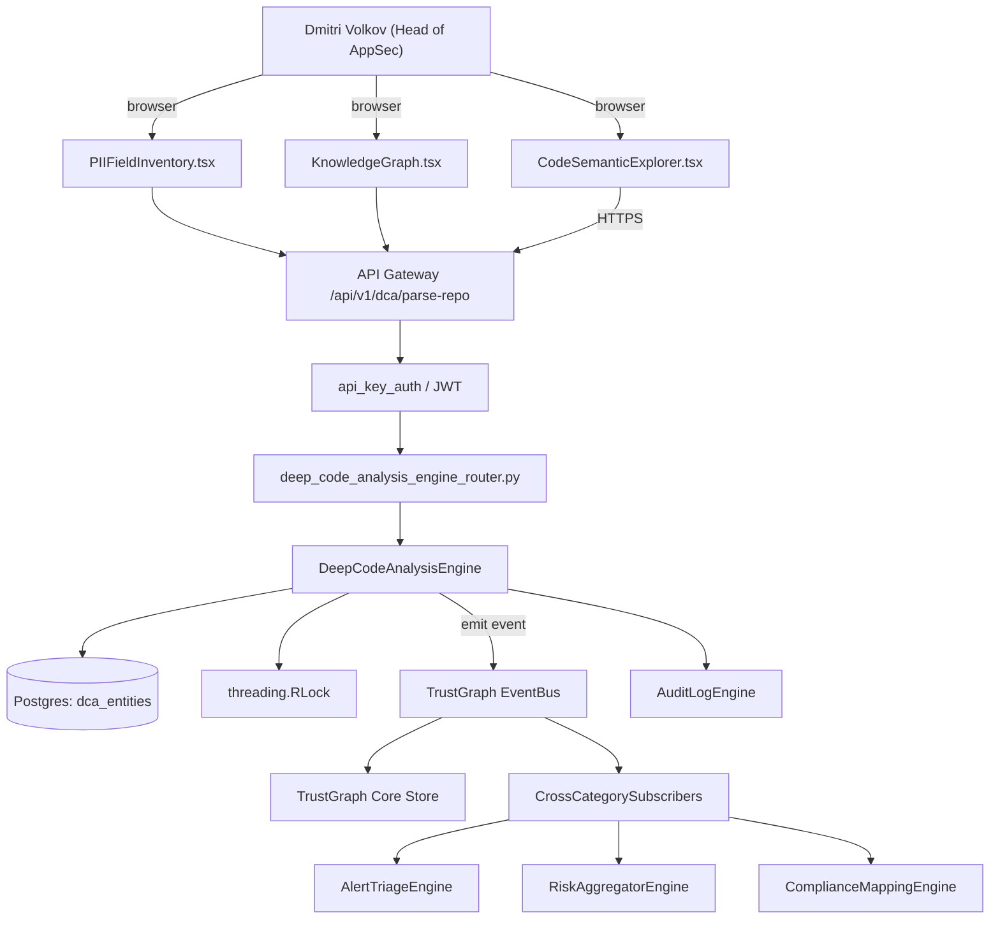

# US-0012: Ship Deep Code Analysis (DCA): AST parser extracting APIs, services, data models, PII fields as graph nodes

## Sub-Epic: ASPM
**Master Goal**: ALDECI — tiered $199-$1,499/mo enterprise security intelligence platform replacing $50K-$500K/yr tools

## User Story
As a **Dmitri Volkov (Head of AppSec)**, I need to ship Deep Code Analysis (DCA): AST parser extracting APIs, services, data models, PII fields as graph nodes so that Fixops matches Apiiro/Cycode ASPM depth and wins replacement deals.

## Why This Matters
Per competitor-emerging.md §1, Apiiro's Risk Graph resolution comes from DCA. TrustGraph currently has ~1,941 nodes — coarse. Splitting into business-meaningful entities (exposed API, service, sensitive-data field, data-model, contributor) 10x's node count and enables exposure-layer and blast-radius queries.

This work is called out as a P1 gap in `competitor-emerging.md`. Shipping it is load-bearing for ALDECI's tiered $199-$1,499/mo positioning against $50K-$500K/yr incumbents: every delayed gap becomes a displacement deal we lose.

## Architecture

## Current State: 0% — MISSING (new engine)
- [ ] Engine module `suite-core/core/deep_code_analysis_engine.py` does not exist yet
- [ ] Router `suite-api/apps/api/deep_code_analysis_engine_router.py` does not exist yet
- [ ] DB tables listed under Data Model do not exist yet
- [ ] Frontend screens listed under Key Functions do not exist yet
- [ ] No TrustGraph events emitted yet

## Key Functions
**Backend (engine methods):**
- `create_parse_repo()` — backs `POST /api/v1/dca/parse-repo`
- `get_repo()` — backs `GET /api/v1/dca/entities/{repo}`
- `get_diff()` — backs `GET /api/v1/dca/diff?from=&to=`

**Frontend screens:**
- `CodeSemanticExplorer.tsx` — operator-facing UI surface for this gap
- `PIIFieldInventory.tsx` — operator-facing UI surface for this gap
- `KnowledgeGraph.tsx` — operator-facing UI surface for this gap

## API Endpoints
| Method | Path | Auth | Purpose |
|--------|------|------|---------|
| POST | `/api/v1/dca/parse-repo` | api_key_auth | dca parse repo |
| GET | `/api/v1/dca/entities/{repo}` | api_key_auth | entities {repo} |
| GET | `/api/v1/dca/diff?from=&to=` | api_key_auth | dca diff?from=&to= |

## Data Model
- add dca_entities table: id, repo, commit, kind (api|service|data_model|pii_field|secret), attributes (JSONB)
- extend TrustGraph node types: exposed_api, service, data_model, pii_field, contributor

## Dependencies
**Depends on**: none explicit
**Depended by**: Router layer, TrustGraph EventBus, CrossCategorySubscribers, CrossCategoryEvidenceBuilder, AuditLogEngine
**New engine module**: `suite-core/core/deep_code_analysis_engine.py`
**New router module**: `suite-api/apps/api/deep_code_analysis_engine_router.py`
**Master gap id**: `GAP-012` (priority P1, effort L)

## Tasks Remaining
1. Schema migration: add dca_entities table (4h)
2. Schema migration: extend TrustGraph node types (4h)
3. Implement endpoint POST /api/v1/dca/parse-repo (6h)
4. Implement endpoint GET /api/v1/dca/entities/{repo} (6h)
5. Implement endpoint GET /api/v1/dca/diff?from=&to= (6h)
6. Wire frontend screen CodeSemanticExplorer.tsx (5h)
7. Wire frontend screen PIIFieldInventory.tsx (5h)
8. Wire frontend screen KnowledgeGraph.tsx (5h)
9. Write 5 pytest cases: test_spring_boot_rest_controller_extracted, test_jpa_entity_pii_classified… (6h)
10. Wire TrustGraph event emission + CrossCategorySubscriber consumers (4h)
11. Persona walkthrough + integration test (3h)
12. Docs + API reference update (2h)

## Definition of Done
- [ ] Given a Spring Boot repo, When DCA runs, Then every `@RestController` endpoint is extracted as an exposed_api node with HTTP method, path, auth-required flag.
- [ ] Given the same repo with a JPA `@Entity User { email, ssn }`, When DCA runs, Then a data_model node is created with sensitive_fields=[ssn] (ssn classified as PII).
- [ ] Given CodeSemanticExplorer.tsx, When a repo is selected, Then the UI shows counts per entity type and graph-preview of edges (controller -> service -> data-model).
- [ ] Given two DCA runs across consecutive commits, When a new API is added, Then the diff is reflected as a new edge in TrustGraph and triggers material-change analysis.
- [ ] Given a repo in an unsupported language, When DCA runs, Then it returns a partial parse with entity_count=0 and reason='language_not_supported' logged.
- [ ] Given DCA outputs, When TrustGraph ingests them, Then node IDs are stable across re-runs (idempotent).
- [ ] All endpoints are org-scoped (no hardcoded org_id) and gated by `api_key_auth`.
- [ ] TrustGraph emits at least one event type for this engine and a CrossCategorySubscriber consumes it.
- [ ] `Dmitri Volkov (Head of AppSec)` can execute the full workflow in the 30-persona walkthrough.

## Tests Required
- `test_spring_boot_rest_controller_extracted`
- `test_jpa_entity_pii_classified`
- `test_dca_run_idempotent_node_ids`
- `test_unsupported_language_partial_output`
- `test_dca_diff_emits_material_change`

## Sprint: Wave 48 (est. May 27-Jun 02, 2026)

## Citation
Source research: `competitor-emerging.md` (gap `GAP-012`, priority `P1`, effort `L`)
