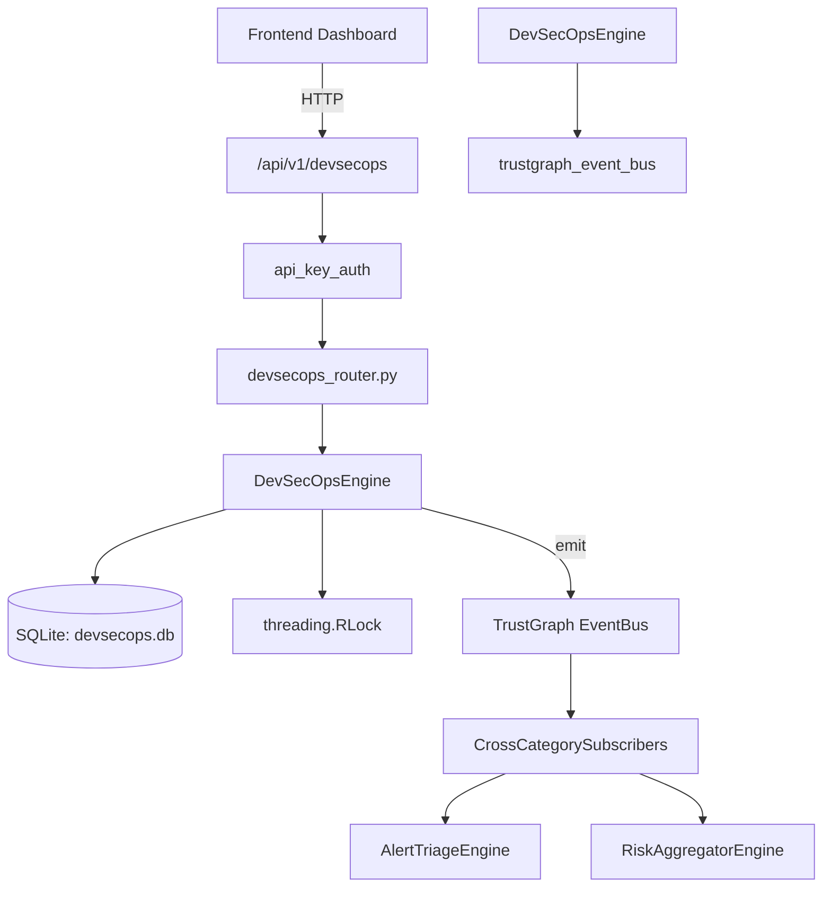

# US-0099: Devsecops

## Sub-Epic: ASPM
**Master Goal**: ALDECI — $35/mo enterprise security intelligence platform replacing $50K-500K/yr tools

## User Story
As a **Emma Davis (DevSecOps Engineer)**, I need to integrate security into CI/CD pipelines
so that the platform delivers enterprise-grade aspm capabilities at 1/1000th the cost of legacy tools.

## Why This Matters
Devsecops replaces functionality found in enterprise tools like CrowdStrike, Wiz, Snyk, and Rapid7.
By building this into ALDECI's $35/mo stack, customers save $50K+/yr on standalone ASPM tooling.

## Architecture

## Current State: 95% Complete
- ✅ `register_pipeline()` — Register a new CI/CD pipeline. Returns the created record. (line 158)
- ✅ `list_pipelines()` — List pipelines for org with optional ci_platform filter. (line 219)
- ✅ `trigger_run()` — Trigger a new pipeline run. (line 248)
- ✅ `get_run()` — Fetch a single run by run_id and org_id. (line 439)
- ✅ `list_runs()` — List runs with optional pipeline_id / status filters. (line 448)
- ✅ `list_findings()` — List security findings with optional filters. (line 475)
- ❌ TrustGraph event emission — not yet verified

## Key Functions (from `suite-core/core/devsecops_engine.py` — 652 lines)
- `DevSecOpsEngine.register_pipeline()` — Register a new CI/CD pipeline. Returns the created record. (line 158)
- `DevSecOpsEngine.list_pipelines()` — List pipelines for org with optional ci_platform filter. (line 219)
- `DevSecOpsEngine.trigger_run()` — Trigger a new pipeline run. (line 248)
- `DevSecOpsEngine.get_run()` — Fetch a single run by run_id and org_id. (line 439)
- `DevSecOpsEngine.list_runs()` — List runs with optional pipeline_id / status filters. (line 448)
- `DevSecOpsEngine.list_findings()` — List security findings with optional filters. (line 475)
- `DevSecOpsEngine.suppress_finding()` — Mark a finding as suppressed. Returns True on success. (line 497)
- `DevSecOpsEngine.create_gate_policy()` — Create a security gate policy. Returns the created record. (line 511)

## Dependencies
- **Depends on**: trustgraph_event_bus
- **Depended by**: Routers, TrustGraph EventBus, CrossCategorySubscribers
- **TrustGraph**: Event emission wired via ResponseInterceptorMiddleware
- **Source file**: `suite-core/core/devsecops_engine.py` (652 lines)
- **Router file**: `suite-api/apps/api/devsecops_router.py`

## API Endpoints
| Method | Path | Description |
|--------|------|-------------|
| POST | `/api/v1/devsecops/pipelines` | register pipeline |
| GET | `/api/v1/devsecops/pipelines` | list pipelines |
| POST | `/api/v1/devsecops/pipelines/{pipeline_id}/runs` | trigger run |
| GET | `/api/v1/devsecops/runs` | list runs |
| GET | `/api/v1/devsecops/runs/{run_id}` | get run |
| GET | `/api/v1/devsecops/findings` | list findings |
| POST | `/api/v1/devsecops/findings/{finding_id}/suppress` | suppress finding |
| POST | `/api/v1/devsecops/gate-policies` | create gate policy |
| GET | `/api/v1/devsecops/gate-policies` | list gate policies |
| GET | `/api/v1/devsecops/stats` | get devsecops stats |

## Tasks Remaining
1. Verify TrustGraph event emission works end-to-end (2h)
2. Add integration test with real persona workflow (2h)
3. Wire CrossCategorySubscriber consumer chain (1h)
4. Validate with 30-persona walkthrough (1h)
5. Optimize query performance for large datasets (2h)
6. Expand test coverage to edge cases (2h)

## Definition of Done
- [ ] Emma Davis (DevSecOps Engineer) can access /api/v1/devsecops and get meaningful data
- [ ] All CRUD operations return correct HTTP status codes
- [ ] TrustGraph receives events from this engine
- [ ] 40+ tests passing in `tests/test_devsecops_engine.py`
- [ ] 30-persona walkthrough includes this endpoint at 100%
- [ ] No hardcoded org_id — all queries are org-scoped

## Sprint: Wave 45 (est. April 21-23, 2026)

## Test Coverage
- **Test file**: `tests/test_devsecops_engine.py`
- **Tests**: 40 tests
- **Status**: Passing
