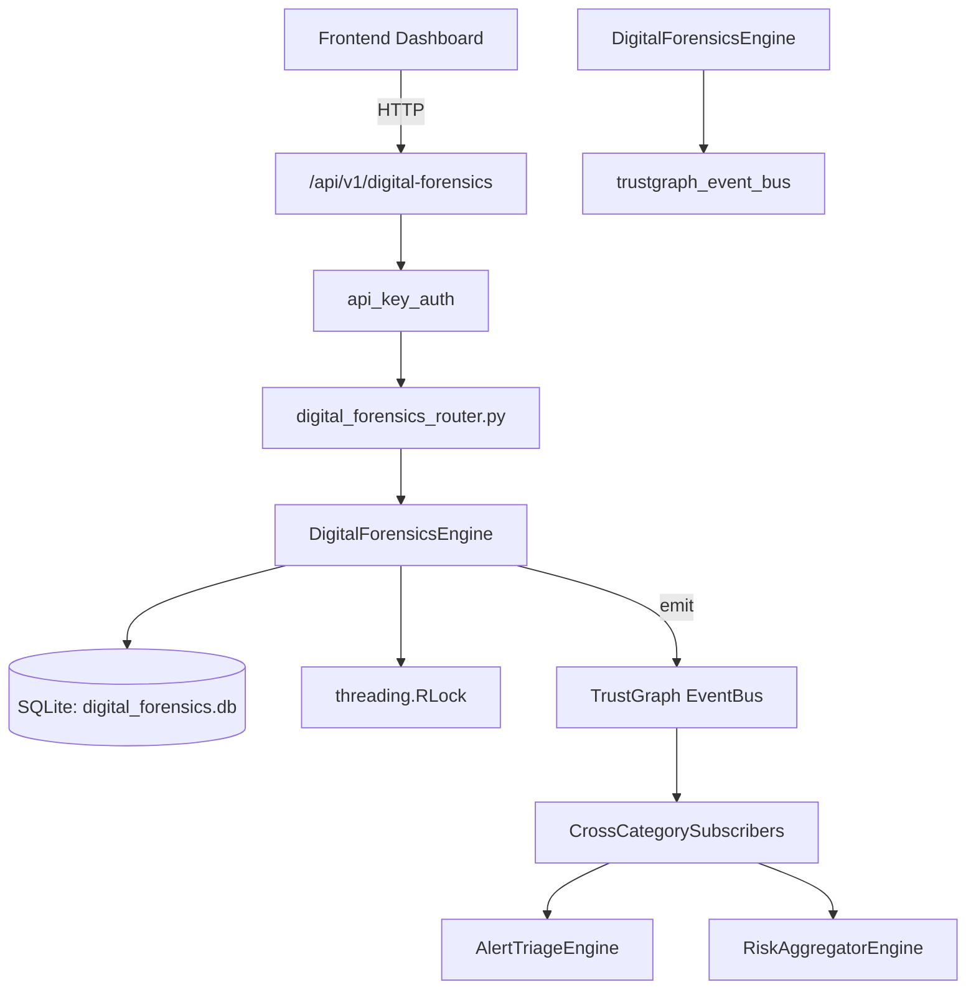

# US-0100: Digital Forensics

## Sub-Epic: Advanced
**Master Goal**: ALDECI — $35/mo enterprise security intelligence platform replacing $50K-500K/yr tools

## User Story
As a **Karen Taylor (IR Lead)**, I need to conduct digital forensic investigations
so that the platform delivers enterprise-grade advanced capabilities at 1/1000th the cost of legacy tools.

## Why This Matters
Digital Forensics replaces functionality found in enterprise tools like CrowdStrike, Wiz, Snyk, and Rapid7.
By building this into ALDECI's $35/mo stack, customers save $50K+/yr on standalone Advanced tooling.

## Architecture

## Current State: 95% Complete
- ✅ `create_case()` — Create a new forensic investigation case. (line 148)
- ✅ `list_cases()` — List forensic cases for an org with optional status filter. (line 205)
- ✅ `get_case()` — Fetch a single forensic case by ID, scoped to org. (line 220)
- ✅ `close_case()` — Close a forensic case. Returns True if updated. (line 229)
- ✅ `add_evidence()` — Add an evidence item to a forensic case. (line 244)
- ✅ `list_evidence()` — List all evidence items for a case. (line 296)
- ❌ TrustGraph event emission — not yet verified

## Key Functions (from `suite-core/core/digital_forensics_engine.py` — 488 lines)
- `DigitalForensicsEngine.create_case()` — Create a new forensic investigation case. (line 148)
- `DigitalForensicsEngine.list_cases()` — List forensic cases for an org with optional status filter. (line 205)
- `DigitalForensicsEngine.get_case()` — Fetch a single forensic case by ID, scoped to org. (line 220)
- `DigitalForensicsEngine.close_case()` — Close a forensic case. Returns True if updated. (line 229)
- `DigitalForensicsEngine.add_evidence()` — Add an evidence item to a forensic case. (line 244)
- `DigitalForensicsEngine.list_evidence()` — List all evidence items for a case. (line 296)
- `DigitalForensicsEngine.get_evidence()` — Fetch a single evidence item by ID, scoped to org. (line 305)
- `DigitalForensicsEngine.add_analysis_result()` — Add an analysis result for a forensic case. (line 318)

## Dependencies
- **Depends on**: trustgraph_event_bus
- **Depended by**: Routers, TrustGraph EventBus, CrossCategorySubscribers
- **TrustGraph**: Event emission wired via ResponseInterceptorMiddleware
- **Source file**: `suite-core/core/digital_forensics_engine.py` (488 lines)
- **Router file**: `suite-api/apps/api/digital_forensics_router.py`

## API Endpoints
| Method | Path | Description |
|--------|------|-------------|
| GET | `/api/v1/digital-forensics/cases` | list cases |
| POST | `/api/v1/digital-forensics/cases` | create case |
| GET | `/api/v1/digital-forensics/cases/{case_id}` | get case |
| POST | `/api/v1/digital-forensics/cases/{case_id}/close` | close case |
| GET | `/api/v1/digital-forensics/cases/{case_id}/evidence` | list evidence |
| POST | `/api/v1/digital-forensics/cases/{case_id}/evidence` | add evidence |
| GET | `/api/v1/digital-forensics/cases/{case_id}/analysis` | list analysis |
| POST | `/api/v1/digital-forensics/cases/{case_id}/analysis` | add analysis |
| GET | `/api/v1/digital-forensics/evidence/{evidence_id}/custody` | get custody |
| POST | `/api/v1/digital-forensics/evidence/{evidence_id}/custody` | log custody |
| GET | `/api/v1/digital-forensics/stats` | get stats |

## Tasks Remaining
1. Verify TrustGraph event emission works end-to-end (2h)
2. Add integration test with real persona workflow (2h)
3. Wire CrossCategorySubscriber consumer chain (1h)
4. Validate with 30-persona walkthrough (1h)
5. Optimize query performance for large datasets (2h)
6. Expand test coverage to edge cases (2h)

## Definition of Done
- [ ] Karen Taylor (IR Lead) can access /api/v1/digital-forensics and get meaningful data
- [ ] All CRUD operations return correct HTTP status codes
- [ ] TrustGraph receives events from this engine
- [ ] 29+ tests passing in `tests/test_digital_forensics_engine.py`
- [ ] 30-persona walkthrough includes this endpoint at 100%
- [ ] No hardcoded org_id — all queries are org-scoped

## Sprint: Wave 45 (est. April 21-23, 2026)

## Test Coverage
- **Test file**: `tests/test_digital_forensics_engine.py`
- **Tests**: 29 tests
- **Status**: Passing
