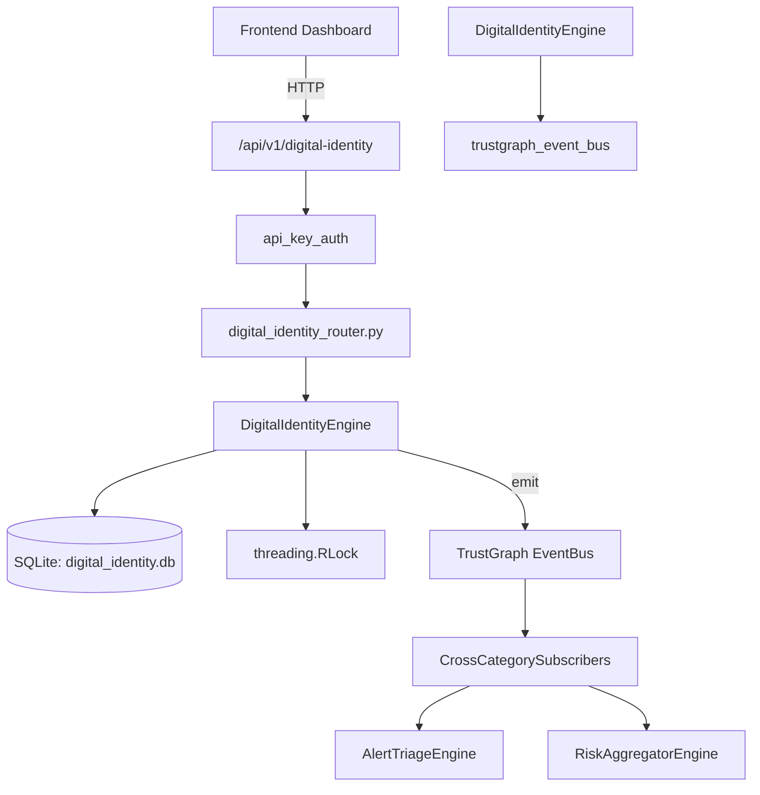

# US-0101: Digital Identity

## Sub-Epic: Identity
**Master Goal**: ALDECI — $35/mo enterprise security intelligence platform replacing $50K-500K/yr tools

## User Story
As a **Maria Lopez (IT Director)**, I need to manage digital identity verification
so that the platform delivers enterprise-grade identity capabilities at 1/1000th the cost of legacy tools.

## Why This Matters
Digital Identity replaces functionality found in enterprise tools like CrowdStrike, Wiz, Snyk, and Rapid7.
By building this into ALDECI's $35/mo stack, customers save $50K+/yr on standalone Identity tooling.

## Architecture

## Current State: 95% Complete
- ✅ `create_profile()` — Create a new identity profile. (line 156)
- ✅ `get_profile()` — Retrieve identity profile by user_id. (line 214)
- ✅ `list_profiles()` — List identity profiles with optional filters. (line 223)
- ✅ `verify_identity()` — Verify an identity profile. (line 243)
- ✅ `suspend_identity()` — Suspend an identity profile. (line 285)
- ✅ `record_verification_event()` — Record a verification event. (line 346)
- ❌ TrustGraph event emission — not yet verified

## Key Functions (from `suite-core/core/digital_identity_engine.py` — 487 lines)
- `DigitalIdentityEngine.create_profile()` — Create a new identity profile. (line 156)
- `DigitalIdentityEngine.get_profile()` — Retrieve identity profile by user_id. (line 214)
- `DigitalIdentityEngine.list_profiles()` — List identity profiles with optional filters. (line 223)
- `DigitalIdentityEngine.verify_identity()` — Verify an identity profile. (line 243)
- `DigitalIdentityEngine.suspend_identity()` — Suspend an identity profile. (line 285)
- `DigitalIdentityEngine.record_verification_event()` — Record a verification event. (line 346)
- `DigitalIdentityEngine.get_verification_history()` — Get verification event history for a user. (line 377)
- `DigitalIdentityEngine.add_attribute()` — Add an identity attribute. (line 395)

## Dependencies
- **Depends on**: trustgraph_event_bus
- **Depended by**: Routers, TrustGraph EventBus, CrossCategorySubscribers
- **TrustGraph**: Event emission wired via ResponseInterceptorMiddleware
- **Source file**: `suite-core/core/digital_identity_engine.py` (487 lines)
- **Router file**: `suite-api/apps/api/digital_identity_router.py`

## API Endpoints
| Method | Path | Description |
|--------|------|-------------|
| POST | `/api/v1/digital-identity/profiles` | create profile |
| GET | `/api/v1/digital-identity/profiles` | list profiles |
| GET | `/api/v1/digital-identity/profiles/{user_id}` | get profile |
| PUT | `/api/v1/digital-identity/profiles/{user_id}/verify` | verify identity |
| PUT | `/api/v1/digital-identity/profiles/{user_id}/suspend` | suspend identity |
| POST | `/api/v1/digital-identity/events` | record verification event |
| GET | `/api/v1/digital-identity/events/{user_id}` | get verification history |
| POST | `/api/v1/digital-identity/attributes/{user_id}` | add attribute |
| GET | `/api/v1/digital-identity/attributes/{user_id}` | list attributes |
| GET | `/api/v1/digital-identity/stats` | get identity stats |

## Tasks Remaining
1. Verify TrustGraph event emission works end-to-end (2h)
2. Add integration test with real persona workflow (2h)
3. Wire CrossCategorySubscriber consumer chain (1h)
4. Validate with 30-persona walkthrough (1h)
5. Optimize query performance for large datasets (2h)
6. Expand test coverage to edge cases (2h)

## Definition of Done
- [ ] Maria Lopez (IT Director) can access /api/v1/digital-identity and get meaningful data
- [ ] All CRUD operations return correct HTTP status codes
- [ ] TrustGraph receives events from this engine
- [ ] 32+ tests passing in `tests/test_digital_identity_engine.py`
- [ ] 30-persona walkthrough includes this endpoint at 100%
- [ ] No hardcoded org_id — all queries are org-scoped

## Sprint: Wave 45 (est. April 21-23, 2026)

## Test Coverage
- **Test file**: `tests/test_digital_identity_engine.py`
- **Tests**: 32 tests
- **Status**: Passing
