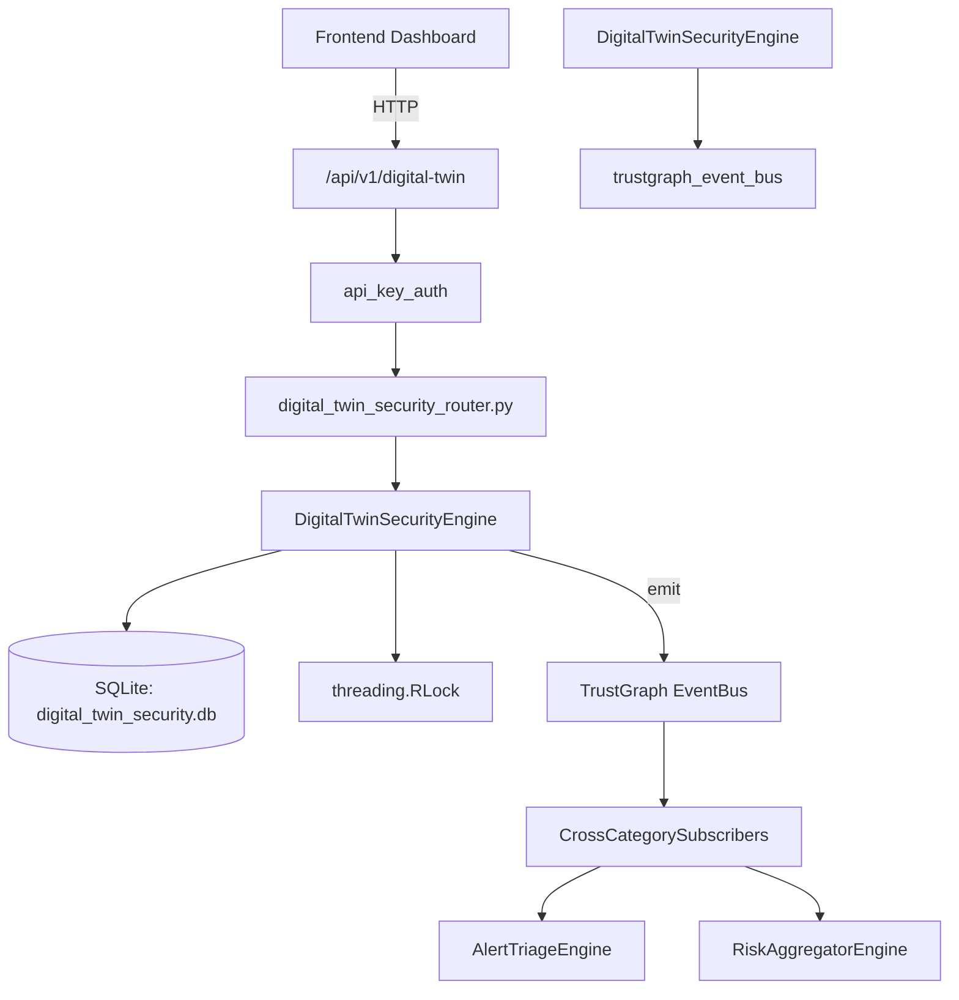

# US-0102: Digital Twin Security

## Sub-Epic: Advanced
**Master Goal**: ALDECI — $35/mo enterprise security intelligence platform replacing $50K-500K/yr tools

## User Story
As a **Richard Adams (Security Architect)**, I need to simulate security with digital twins
so that the platform delivers enterprise-grade advanced capabilities at 1/1000th the cost of legacy tools.

## Why This Matters
Digital Twin Security replaces functionality found in enterprise tools like CrowdStrike, Wiz, Snyk, and Rapid7.
By building this into ALDECI's $35/mo stack, customers save $50K+/yr on standalone Advanced tooling.

## Architecture

## Current State: 95% Complete
- ✅ `create_twin()` — Create a new digital twin. (line 153)
- ✅ `list_twins()` — List digital twins with optional type filter. (line 210)
- ✅ `get_twin()` — Retrieve a single twin by ID. Returns None if not found or wrong org. (line 226)
- ✅ `run_simulation()` — Create and immediately run a simulation on a digital twin. (line 239)
- ✅ `list_simulations()` — List simulations with optional filters. (line 289)
- ✅ `add_finding()` — Add a finding linked to a simulation. (line 317)
- ❌ TrustGraph event emission — not yet verified

## Key Functions (from `suite-core/core/digital_twin_security_engine.py` — 435 lines)
- `DigitalTwinSecurityEngine.create_twin()` — Create a new digital twin. (line 153)
- `DigitalTwinSecurityEngine.list_twins()` — List digital twins with optional type filter. (line 210)
- `DigitalTwinSecurityEngine.get_twin()` — Retrieve a single twin by ID. Returns None if not found or wrong org. (line 226)
- `DigitalTwinSecurityEngine.run_simulation()` — Create and immediately run a simulation on a digital twin. (line 239)
- `DigitalTwinSecurityEngine.list_simulations()` — List simulations with optional filters. (line 289)
- `DigitalTwinSecurityEngine.add_finding()` — Add a finding linked to a simulation. (line 317)
- `DigitalTwinSecurityEngine.list_findings()` — List findings with optional filters. (line 368)
- `DigitalTwinSecurityEngine.get_twin_stats()` — Return aggregated digital twin statistics for an org. (line 392)

## Dependencies
- **Depends on**: trustgraph_event_bus
- **Depended by**: Routers, TrustGraph EventBus, CrossCategorySubscribers
- **TrustGraph**: Event emission wired via ResponseInterceptorMiddleware
- **Source file**: `suite-core/core/digital_twin_security_engine.py` (435 lines)
- **Router file**: `suite-api/apps/api/digital_twin_security_router.py`

## API Endpoints
| Method | Path | Description |
|--------|------|-------------|
| POST | `/api/v1/digital-twin/twins` | create twin |
| GET | `/api/v1/digital-twin/twins` | list twins |
| GET | `/api/v1/digital-twin/twins/{twin_id}` | get twin |
| POST | `/api/v1/digital-twin/twins/{twin_id}/simulations` | run simulation |
| GET | `/api/v1/digital-twin/simulations` | list simulations |
| POST | `/api/v1/digital-twin/simulations/{simulation_id}/findings` | add finding |
| GET | `/api/v1/digital-twin/findings` | list findings |
| GET | `/api/v1/digital-twin/stats` | get twin stats |

## Tasks Remaining
1. Verify TrustGraph event emission works end-to-end (2h)
2. Add integration test with real persona workflow (2h)
3. Wire CrossCategorySubscriber consumer chain (1h)
4. Validate with 30-persona walkthrough (1h)
5. Optimize query performance for large datasets (2h)
6. Expand test coverage to edge cases (2h)

## Definition of Done
- [ ] Richard Adams (Security Architect) can access /api/v1/digital-twin and get meaningful data
- [ ] All CRUD operations return correct HTTP status codes
- [ ] TrustGraph receives events from this engine
- [ ] 37+ tests passing in `tests/test_digital_twin_security_engine.py`
- [ ] 30-persona walkthrough includes this endpoint at 100%
- [ ] No hardcoded org_id — all queries are org-scoped

## Sprint: Wave 45 (est. April 21-23, 2026)

## Test Coverage
- **Test file**: `tests/test_digital_twin_security_engine.py`
- **Tests**: 37 tests
- **Status**: Passing
