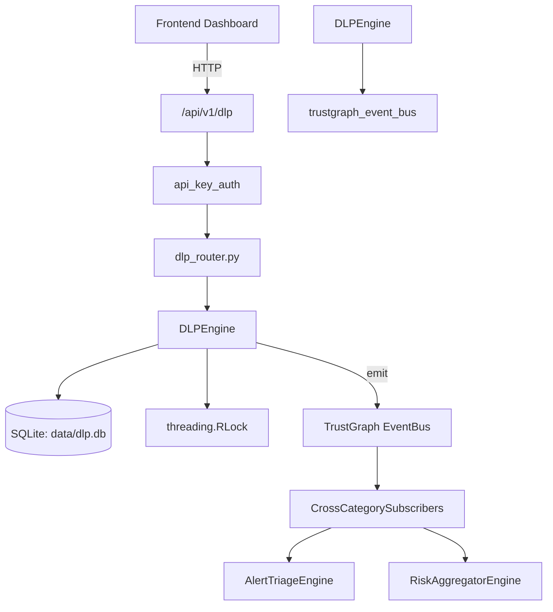

# US-0103: Dlp

## Sub-Epic: Advanced
**Master Goal**: ALDECI — $35/mo enterprise security intelligence platform replacing $50K-500K/yr tools

## User Story
As a **Robert Kim (Compliance Officer)**, I need to prevent data loss with DLP policies
so that the platform delivers enterprise-grade advanced capabilities at 1/1000th the cost of legacy tools.

## Why This Matters
Dlp replaces functionality found in enterprise tools like CrowdStrike, Wiz, Snyk, and Rapid7.
By building this into ALDECI's $35/mo stack, customers save $50K+/yr on standalone Advanced tooling.

## Architecture

## Current State: 95% Complete
- ✅ `scan_text()` — Scan text for sensitive data patterns. (line 137)
- ✅ `scan_file()` — Read a file and scan its contents. Returns same shape as scan_text. (line 206)
- ✅ `redact_text()` — Replace all detected sensitive data with [REDACTED-TYPE] placeholders. (line 217)
- ✅ `get_scan_result()` — Retrieve a stored scan result by ID. (line 232)
- ✅ `list_scan_results()` — List scan results for an org, optionally filtered by risk_level. (line 255)
- ✅ `get_stats()` — Return {total_scans, total_findings, by_category, by_severity, critical_scans}. (line 290)
- ❌ TrustGraph event emission — not yet verified

## Key Functions (from `suite-core/core/dlp_engine.py` — 871 lines)
- `DLPEngine.scan_text()` — Scan text for sensitive data patterns. (line 137)
- `DLPEngine.scan_file()` — Read a file and scan its contents. Returns same shape as scan_text. (line 206)
- `DLPEngine.redact_text()` — Replace all detected sensitive data with [REDACTED-TYPE] placeholders. (line 217)
- `DLPEngine.get_scan_result()` — Retrieve a stored scan result by ID. (line 232)
- `DLPEngine.list_scan_results()` — List scan results for an org, optionally filtered by risk_level. (line 255)
- `DLPEngine.get_stats()` — Return {total_scans, total_findings, by_category, by_severity, critical_scans}. (line 290)
- `DLPEngine.add_custom_pattern()` — Add a custom detection pattern for an org. (line 333)
- `DLPEngine.create_policy()` — Create a DLP policy. Returns the created record. (line 548)

## Dependencies
- **Depends on**: trustgraph_event_bus
- **Depended by**: Routers, TrustGraph EventBus, CrossCategorySubscribers
- **TrustGraph**: Event emission wired via ResponseInterceptorMiddleware
- **Source file**: `suite-core/core/dlp_engine.py` (871 lines)
- **Router file**: `suite-api/apps/api/dlp_router.py`

## API Endpoints
| Method | Path | Description |
|--------|------|-------------|
| POST | `/api/v1/dlp/scan` | scan text |
| POST | `/api/v1/dlp/scan-file` | scan file |
| POST | `/api/v1/dlp/redact` | redact text |
| GET | `/api/v1/dlp/results` | list results |
| GET | `/api/v1/dlp/results/{scan_id}` | get result |
| GET | `/api/v1/dlp/stats` | get stats |
| POST | `/api/v1/dlp/patterns` | add pattern |
| POST | `/api/v1/dlp/policies` | create policy |
| GET | `/api/v1/dlp/policies` | list policies |
| GET | `/api/v1/dlp/policies/{policy_id}` | get policy |
| POST | `/api/v1/dlp/detect` | detect incident |
| GET | `/api/v1/dlp/incidents` | list incidents |

## Tasks Remaining
1. Verify TrustGraph event emission works end-to-end (2h)
2. Add integration test with real persona workflow (2h)
3. Wire CrossCategorySubscriber consumer chain (1h)
4. Validate with 30-persona walkthrough (1h)
5. Optimize query performance for large datasets (2h)
6. Expand test coverage to edge cases (2h)

## Definition of Done
- [ ] Robert Kim (Compliance Officer) can access /api/v1/dlp and get meaningful data
- [ ] All CRUD operations return correct HTTP status codes
- [ ] TrustGraph receives events from this engine
- [ ] 57+ tests passing in `tests/test_dlp_engine.py`
- [ ] 30-persona walkthrough includes this endpoint at 100%
- [ ] No hardcoded org_id — all queries are org-scoped

## Sprint: Wave 45 (est. April 21-23, 2026)

## Test Coverage
- **Test file**: `tests/test_dlp_engine.py`
- **Tests**: 57 tests
- **Status**: Passing
