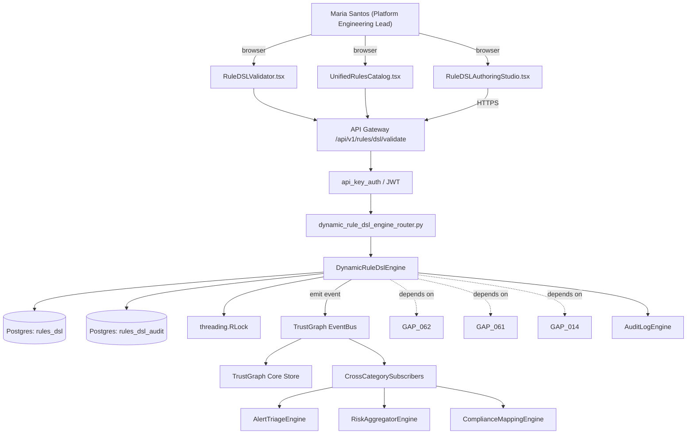

# US-0069: Leapfrog: YAML/JSON rule DSL for dynamic rule authoring (no fork + rebuild) + VS Code extension pairing

## Sub-Epic: Platform
**Master Goal**: ALDECI — tiered $199-$1,499/mo enterprise security intelligence platform replacing $50K-$500K/yr tools

## User Story
As a **Maria Santos (Platform Engineering Lead)**, I need the ability to leapfrog: YAML/JSON rule DSL for dynamic rule authoring (no fork + rebuild) + VS Code extension pairing so that ALDECI keeps parity with $50K-$500K/yr incumbents at $199-$1,499/mo.

## Why This Matters
Per /tmp/truecourse-analysis.md §6 (Extensibility) + §9 takeaway 12 ('Two structural gaps to beat') and competitor-truecourse.md, TrueCourse explicitly lacks (a) a dynamic rule authoring system (custom rules require fork + rebuild) and (b) a VS Code extension. Fixops can leapfrog on both. This task delivers (1) a YAML/JSON rule DSL (aligned with GAP-062 shared taxonomy) that lets customers drop in a rule file and have it loaded into the sast/iac_scanner/secret_scanner/policy_engine runtime without a rebuild, and (2) coordinates with GAP-014 (IDE extension) for the VS Code side. DSL supports deterministic rules (via OPA/Rego for policy rules, tree-sitter matcher for AST rules) and LLM rules (with prompt + contextRequirement from GAP-061).

This work is called out as a P1 gap in `competitor-truecourse.md`. Shipping it is load-bearing for ALDECI's tiered $199-$1,499/mo positioning against $50K-$500K/yr incumbents: every delayed gap becomes a displacement deal we lose.

## Architecture

## Current State: 0% — MISSING (new engine)
- [ ] Engine module `suite-core/core/dynamic_rule_dsl_engine.py` does not exist yet
- [ ] Router `suite-api/apps/api/dynamic_rule_dsl_engine_router.py` does not exist yet
- [ ] DB tables listed under Data Model do not exist yet
- [ ] Frontend screens listed under Key Functions do not exist yet
- [ ] No TrustGraph events emitted yet

## Key Functions
**Backend (engine methods):**
- `create_validate()` — backs `POST /api/v1/rules/dsl/validate`
- `create_publish()` — backs `POST /api/v1/rules/dsl/publish`
- `get_schema()` — backs `GET /api/v1/rules/dsl/schema`
- `delete_key()` — backs `DELETE /api/v1/rules/dsl/{key}`
- `get_dsl()` — backs `GET /api/v1/rules/dsl`

**Frontend screens:**
- `RuleDSLAuthoringStudio.tsx` — operator-facing UI surface for this gap
- `RuleDSLValidator.tsx` — operator-facing UI surface for this gap
- `UnifiedRulesCatalog.tsx` — operator-facing UI surface for this gap

## API Endpoints
| Method | Path | Auth | Purpose |
|--------|------|------|---------|
| POST | `/api/v1/rules/dsl/validate` | api_key_auth | dsl validate |
| POST | `/api/v1/rules/dsl/publish` | api_key_auth | dsl publish |
| GET | `/api/v1/rules/dsl/schema` | api_key_auth | dsl schema |
| DELETE | `/api/v1/rules/dsl/{key}` | api_key_auth | dsl {key} |
| GET | `/api/v1/rules/dsl` | api_key_auth | rules dsl |

## Data Model
- add rules_dsl table: key (PK), org_id, descriptor (JSONB, conforms to RuleDescriptor + matcher), dsl_version, published_at, published_by, quarantined (bool), quarantine_reason
- add rules_dsl_audit table: id, rule_key, action (validate|publish|delete|quarantine), actor, at, payload_hash

## Dependencies
**Depends on**: GAP-062, GAP-061, GAP-014
**Depended by**: Router layer, TrustGraph EventBus, CrossCategorySubscribers, CrossCategoryEvidenceBuilder, AuditLogEngine
**New engine module**: `suite-core/core/dynamic_rule_dsl_engine.py`
**New router module**: `suite-api/apps/api/dynamic_rule_dsl_engine_router.py`
**Master gap id**: `GAP-069` (priority P1, effort L)

## Tasks Remaining
1. Schema migration: add rules_dsl table (4h)
2. Schema migration: add rules_dsl_audit table (4h)
3. Implement endpoint POST /api/v1/rules/dsl/validate (6h)
4. Implement endpoint POST /api/v1/rules/dsl/publish (6h)
5. Implement endpoint GET /api/v1/rules/dsl/schema (6h)
6. Implement endpoint DELETE /api/v1/rules/dsl/{key} (6h)
7. Implement endpoint GET /api/v1/rules/dsl (6h)
8. Wire frontend screen RuleDSLAuthoringStudio.tsx (5h)
9. Wire frontend screen RuleDSLValidator.tsx (5h)
10. Wire frontend screen UnifiedRulesCatalog.tsx (5h)
11. Write 8 pytest cases: test_dsl_yaml_validates_against_schema, test_publish_loads_rule_without_restart… (6h)
12. Wire TrustGraph event emission + CrossCategorySubscriber consumers (4h)
13. Persona walkthrough + integration test (3h)
14. Docs + API reference update (2h)

## Definition of Done
- [ ] Given a valid YAML/JSON rule file conforming to the DSL schema (extends GAP-062 RuleDescriptor with `matcher: { kind: ast|rego|llm, body: ... }`), When POST /api/v1/rules/dsl/validate is called with the file, Then validation passes and returns the parsed rule descriptor.
- [ ] Given a validated rule, When POST /api/v1/rules/dsl/publish is called, Then the rule is loaded into the appropriate engine's runtime without a service restart and subsequent scans apply it.
- [ ] Given an invalid rule (unknown matcher.kind), When validate is called, Then the response returns error_code=DSL_INVALID with the exact JSON Pointer to the offending field.
- [ ] Given GET /api/v1/rules/dsl/schema, When called, Then it returns the current JSON Schema for the DSL (suitable for IDE autocomplete).
- [ ] Given a published AST-matcher rule, When a scan runs, Then the rule fires on matching AST nodes and produces findings with the declared severity/description.
- [ ] Given a published LLM rule, When a scan runs, Then the rule is batched through the GAP-061 context router using its declared contextRequirement.
- [ ] Given a published Rego rule, When a scan runs, Then the rule is evaluated by real_opa_engine and failures surface as findings.
- [ ] Given a published rule that later fails validation due to a DSL version bump, When scanning, Then the rule is quarantined (not fired) and an admin alert is raised with the upgrade path.
- [ ] Given RuleDSLAuthoringStudio.tsx, When a user edits a DSL rule, Then validation runs live and errors are inlined with JSON Pointer references.
- [ ] All endpoints are org-scoped (no hardcoded org_id) and gated by `api_key_auth`.
- [ ] TrustGraph emits at least one event type for this engine and a CrossCategorySubscriber consumes it.
- [ ] `Maria Santos (Platform Engineering Lead)` can execute the full workflow in the 30-persona walkthrough.

## Tests Required
- `test_dsl_yaml_validates_against_schema`
- `test_publish_loads_rule_without_restart`
- `test_invalid_matcher_kind_returns_json_pointer`
- `test_ast_matcher_rule_fires_on_match`
- `test_llm_rule_uses_gap061_context_router`
- `test_rego_rule_evaluated_by_real_opa_engine`
- `test_version_bump_quarantines_old_rule`
- `test_delete_rule_stops_firing_within_5s`

## Sprint: Wave 47 (est. May 20-May 26, 2026)

## Citation
Source research: `competitor-truecourse.md` (gap `GAP-069`, priority `P1`, effort `L`)
