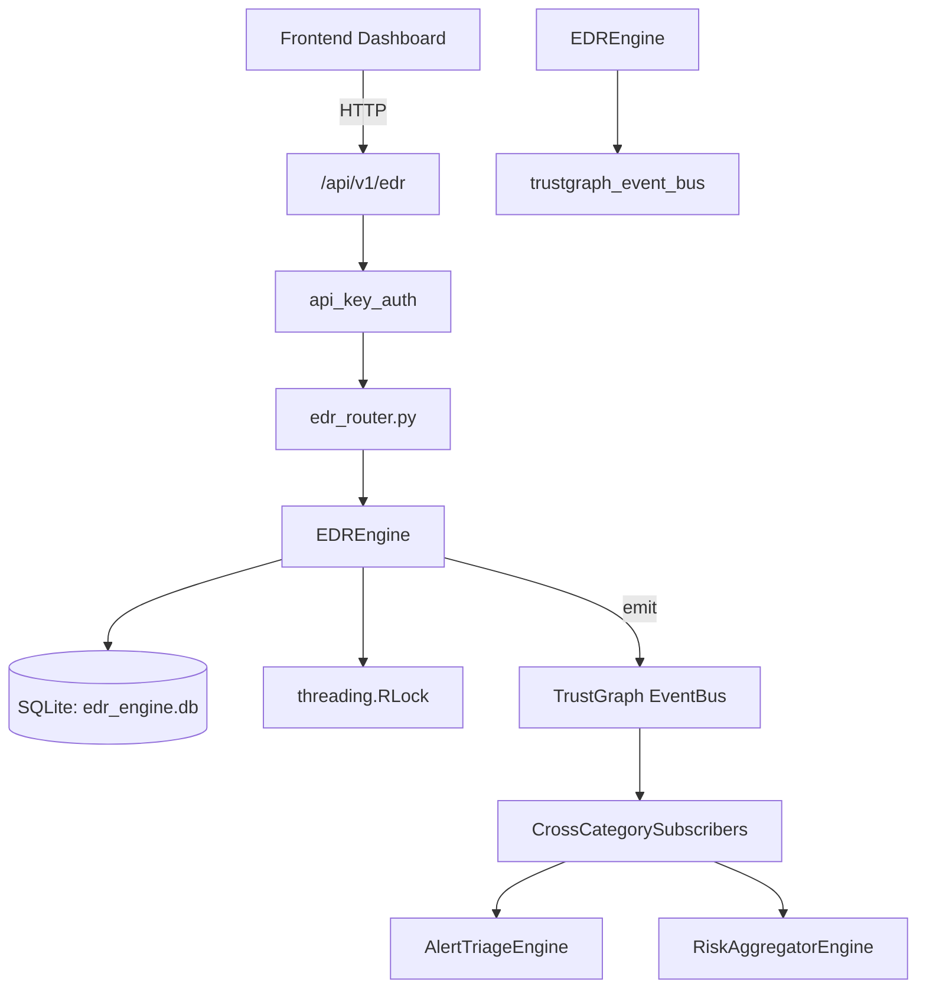

# US-0105: Edr

## Sub-Epic: SOC
**Master Goal**: ALDECI — $35/mo enterprise security intelligence platform replacing $50K-500K/yr tools

## User Story
As a **Alex Rivera (SOC T1 Analyst)**, I need to detect and respond to endpoint threats
so that the platform delivers enterprise-grade soc capabilities at 1/1000th the cost of legacy tools.

## Why This Matters
Edr replaces functionality found in enterprise tools like CrowdStrike, Wiz, Snyk, and Rapid7.
By building this into ALDECI's $35/mo stack, customers save $50K+/yr on standalone SOC tooling.

## Architecture

## Current State: 95% Complete
- ✅ `register_endpoint()` — Register a new endpoint. Returns the created record. (line 204)
- ✅ `list_endpoints()` — List endpoints, optionally filtered by status and/or os_type. (line 240)
- ✅ `get_endpoint()` — Retrieve a single endpoint by ID. (line 259)
- ✅ `ingest_process_event()` — Ingest a process event and auto-detect suspicious patterns. (line 272)
- ✅ `list_process_events()` — List process events with optional filters. (line 394)
- ✅ `list_detections()` — List detections with optional filters. (line 419)
- ❌ TrustGraph event emission — not yet verified

## Key Functions (from `suite-core/core/edr_engine.py` — 560 lines)
- `EDREngine.register_endpoint()` — Register a new endpoint. Returns the created record. (line 204)
- `EDREngine.list_endpoints()` — List endpoints, optionally filtered by status and/or os_type. (line 240)
- `EDREngine.get_endpoint()` — Retrieve a single endpoint by ID. (line 259)
- `EDREngine.ingest_process_event()` — Ingest a process event and auto-detect suspicious patterns. (line 272)
- `EDREngine.list_process_events()` — List process events with optional filters. (line 394)
- `EDREngine.list_detections()` — List detections with optional filters. (line 419)
- `EDREngine.update_detection_status()` — Update detection status. Returns True if record was found and updated. (line 442)
- `EDREngine.isolate_endpoint()` — Isolate an endpoint. Sets status=isolated and creates isolation record. (line 460)

## Dependencies
- **Depends on**: trustgraph_event_bus
- **Depended by**: Routers, TrustGraph EventBus, CrossCategorySubscribers
- **TrustGraph**: Event emission wired via ResponseInterceptorMiddleware
- **Source file**: `suite-core/core/edr_engine.py` (560 lines)
- **Router file**: `suite-api/apps/api/edr_router.py`

## API Endpoints
| Method | Path | Description |
|--------|------|-------------|
| POST | `/api/v1/edr/endpoints` | register endpoint |
| GET | `/api/v1/edr/endpoints` | list endpoints |
| GET | `/api/v1/edr/endpoints/{endpoint_id}` | get endpoint |
| POST | `/api/v1/edr/endpoints/{endpoint_id}/process-events` | ingest process event |
| GET | `/api/v1/edr/process-events` | list process events |
| GET | `/api/v1/edr/detections` | list detections |
| PATCH | `/api/v1/edr/detections/{detection_id}/status` | update detection status |
| POST | `/api/v1/edr/endpoints/{endpoint_id}/isolate` | isolate endpoint |
| POST | `/api/v1/edr/endpoints/{endpoint_id}/release` | release endpoint |
| GET | `/api/v1/edr/stats` | get edr stats |

## Tasks Remaining
1. Verify TrustGraph event emission works end-to-end (2h)
2. Add integration test with real persona workflow (2h)
3. Wire CrossCategorySubscriber consumer chain (1h)
4. Validate with 30-persona walkthrough (1h)
5. Optimize query performance for large datasets (2h)
6. Expand test coverage to edge cases (2h)

## Definition of Done
- [ ] Alex Rivera (SOC T1 Analyst) can access /api/v1/edr and get meaningful data
- [ ] All CRUD operations return correct HTTP status codes
- [ ] TrustGraph receives events from this engine
- [ ] 31+ tests passing in `tests/test_edr_engine.py`
- [ ] 30-persona walkthrough includes this endpoint at 100%
- [ ] No hardcoded org_id — all queries are org-scoped

## Sprint: Wave 45 (est. April 21-23, 2026)

## Test Coverage
- **Test file**: `tests/test_edr_engine.py`
- **Tests**: 31 tests
- **Status**: Passing
