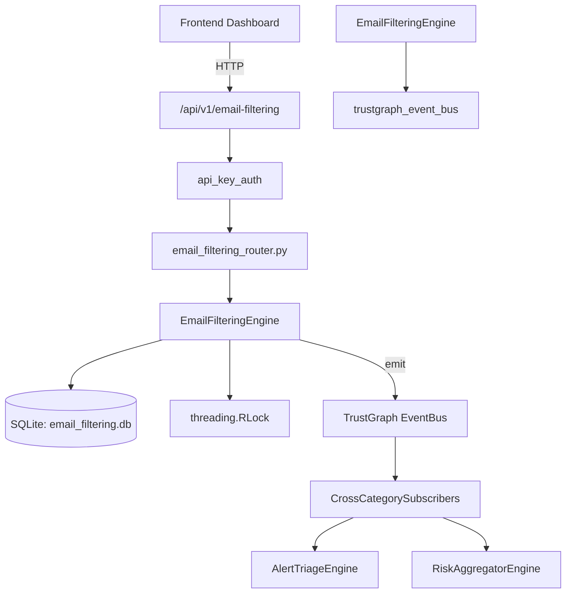

# US-0106: Email Filtering

## Sub-Epic: Network
**Master Goal**: ALDECI — $35/mo enterprise security intelligence platform replacing $50K-500K/yr tools

## User Story
As a **James Wilson (Security Engineer)**, I need to filter malicious emails and phishing
so that the platform delivers enterprise-grade network capabilities at 1/1000th the cost of legacy tools.

## Why This Matters
Email Filtering replaces functionality found in enterprise tools like CrowdStrike, Wiz, Snyk, and Rapid7.
By building this into ALDECI's $35/mo stack, customers save $50K+/yr on standalone Network tooling.

## Architecture

## Current State: 95% Complete
- ✅ `create_filter_rule()` — Create a filter rule for the given org. (line 112)
- ✅ `list_filter_rules()` — List filter rules for the org, optionally filtered by rule_type and action. (line 167)
- ✅ `get_filter_rule()` — Get a single filter rule by ID for the org. (line 187)
- ✅ `log_email_event()` — Log an email processing event. (line 216)
- ✅ `list_email_events()` — List email events for the org, optionally filtered by filter_result. (line 258)
- ✅ `get_email_stats()` — Return email filtering statistics for the org. (line 293)
- ❌ TrustGraph event emission — not yet verified

## Key Functions (from `suite-core/core/email_filtering_engine.py` — 347 lines)
- `EmailFilteringEngine.create_filter_rule()` — Create a filter rule for the given org. (line 112)
- `EmailFilteringEngine.list_filter_rules()` — List filter rules for the org, optionally filtered by rule_type and action. (line 167)
- `EmailFilteringEngine.get_filter_rule()` — Get a single filter rule by ID for the org. (line 187)
- `EmailFilteringEngine.log_email_event()` — Log an email processing event. (line 216)
- `EmailFilteringEngine.list_email_events()` — List email events for the org, optionally filtered by filter_result. (line 258)
- `EmailFilteringEngine.get_email_stats()` — Return email filtering statistics for the org. (line 293)

## Dependencies
- **Depends on**: trustgraph_event_bus
- **Depended by**: Routers, TrustGraph EventBus, CrossCategorySubscribers
- **TrustGraph**: Event emission wired via ResponseInterceptorMiddleware
- **Source file**: `suite-core/core/email_filtering_engine.py` (347 lines)
- **Router file**: `suite-api/apps/api/email_filtering_router.py`

## API Endpoints
| Method | Path | Description |
|--------|------|-------------|
| POST | `/api/v1/email-filtering/rules` | create filter rule |
| GET | `/api/v1/email-filtering/rules` | list filter rules |
| GET | `/api/v1/email-filtering/rules/{rule_id}` | get filter rule |
| POST | `/api/v1/email-filtering/events` | log email event |
| GET | `/api/v1/email-filtering/events` | list email events |
| GET | `/api/v1/email-filtering/stats` | get email stats |

## Tasks Remaining
1. Verify TrustGraph event emission works end-to-end (2h)
2. Add integration test with real persona workflow (2h)
3. Wire CrossCategorySubscriber consumer chain (1h)
4. Validate with 30-persona walkthrough (1h)
5. Optimize query performance for large datasets (2h)
6. Expand test coverage to edge cases (2h)

## Definition of Done
- [ ] James Wilson (Security Engineer) can access /api/v1/email-filtering and get meaningful data
- [ ] All CRUD operations return correct HTTP status codes
- [ ] TrustGraph receives events from this engine
- [ ] 35+ tests passing in `tests/test_email_filtering_engine.py`
- [ ] 30-persona walkthrough includes this endpoint at 100%
- [ ] No hardcoded org_id — all queries are org-scoped

## Sprint: Wave 45 (est. April 21-23, 2026)

## Test Coverage
- **Test file**: `tests/test_email_filtering_engine.py`
- **Tests**: 35 tests
- **Status**: Passing
