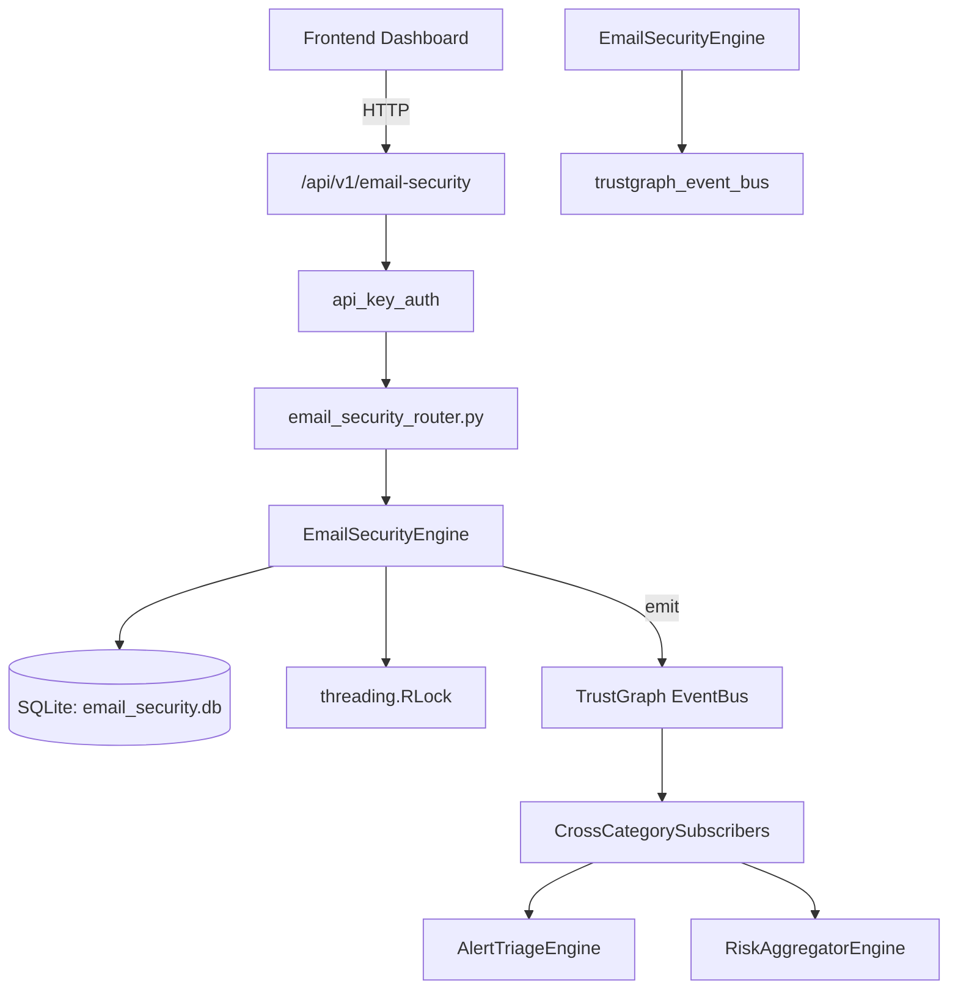

# US-0107: Email Security

## Sub-Epic: Network
**Master Goal**: ALDECI — $35/mo enterprise security intelligence platform replacing $50K-500K/yr tools

## User Story
As a **James Wilson (Security Engineer)**, I need to filter malicious emails and phishing
so that the platform delivers enterprise-grade network capabilities at 1/1000th the cost of legacy tools.

## Why This Matters
Email Security replaces functionality found in enterprise tools like CrowdStrike, Wiz, Snyk, and Rapid7.
By building this into ALDECI's $35/mo stack, customers save $50K+/yr on standalone Network tooling.

## Architecture

## Current State: 95% Complete
- ✅ `add_domain()` — Add a domain to email security inventory. Returns the created domain dict. (line 199)
- ✅ `list_domains()` — List all domains for an org, ordered by compliance score ascending. (line 258)
- ✅ `get_domain()` — Fetch a single domain config scoped to org. (line 267)
- ✅ `analyze_domain()` — Recompute compliance score and issues for a domain. Returns updated dict. (line 276)
- ✅ `update_domain_policy()` — Update domain SPF/DKIM/DMARC fields and recompute compliance score. (line 306)
- ✅ `create_threat()` — Create an email threat record. Returns the created threat dict. (line 363)
- ❌ TrustGraph event emission — not yet verified

## Key Functions (from `suite-core/core/email_security_engine.py` — 566 lines)
- `EmailSecurityEngine.add_domain()` — Add a domain to email security inventory. Returns the created domain dict. (line 199)
- `EmailSecurityEngine.list_domains()` — List all domains for an org, ordered by compliance score ascending. (line 258)
- `EmailSecurityEngine.get_domain()` — Fetch a single domain config scoped to org. (line 267)
- `EmailSecurityEngine.analyze_domain()` — Recompute compliance score and issues for a domain. Returns updated dict. (line 276)
- `EmailSecurityEngine.update_domain_policy()` — Update domain SPF/DKIM/DMARC fields and recompute compliance score. (line 306)
- `EmailSecurityEngine.create_threat()` — Create an email threat record. Returns the created threat dict. (line 363)
- `EmailSecurityEngine.list_threats()` — List email threats for an org, with optional type/status filter. (line 418)
- `EmailSecurityEngine.update_threat_status()` — Update a threat's status. Returns True if updated. (line 441)

## Dependencies
- **Depends on**: trustgraph_event_bus
- **Depended by**: Routers, TrustGraph EventBus, CrossCategorySubscribers
- **TrustGraph**: Event emission wired via ResponseInterceptorMiddleware
- **Source file**: `suite-core/core/email_security_engine.py` (566 lines)
- **Router file**: `suite-api/apps/api/email_security_router.py`

## API Endpoints
| Method | Path | Description |
|--------|------|-------------|
| GET | `/api/v1/email-security/domains` | list domains |
| POST | `/api/v1/email-security/domains` | add domain |
| PATCH | `/api/v1/email-security/domains/{domain_id}` | update domain policy |
| POST | `/api/v1/email-security/domains/{domain_id}/analyze` | analyze domain |
| GET | `/api/v1/email-security/threats` | list threats |
| POST | `/api/v1/email-security/threats` | create threat |
| PATCH | `/api/v1/email-security/threats/{threat_id}/status` | update threat status |
| GET | `/api/v1/email-security/dmarc-reports` | list dmarc reports |
| POST | `/api/v1/email-security/dmarc-reports` | add dmarc report |
| GET | `/api/v1/email-security/stats` | get email stats |

## Tasks Remaining
1. Verify TrustGraph event emission works end-to-end (2h)
2. Add integration test with real persona workflow (2h)
3. Wire CrossCategorySubscriber consumer chain (1h)
4. Validate with 30-persona walkthrough (1h)
5. Optimize query performance for large datasets (2h)
6. Expand test coverage to edge cases (2h)

## Definition of Done
- [ ] James Wilson (Security Engineer) can access /api/v1/email-security and get meaningful data
- [ ] All CRUD operations return correct HTTP status codes
- [ ] TrustGraph receives events from this engine
- [ ] 38+ tests passing in `tests/test_email_security_engine.py`
- [ ] 30-persona walkthrough includes this endpoint at 100%
- [ ] No hardcoded org_id — all queries are org-scoped

## Sprint: Wave 45 (est. April 21-23, 2026)

## Test Coverage
- **Test file**: `tests/test_email_security_engine.py`
- **Tests**: 38 tests
- **Status**: Passing
