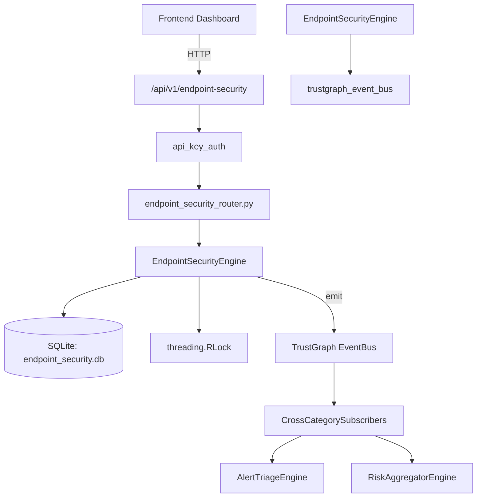

# US-0109: Endpoint Security

## Sub-Epic: Advanced
**Master Goal**: ALDECI — $35/mo enterprise security intelligence platform replacing $50K-500K/yr tools

## User Story
As a **James Wilson (Security Engineer)**, I need to enforce endpoint security compliance
so that the platform delivers enterprise-grade advanced capabilities at 1/1000th the cost of legacy tools.

## Why This Matters
Endpoint Security replaces functionality found in enterprise tools like CrowdStrike, Wiz, Snyk, and Rapid7.
By building this into ALDECI's $35/mo stack, customers save $50K+/yr on standalone Advanced tooling.

## Architecture

## Current State: 95% Complete
- ✅ `register_endpoint()` — Register a new endpoint agent. Returns the full endpoint record. (line 152)
- ✅ `list_endpoints()` — List endpoints for an org, optionally filtered by status. (line 197)
- ✅ `update_endpoint_status()` — Update the status of an endpoint. Returns True if updated. (line 215)
- ✅ `get_endpoint()` — Fetch a single endpoint by ID, scoped to org. (line 229)
- ✅ `create_alert()` — Create an EDR alert. Returns the full alert record. (line 244)
- ✅ `list_alerts()` — List EDR alerts for an org, optionally filtered by status and/or severity. (line 288)
- ❌ TrustGraph event emission — not yet verified

## Key Functions (from `suite-core/core/endpoint_security_engine.py` — 457 lines)
- `EndpointSecurityEngine.register_endpoint()` — Register a new endpoint agent. Returns the full endpoint record. (line 152)
- `EndpointSecurityEngine.list_endpoints()` — List endpoints for an org, optionally filtered by status. (line 197)
- `EndpointSecurityEngine.update_endpoint_status()` — Update the status of an endpoint. Returns True if updated. (line 215)
- `EndpointSecurityEngine.get_endpoint()` — Fetch a single endpoint by ID, scoped to org. (line 229)
- `EndpointSecurityEngine.create_alert()` — Create an EDR alert. Returns the full alert record. (line 244)
- `EndpointSecurityEngine.list_alerts()` — List EDR alerts for an org, optionally filtered by status and/or severity. (line 288)
- `EndpointSecurityEngine.resolve_alert()` — Mark an alert as resolved. Returns True if updated. (line 313)
- `EndpointSecurityEngine.create_policy()` — Create an EDR policy. Returns the full policy record. (line 334)

## Dependencies
- **Depends on**: trustgraph_event_bus
- **Depended by**: Routers, TrustGraph EventBus, CrossCategorySubscribers
- **TrustGraph**: Event emission wired via ResponseInterceptorMiddleware
- **Source file**: `suite-core/core/endpoint_security_engine.py` (457 lines)
- **Router file**: `suite-api/apps/api/endpoint_security_router.py`

## API Endpoints
| Method | Path | Description |
|--------|------|-------------|
| GET | `/api/v1/endpoint-security/endpoints` | list endpoints |
| POST | `/api/v1/endpoint-security/endpoints` | register endpoint |
| PATCH | `/api/v1/endpoint-security/endpoints/{endpoint_id}/status` | update endpoint status |
| GET | `/api/v1/endpoint-security/alerts` | list alerts |
| POST | `/api/v1/endpoint-security/alerts` | create alert |
| POST | `/api/v1/endpoint-security/alerts/{alert_id}/resolve` | resolve alert |
| GET | `/api/v1/endpoint-security/stats` | get edr stats |
| GET | `/api/v1/endpoint-security/policies` | list policies |
| POST | `/api/v1/endpoint-security/policies` | create policy |
| GET | `/api/v1/endpoint-security/endpoints/{endpoint_id}/timeline` | get endpoint timeline |

## Tasks Remaining
1. Verify TrustGraph event emission works end-to-end (2h)
2. Add integration test with real persona workflow (2h)
3. Wire CrossCategorySubscriber consumer chain (1h)
4. Validate with 30-persona walkthrough (1h)
5. Optimize query performance for large datasets (2h)
6. Expand test coverage to edge cases (2h)

## Definition of Done
- [ ] James Wilson (Security Engineer) can access /api/v1/endpoint-security and get meaningful data
- [ ] All CRUD operations return correct HTTP status codes
- [ ] TrustGraph receives events from this engine
- [ ] 40+ tests passing in `tests/test_endpoint_security_engine.py`
- [ ] 30-persona walkthrough includes this endpoint at 100%
- [ ] No hardcoded org_id — all queries are org-scoped

## Sprint: Wave 45 (est. April 21-23, 2026)

## Test Coverage
- **Test file**: `tests/test_endpoint_security_engine.py`
- **Tests**: 40 tests
- **Status**: Passing
